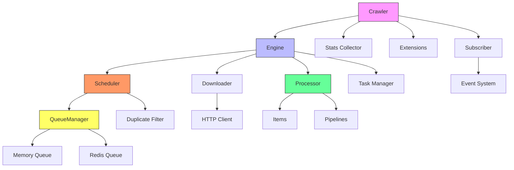

# Crawlo框架整体架构与核心特性深度解析

## 引言

在当今大数据时代，网络爬虫已成为数据采集和分析的重要工具。Crawlo作为一个基于asyncio的现代异步网络爬虫框架，专为高性能数据采集而设计。它提供了完整的工具集来处理从简单网页抓取到复杂分布式爬取的各种场景。

Crawlo框架的源代码托管在GitHub上，您可以访问 [https://github.com/crawl-coder/Crawlo.git](https://github.com/crawl-coder/Crawlo.git) 获取最新版本和更多信息。

本文将深入解析Crawlo框架的整体架构和核心特性，帮助开发者全面了解框架的设计理念和技术优势。

## 核心架构概述

Crawlo采用模块化设计，具有清晰的组件分离和良好的可扩展性。其核心架构如下图所示：

## 核心组件详解

### Crawler（爬虫控制器）

Crawler是Crawlo框架的主要协调器，负责管理整个爬取作业的生命周期。它初始化和协调所有其他核心组件，包括引擎、调度器、下载器和处理器。

主要职责：
- 管理爬虫作业的生命周期
- 初始化和协调核心组件
- 提供对设置和统计等共享资源的访问

### Engine（引擎）

Engine是Crawlo的核心执行单元，负责驱动整个爬取过程。它协调请求调度、页面下载和响应处理，确保数据在各个组件之间正确流动。

核心功能：
- 请求调度管理
- 页面下载协调
- 响应处理调度
- 数据在组件间的正确流动

### Scheduler（调度器）

Scheduler管理请求队列，实现基于优先级的调度和重复请求过滤。它与队列管理器和过滤器协同工作，确保请求按正确的顺序处理。

主要特性：
- 基于优先级的请求调度
- 重复请求过滤机制
- 与队列管理器和过滤器协同工作

### Downloader（下载器）

Downloader负责发送HTTP请求并获取网页内容。Crawlo支持多种下载器实现，包括基于aiohttp、httpx和curl-cffi的下载器。

支持的下载器：
- AioHttpDownloader：基于aiohttp实现
- HttpxDownloader：基于httpx实现
- CurlCffiDownloader：基于curl-cffi实现

### Processor（处理器）

Processor处理下载器返回的响应，调用用户定义的解析函数，并将提取的数据项路由到相应的数据管道。

处理流程：
- 响应解析
- 用户定义函数调用
- 数据项路由到管道

### QueueManager（队列管理器）

QueueManager提供统一的队列接口，支持内存队列和Redis队列的无缝切换，是实现分布式爬取的关键组件。

特性：
- 统一队列接口
- 内存队列与Redis队列切换
- 分布式爬取支持

### Filter（过滤器）

Filter实现请求去重功能，防止重复爬取相同的URL。支持内存过滤器和基于Redis的分布式过滤器。

去重机制：
- 内存过滤器（单机模式）
- Redis分布式过滤器（分布式模式）

## 数据流处理过程

Crawlo的数据流遵循以下过程：

1. **请求生成** - 爬虫或解析函数生成新的请求
2. **请求调度** - 调度器将请求添加到队列中
3. **请求获取** - 调度器从队列中获取下一个请求
4. **页面下载** - 下载器发送HTTP请求并获取响应
5. **响应处理** - 处理器调用用户定义的解析函数
6. **数据提取** - 解析函数提取数据项或生成新请求
7. **数据存储** - 数据项通过管道存储到目标位置

## 设计原则

### 模块化设计

Crawlo采用模块化设计，各组件职责清晰，便于扩展和维护。核心模块包括引擎、下载器、调度器、中间件、管道、过滤器等。

优势：
- 组件职责清晰
- 易于扩展和维护
- 降低模块间耦合度

### 异步非阻塞

基于asyncio实现异步非阻塞I/O，充分利用系统资源，实现高并发处理能力。

技术优势：
- 高并发请求处理
- 减少等待时间
- 优化资源使用

### 可扩展性

通过中间件、管道和扩展机制，用户可以轻松定制和扩展框架功能。

扩展机制：
- 中间件系统：请求/响应处理
- 管道系统：数据处理和存储
- 扩展系统：附加功能和监控

### 配置驱动

提供强大的配置管理系统，支持通过配置文件灵活调整框架行为。

配置特性：
- 灵活的配置调整
- 多种配置方式支持
- 配置验证机制

### 分布式支持

通过Redis实现任务分发与状态共享，支持多节点并行采集，具备良好的扩展性与容错能力。

分布式特性：
- 多节点并行采集
- 任务分发与状态共享
- 良好的扩展性和容错能力

## 核心特性详解

### 高性能异步爬取

Crawlo基于asyncio实现高并发处理，能够同时处理大量请求，显著提升爬取效率。

性能优势：
- 高并发请求处理能力
- 异步非阻塞I/O操作
- 智能并发控制和背压机制

### 多种下载器支持

框架支持多种HTTP客户端实现，包括aiohttp、httpx、curl-cffi，满足不同场景需求。

下载器选择：
- aiohttp：稳定可靠的异步HTTP客户端
- httpx：支持HTTP/2的现代HTTP客户端
- curl-cffi：基于curl的高性能下载器

### 内置数据清洗和验证

提供强大的数据处理能力，包括文本清洗、数据格式化、编码转换等功能。

数据处理功能：
- 文本清洗：HTML标签移除、空白字符清理等
- 数据格式化：数字、货币、百分比格式化
- 编码转换：自动编码检测和转换

### 分布式爬取支持

无缝支持单机与分布式部署切换，通过Redis实现任务分发和状态共享。

分布式优势：
- 无缝部署模式切换
- 多节点协同工作
- 水平扩展能力

### 灵活的中间件系统

可扩展的请求/响应处理机制，允许用户自定义处理逻辑。

中间件功能：
- 请求处理前/后操作
- 响应处理前/后操作
- 自定义业务逻辑集成

### 强大的配置管理系统

统一的配置管理与验证，确保配置的合理性和一致性。

配置管理特性：
- 多层次配置合并
- 配置项验证机制
- 灵活的配置方式

### 详细的日志记录和监控

全面的运行状态跟踪，帮助用户了解爬虫运行情况。

监控功能：
- 详细的日志记录
- 实时统计信息
- 性能监控指标

### 跨平台支持

支持Windows和Linux系统，满足不同开发环境需求。

兼容性优势：
- Windows系统兼容
- Linux系统支持
- 统一的API接口

## 性能特征

- **高并发** - 基于asyncio实现高并发请求处理
- **低延迟** - 异步非阻塞I/O减少等待时间
- **可扩展** - 支持水平扩展以处理大规模数据采集
- **资源优化** - 智能并发控制和背压机制优化资源使用

## 总结

Crawlo框架通过其模块化设计、异步非阻塞架构和丰富的功能特性，为开发者提供了一个强大而灵活的爬虫开发平台。无论是简单的网页抓取还是复杂的分布式数据采集，Crawlo都能提供高效的解决方案。

在接下来的文章中，我们将详细介绍Crawlo的CLI工具使用方法、分布式工作机制、数据清洗模块、配置验证器等核心功能，帮助您全面掌握这一强大的爬虫框架。