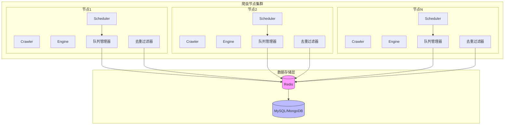

# 深入理解Crawlo分布式爬虫工作机制

## 引言

随着互联网数据规模的不断增长，单机爬虫已经难以满足大规模数据采集的需求。Crawlo框架提供了分布式爬虫支持，通过Redis实现任务分发与状态共享，支持多节点并行采集，具备良好的扩展性与容错能力。

本文将深入解析Crawlo分布式爬虫的工作机制，帮助开发者全面理解并高效使用该框架的分布式功能。

## 分布式架构概述

Crawlo的分布式架构基于Redis实现任务分发与状态共享，支持多节点并行采集，具备良好的扩展性与容错能力。

### 核心组件

1. **Redis服务器** - 用于任务队列和状态共享
2. **爬虫节点** - 执行具体的爬取任务
3. **数据存储** - 存储爬取结果

### 架构设计



在这个架构中：

1. **所有爬虫节点都是对等的** - 没有专门的控制节点或工作节点区分
2. **Redis作为中心协调器** - 所有节点通过Redis共享任务队列和去重信息
3. **分布式去重** - 每个节点的去重过滤器都连接到同一个Redis实例
4. **任务分发** - 任意节点都可以向Redis队列添加任务，所有节点都可以从中获取任务

## 环境准备

### Redis服务器

#### 安装Redis

```bash
# Ubuntu/Debian
sudo apt-get update
sudo apt-get install redis-server

# CentOS/RHEL
sudo yum install redis

# macOS
brew install redis
```

#### 配置Redis

```bash
# 编辑Redis配置文件
sudo nano /etc/redis/redis.conf

# 设置密码（可选但推荐）
requirepass your_redis_password

# 启用持久化（可选）
save 900 1
save 300 10
save 60 10000
```

#### 启动Redis

```bash
# 启动Redis服务
sudo systemctl start redis

# 设置开机自启
sudo systemctl enable redis

# 检查Redis状态
sudo systemctl status redis
```

### Redis集群支持

Crawlo框架还支持Redis集群模式，可以提供更高的可用性和扩展性。

#### 配置Redis集群

```bash
# 创建集群配置文件 redis-cluster.conf
port 7000
cluster-enabled yes
cluster-config-file nodes.conf
cluster-node-timeout 5000
appendonly yes
```

#### 启动Redis集群节点

```bash
# 启动多个Redis实例
redis-server redis-cluster.conf --port 7000
redis-server redis-cluster.conf --port 7001
redis-server redis-cluster.conf --port 7002
```

#### 创建集群

```bash
# 使用redis-cli创建集群
redis-cli --cluster create 127.0.0.1:7000 127.0.0.1:7001 127.0.0.1:7002 --cluster-replicas 0
```

### 节点配置

所有爬虫节点使用相同的配置来连接Redis服务器并协同工作。

```python
# settings_distributed.py
from crawlo.config import CrawloConfig

# 分布式配置 - 单实例Redis
config = CrawloConfig.distributed(
    project_name='distributed_project',
    redis_host='192.168.1.100',      # Redis服务器地址
    redis_port=6379,                 # Redis端口
    redis_password='your_password',  # Redis密码
    redis_db=0,                      # Redis数据库编号
    concurrency=16,                  # 节点并发数
    download_delay=1.0               # 下载延迟
)

# 分布式配置 - Redis集群
config = CrawloConfig.distributed(
    project_name='distributed_project',
    redis_host='192.168.1.100:7000,192.168.1.100:7001,192.168.1.100:7002',  # Redis集群节点
    redis_password='your_password',  # Redis密码
    concurrency=16,                  # 节点并发数
    download_delay=1.0               # 下载延迟
)
```

## 部署步骤

### 1. 配置Redis服务器

确保Redis服务器已安装并运行，配置好网络访问权限。

### 2. 配置爬虫节点

```bash
# 在每个节点上创建或复制项目
crawlo startproject distributed_project
cd distributed_project

# 配置 settings_distributed.py
# 编辑爬虫文件
```

### 3. 启动多个爬虫节点

```bash
# 在不同的终端或服务器上启动多个爬虫节点
# 终端 1
crawlo run myspider --config settings_distributed.py

# 终端 2
crawlo run myspider --config settings_distributed.py

# 终端 3
crawlo run myspider --config settings_distributed.py
```

## 核心组件详解

### Redis优先级队列

Redis优先级队列作为分布式任务代理运行，允许多个爬虫实例协调工作。任务使用有序集合存储在Redis中，其中分数表示优先级。每个请求在通过`RequestSerializer`清理后使用`pickle`进行序列化。

当消费者获取任务时，它会从主队列中原子性地移除，并移动到处理队列中。成功完成后会触发`ack`，而失败则导致重试逻辑或归档到失败队列。

### AioRedis过滤器

AioRedis过滤器通过维护已处理请求指纹的Redis集合提供分布式去重。当爬虫节点接收到请求时，它首先检查此共享集合，以确定该请求是否已被集群中的任何节点处理过，从而防止跨分布式系统的冗余工作。

### 分布式协调机制

分布式协调机制通过Redis实现任务分发与状态共享，确保多节点协同工作：

1. **任务分发** - 任意节点都可以将任务添加到Redis队列
2. **任务获取** - 所有节点从Redis队列中获取任务
3. **状态同步** - 通过Redis共享状态信息
4. **结果存储** - 爬取结果存储到共享数据存储中

## 配置选项

分布式部署的行为可以通过以下配置项进行调整：

| 配置项 | 类型 | 默认值 | 说明 |
|--------|------|--------|------|
| REDIS_HOST | str | '127.0.0.1' | Redis服务器地址 |
| REDIS_PORT | int | 6379 | Redis端口 |
| REDIS_PASSWORD | str | None | Redis密码 |
| REDIS_DB | int | 0 | Redis数据库编号 |
| PROJECT_NAME | str | 'crawlo' | 项目名称，用于命名空间 |
| CONCURRENCY | int | 16 | 节点并发数 |
| DOWNLOAD_DELAY | float | 1.0 | 下载延迟 |

## 性能优化

### 调整并发数

```python
# 设置节点并发数
config = CrawloConfig.distributed(concurrency=16)
```

### 优化Redis配置

```python
# 配置Redis连接参数
config = CrawloConfig.distributed(
    redis_host='192.168.1.100',
    redis_port=6379,
    redis_password='your_password',
    redis_db=0
)
```

### Redis集群优化

```python
# 配置Redis集群连接参数
config = CrawloConfig.distributed(
    redis_host='192.168.1.100:7000,192.168.1.100:7001,192.168.1.100:7002',
    redis_password='your_password'
)
```

## 监控和日志

### 1. Redis监控

```bash
# 监控Redis性能
redis-cli info

# 监控Redis内存使用
redis-cli info memory

# 监控Redis连接数
redis-cli info clients
```

### 2. 爬虫监控

```python
# 启用分布式统计扩展
EXTENSIONS = [
    'crawlo.extension.stats.StatsExtension',
    'crawlo.extension.log_stats.LogStatsExtension',
]

# 设置统计日志间隔
LOG_STATS_INTERVAL = 30
```

### 3. 日志配置

```python
# 配置分布式日志
LOG_LEVEL = 'INFO'
LOG_FILE = 'distributed_crawler.log'
LOG_MAX_BYTES = 10 * 1024 * 1024  # 10MB
LOG_BACKUP_COUNT = 5

# 包含节点标识
LOG_INCLUDE_NODE_ID = True
```

## 故障排除

### 1. Redis连接问题

```bash
# 检查Redis服务状态
sudo systemctl status redis

# 测试Redis连接
redis-cli -h 192.168.1.100 -p 6379 ping

# 检查防火墙设置
sudo ufw status
```

### 2. 节点通信问题

```python
# 启用详细日志
LOG_LEVEL = 'DEBUG'

# 检查网络连接
import socket
sock = socket.socket(socket.AF_INET, socket.SOCK_STREAM)
result = sock.connect_ex(('192.168.1.100', 6379))
if result == 0:
    print("端口开放")
else:
    print("端口关闭")
sock.close()
```

### 3. 数据一致性问题

```python
# 启用队列持久化
QUEUE_PERSISTENCE = True

# 启用统计持久化
STATS_PERSISTENCE = True

# 定期备份Redis数据
# 在 crontab 中添加
# 0 2 * * * redis-cli bgsave
```

## 最佳实践

### 1. 安全配置

```python
# 使用强密码
REDIS_PASSWORD = 'strong_password_here'

# 限制Redis访问
BIND_ADDRESS = '192.168.1.100'  # 只绑定内网地址

# 启用Redis认证
REQUIREPASS = 'your_strong_password'
```

### 2. 资源管理

```python
# 合理设置并发数
config = CrawloConfig.distributed(concurrency=16)

# 设置内存限制
MEMORY_LIMIT = '2GB'
```

### 3. 容错处理

```python
# 配置重试机制
MAX_RETRY_TIMES = 5
RETRY_STATUS_CODES = [500, 502, 503, 504, 429]

# 重试功能通过RetryMiddleware自动启用，无需额外配置
```

### 4. 监控告警

```python
# 配置监控扩展
EXTENSIONS = [
    'crawlo.extension.stats.StatsExtension',
    'crawlo.extension.log_stats.LogStatsExtension',
    'crawlo.extension.memory_monitor.MemoryMonitorExtension',
]

# 设置告警阈值
MEMORY_USAGE_WARNING_THRESHOLD = 500  # 500MB
```

## 扩展部署

### 1. Docker部署

```dockerfile
# Dockerfile
FROM python:3.9

WORKDIR /app

COPY requirements.txt .
RUN pip install -r requirements.txt

COPY . .

CMD ["crawlo", "run", "myspider"]
```

```bash
# 构建镜像
docker build -t crawlo-worker .

# 运行容器
docker run -d --name worker1 crawlo-worker
```

### 2. Kubernetes部署

```yaml
# worker-deployment.yaml
apiVersion: apps/v1
kind: Deployment
metadata:
  name: crawlo-worker
spec:
  replicas: 3
  selector:
    matchLabels:
      app: crawlo-worker
  template:
    metadata:
      labels:
        app: crawlo-worker
    spec:
      containers:
      - name: worker
        image: crawlo-worker:latest
        env:
        - name: REDIS_HOST
          value: "redis-service"
        - name: CONCURRENCY
          value: "20"
```

## 与单机模式的对比

### 关键差异

| 方面 | 单机模式 | 分布式模式 |
|-------|------------|-------------|
| **队列后端** | 内存（PriorityQueue） | Redis（RedisPriorityQueue） |
| **去重过滤器** | MemoryFilter | AioRedisFilter |
| **状态共享** | 无 | Redis协调 |
| **可扩展性** | 单进程 | 多节点集群 |

### 适用场景

**单机模式适用于：**
- 小规模数据采集任务
- 开发和测试环境
- 对资源要求较低的场景

**分布式模式适用于：**
- 大规模数据采集任务
- 生产环境部署
- 需要高可用性和容错能力的场景
- 需要水平扩展的场景

## Redis集群支持

Crawlo框架现在支持Redis集群模式，提供了更高的可用性和扩展性：

### 特性

1. **自动故障转移** - 当主节点故障时，从节点自动接管
2. **水平扩展** - 可以动态添加更多节点
3. **数据分片** - 数据分布在多个节点上，提高性能
4. **智能路由** - 自动将请求路由到正确的节点

### 配置

```python
# 使用Redis集群URL格式
config = CrawloConfig.distributed(
    project_name='distributed_project',
    redis_host='192.168.1.100:7000,192.168.1.100:7001,192.168.1.100:7002',
    redis_password='your_password'
)
```

### 优势

1. **高可用性** - 即使部分节点故障，系统仍可正常运行
2. **扩展性** - 可以根据需要添加更多节点
3. **性能** - 数据分片提高了读写性能
4. **透明性** - 对用户来说，使用方式与单实例Redis相同

## 总结

Crawlo框架的分布式爬虫机制通过Redis实现了任务分发与状态共享，支持多节点并行采集，具备良好的扩展性与容错能力。通过合理的配置和部署，可以构建高效、稳定的分布式爬虫系统。

掌握分布式爬虫的工作机制对于处理大规模数据采集任务至关重要。现在Crawlo还支持Redis集群模式，进一步提高了系统的可用性和扩展性。