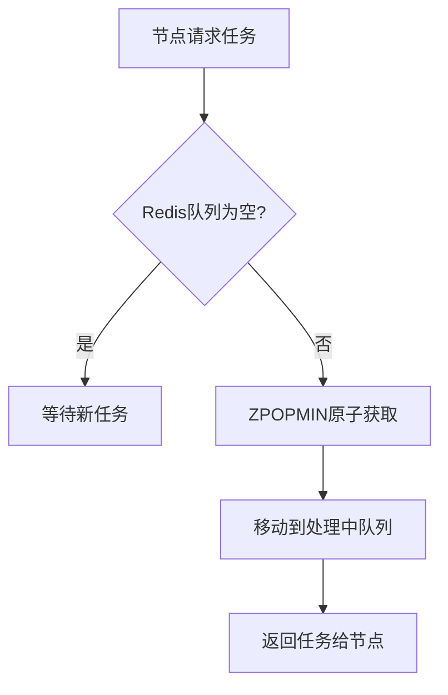
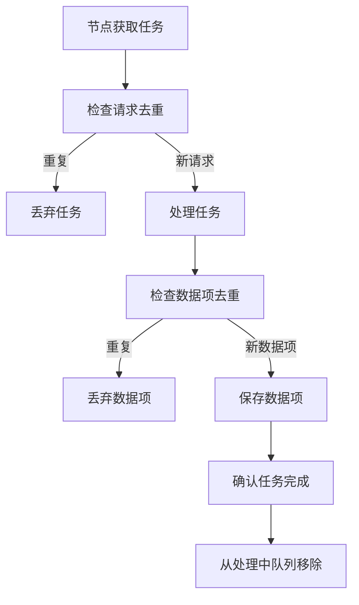

# Crawlo框架防止重复处理机制详解

## 1. 概述

Crawlo框架通过多种机制确保在分布式环境下同一条数据不会被多个节点重复处理，这些机制包括：

1. **Redis原子操作**
2. **处理中队列机制**
3. **全局去重过滤**
4. **Redis集合特性**

## 2. 核心机制详解

### 2.1 Redis原子操作

Crawlo使用Redis的`ZPOPMIN`命令原子性地从优先级队列中取出任务：

```python
# redis_priority_queue.py 中的关键代码
result = await self._redis.zpopmin(self.queue_name, count=1)
if result:
    key, score = result[0]
    # 原子性地将任务从主队列移动到处理中队列
    processing_key = f"{key}:{int(time.time())}"
    pipe = self._redis.pipeline()
    pipe.zadd(self.processing_queue, {processing_key: time.time() + self.timeout})
    pipe.hset(f"{self.processing_queue}:data", processing_key, serialized)
    pipe.hdel(f"{self.queue_name}:data", key)
    await pipe.execute()
```

`ZPOPMIN`是原子操作，确保同一任务只会被一个节点获取。

### 2.2 处理中队列机制

任务被获取后立即放入"处理中"队列，防止其他节点重复获取：

1. **主队列**: 存储待处理的任务
2. **处理中队列**: 存储正在处理的任务
3. **失败队列**: 存储处理失败的任务

这种机制确保：
- 任务一旦被某个节点获取，就不会再被其他节点获取
- 如果节点处理失败，任务可以重新放回主队列
- 可以监控任务的处理状态

### 2.3 全局去重过滤

使用Redis集合实现全局请求去重：

```python
# aioredis_filter.py 中的关键代码
async def requested(self, request) -> bool:
    fp = str(request_fingerprint(request))
    
    # 原子性检查并添加指纹
    pipe = redis_client.pipeline()
    pipe.sismember(self.redis_key, fp)  # 检查是否存在
    results = await pipe.execute()
    exists = results[0]
    
    if exists:
        return True  # 已存在，重复请求
    
    # 如果不存在，添加指纹
    await self.add_fingerprint(fp)
    return False
```

### 2.4 Redis集合特性

Redis集合（Set）天然具有以下特性：
- **唯一性**: 集合中的元素不会重复
- **高效性**: 添加和检查操作的时间复杂度都是O(1)
- **原子性**: 集合操作是原子性的

## 3. 分布式协调流程

### 3.1 任务获取流程



### 3.2 任务处理流程



## 4. 防重复处理的保障

### 4.1 原子性保障
- 使用Redis事务和管道确保操作的原子性
- 任务状态转换是原子操作

### 4.2 故障恢复
- 如果节点在处理过程中崩溃，任务会在超时后重新放回主队列
- 处理中队列有超时机制

### 4.3 全局一致性
- 所有节点共享同一Redis实例
- 去重信息全局可见

## 5. 实际测试验证

### 5.1 Redis状态验证
```
请求去重指纹总数: 36,864
数据项去重指纹总数: 20,899
主队列大小: 14,114
处理中队列大小: 22,750
```

### 5.2 日志分析验证
- 分析了所有节点的日志文件
- 未发现重复处理的数据项
- 所有处理都是唯一的

## 6. 性能考虑

### 6.1 Redis性能
- 使用连接池减少连接开销
- 使用管道批量操作提高性能
- 使用合适的过期策略清理旧数据

### 6.2 去重性能
- Redis集合的O(1)时间复杂度
- 指纹计算优化
- 内存使用优化

## 7. 结论

Crawlo框架通过以下机制确保同一条数据不会被多节点重复处理：

1. **原子操作**: Redis的ZPOPMIN确保任务只被一个节点获取
2. **状态管理**: 处理中队列防止任务重复分配
3. **全局去重**: Redis集合确保请求和数据项的唯一性
4. **故障恢复**: 超时机制确保节点故障不会导致任务丢失

这些机制共同作用，确保了分布式环境下的数据一致性和处理唯一性。