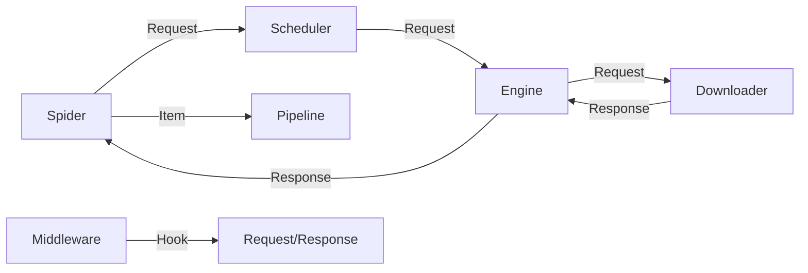

# 核心架构与运行模式

Crawlo 采用解耦的异步架构设计，确保了在处理高并发请求时的极高性能和稳定性。

## 1. 整体架构图

### 核心组件职责
- **Engine (引擎)**：系统的指挥中枢，控制所有组件之间的数据流。
- **Scheduler (调度器)**：管理请求队列，处理优先级并执行去重（Fingerprinting）。
- **Downloader (下载器)**：执行实际的网络 I/O，支持智能混合模式。
- **Spider (爬虫)**：开发者编写业务逻辑的地方，负责解析响应并提取数据。
- **Middleware (中间件)**：提供钩子函数，用于在请求/响应阶段注入自定义逻辑（如代理、User-Agent、重试等）。
- **Pipeline (管道)**：负责对提取的数据进行清洗、验证及持久化（数据库存储）。

---

## 2. 运行模式 (Run Modes)

Crawlo 提供了三种灵活的运行模式，可以通过 `CRAWLO_MODE` 环境变量或配置项进行切换。

### Standalone (单机模式)
- **特点**：无需外部依赖，使用内存队列和内存去重。
- **适用**：开发调试、中小规模抓取。

### Distributed (分布式模式)
- **特点**：严格要求 Redis 环境，所有节点共享任务队列和指纹。
- **适用**：多节点协同工作、大规模持久化抓取。

### Auto (智能自动模式 - 推荐)
- **特点**：启动时自动检测 Redis 可用性。如果 Redis 可用则进入分布式模式，否则自动降级为单机模式。
- **适用**：生产环境，提供最佳的容错性。

---

## 3. 数据流 (Data Flow)

1. 引擎从 **Spider** 获取初始请求。
2. 引擎将请求发送给 **Scheduler** 排队并去重。
3. 引擎向 **Scheduler** 请求下一个待抓取的请求。
4. 引擎将请求通过 **Middleware**（process_request）发送给 **Downloader**。
5. **Downloader** 获取网页内容，生成 **Response**。
6. 引擎将响应通过 **Middleware**（process_response）发送回 **Spider** 进行解析。
7. **Spider** 提取出数据（Item）或新的请求。
8. 提取的 **Item** 进入 **Pipeline** 处理，新的请求重新进入 **Scheduler**。
