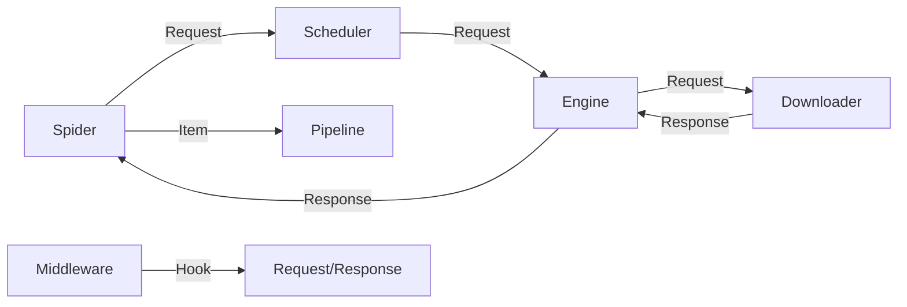

# 核心架构与部署模式

Crawlo 采用解耦的异步架构设计，确保了在处理高并发请求时的极高性能和稳定性。

## 1. 整体架构图



### 核心组件职责
- **Engine (引擎)**：系统的指挥中枢，控制所有组件之间的数据流。
- **Scheduler (调度器)**：管理请求队列，处理优先级并执行去重（Fingerprinting）。
- **Downloader (下载器)**：执行实际的网络 I/O，支持智能混合模式。
- **Spider (爬虫)**：开发者编写业务逻辑的地方，负责解析响应并提取数据。
- **Middleware (中间件)**：提供钩子函数，用于在请求/响应阶段注入自定义逻辑（如代理、User-Agent、重试等）。
- **Pipeline (管道)**：负责对提取的数据进行清洗、验证及持久化（数据库存储）。

---

## 2. 部署模式 (Deployment Modes)

Crawlo 支持三种部署模式，从单机开发调试到生产级分布式爬取，覆盖全场景需求。

| 模式 | 配置 | 队列 | 适用场景 |
|------|------|------|---------|
| **内存模式** | `standalone` + `memory` | 内存 PriorityQueue | 开发调试、小规模单机 |
| **多节点协作** | `auto` + `redis` | Redis ZSET | 多机并发，可接受任务丢失 |
| **分布式系统** | `distributed` + `redis_stream` | Redis Stream + CG | 生产环境，任务可靠性要求高 |

> 三种模式的优先级模型完全一致（数值越小越优先），切换模式无需修改爬虫代码。

**详细的设计原理、架构图、对比与切换指南**，请阅读 [三种部署模式详解](../architecture-overview.md)。

分布式系统的完整设计文档（10 大章节 + 附录），请阅读 [分布式架构设计文档](../distributed_architecture.md)。

---

## 3. 数据流 (Data Flow)

1. 引擎从 **Spider** 获取初始请求。
2. 引擎将请求发送给 **Scheduler** 排队并去重。
3. 引擎向 **Scheduler** 请求下一个待抓取的请求。
4. 引擎将请求通过 **Middleware**（process_request）发送给 **Downloader**。
5. **Downloader** 获取网页内容，生成 **Response**。
6. 引擎将响应通过 **Middleware**（process_response）发送回 **Spider** 进行解析。
7. **Spider** 提取出数据（Item）或新的请求。
8. 提取的 **Item** 进入 **Pipeline** 处理，新的请求重新进入 **Scheduler**。

### Depth 自动传播

在步骤 7→8 中，当 Spider 回调产生新的 Request 时，Engine 会自动将父请求的 `depth` 传播给子请求：

```
父请求 (depth=N)
  ↓ Spider 回调产出
子请求 (depth=N+1)  ← 框架自动注入，无需用户手动设置
  ↓ 进入 Scheduler
set_request(): 根据 depth 和 DEPTH_PRIORITY 调整内部优先级
  ↓ 入队
优先级队列按内部 priority 排序出队
```

这使得通过 `DEPTH_PRIORITY` 配置即可切换深度优先/广度优先策略，无需在每个 Spider 中手动管理 depth。
