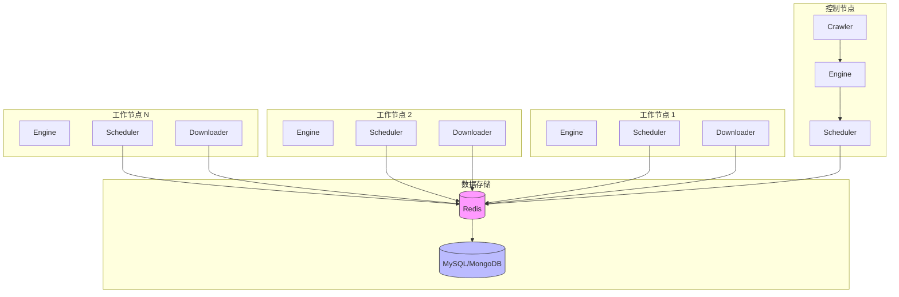

# 分布式部署

Crawlo 支持分布式部署，允许多个节点协同工作以处理大规模爬取任务。本文档详细介绍如何配置和部署分布式爬虫系统。

## 概述

分布式部署通过 Redis 实现任务分发与状态共享，支持多节点并行采集，具备良好的扩展性与容错能力。

### 核心组件

1. **Redis 服务器** - 用于任务队列和状态共享
2. **控制节点** - 负责任务分发和协调
3. **工作节点** - 执行具体的爬取任务
4. **数据存储** - 存储爬取结果

## 架构设计



## 环境准备

### Redis 服务器

1. **安装 Redis**
   ```bash
   # Ubuntu/Debian
   sudo apt-get update
   sudo apt-get install redis-server
   
   # CentOS/RHEL
   sudo yum install redis
   
   # macOS
   brew install redis
   ```

2. **配置 Redis**
   ```bash
   # 编辑 Redis 配置文件
   sudo nano /etc/redis/redis.conf
   
   # 设置密码（可选但推荐）
   requirepass your_redis_password
   
   # 启用持久化（可选）
   save 900 1
   save 300 10
   save 60 10000
   ```

3. **启动 Redis**
   ```bash
   # 启动 Redis 服务
   sudo systemctl start redis
   
   # 设置开机自启
   sudo systemctl enable redis
   
   # 检查 Redis 状态
   sudo systemctl status redis
   ```

### Redis 集群支持

Crawlo 框架支持 Redis 集群模式，可以提供更高的可用性和性能。详细配置请参考 [Redis 集群使用指南](./redis_cluster.md)。

### 控制节点配置

控制节点负责启动爬虫和分发初始任务。

```python
# settings_distributed.py
from crawlo.config import CrawloConfig

# 分布式配置
config = CrawloConfig.distributed(
    project_name='distributed_project',
    redis_host='192.168.1.100',      # Redis 服务器地址
    redis_port=6379,                 # Redis 端口
    redis_password='your_password',  # Redis 密码
    redis_db=0,                      # Redis 数据库编号
    concurrency=10,                  # 控制节点并发数
    download_delay=1.0               # 下载延迟
)
```

### 工作节点配置

工作节点负责执行具体的爬取任务。

```python
# worker_settings.py
from crawlo.config import CrawloConfig

# 工作节点配置
config = CrawloConfig.distributed(
    project_name='distributed_project',
    redis_host='192.168.1.100',      # Redis 服务器地址
    redis_port=6379,                 # Redis 端口
    redis_password='your_password',  # Redis 密码
    redis_db=0,                      # Redis 数据库编号
    concurrency=20,                  # 工作节点并发数
    download_delay=0.5               # 下载延迟
)
```

## 部署步骤

### 1. 部署控制节点

```bash
# 在控制节点上创建项目
crawlo startproject distributed_project
cd distributed_project

# 配置 settings_distributed.py
# 编辑爬虫文件

# 启动控制节点
crawlo run myspider --config settings_distributed.py
```

### 2. 部署工作节点

```bash
# 在工作节点上复制项目代码
git clone https://github.com/your-org/distributed_project.git
cd distributed_project

# 配置 worker_settings.py

# 启动工作节点
crawlo run myspider --config worker_settings.py
```

### 3. 启动多个工作节点

```bash
# 在不同的终端或服务器上启动多个工作节点
# 终端 1
crawlo run myspider --config worker_settings.py

# 终端 2
crawlo run myspider --config worker_settings.py

# 终端 3
crawlo run myspider --config worker_settings.py
```

## 配置选项

分布式部署的行为可以通过以下配置项进行调整：

| 配置项 | 类型 | 默认值 | 说明 |
|--------|------|--------|------|
| REDIS_HOST | str | '127.0.0.1' | Redis 服务器地址 |
| REDIS_PORT | int | 6379 | Redis 端口 |
| REDIS_PASSWORD | str | None | Redis 密码 |
| REDIS_DB | int | 0 | Redis 数据库编号 |
| REDIS_CONNECTION_POOL_SIZE | int | 20 | Redis 连接池大小 |
| SCHEDULER_PERSIST | bool | True | 是否持久化调度器状态 |
| QUEUE_PERSISTENCE | bool | True | 是否持久化队列数据 |
| STATS_PERSISTENCE | bool | True | 是否持久化统计信息 |

## 性能优化

### 1. 调整并发数

```python
# 控制节点并发数（较低）
config = CrawloConfig.distributed(concurrency=5)

# 工作节点并发数（较高）
config = CrawloConfig.distributed(concurrency=30)
```

### 2. 优化 Redis 配置

```python
# 增加连接池大小
config = CrawloConfig.distributed(
    redis_connection_pool_size=50
)

# 启用 Redis 集群模式（高级配置）
REDIS_CLUSTER_NODES = [
    '192.168.1.100:7000',
    '192.168.1.101:7000',
    '192.168.1.102:7000'
]
```

### 3. 负载均衡

```python
# 不同工作节点使用不同的配置
# 工作节点 1 - 高性能
config = CrawloConfig.distributed(concurrency=50, download_delay=0.1)

# 工作节点 2 - 中等性能
config = CrawloConfig.distributed(concurrency=20, download_delay=0.5)

# 工作节点 3 - 低性能（避免被封）
config = CrawloConfig.distributed(concurrency=5, download_delay=2.0)
```

## 监控和日志

### 1. Redis 监控

```bash
# 监控 Redis 性能
redis-cli info

# 监控 Redis 内存使用
redis-cli info memory

# 监控 Redis 连接数
redis-cli info clients
```

### 2. 爬虫监控

```python
# 启用分布式统计扩展
EXTENSIONS = [
    'crawlo.extensions.StatsExtension',
    'crawlo.extensions.LogStatsExtension',
]

# 设置统计日志间隔
LOG_STATS_INTERVAL = 30
```

### 3. 日志配置

```python
# 配置分布式日志
LOG_LEVEL = 'INFO'
LOG_FILE = 'distributed_crawler.log'
LOG_MAX_BYTES = 10 * 1024 * 1024  # 10MB
LOG_BACKUP_COUNT = 5

# 包含节点标识
LOG_INCLUDE_NODE_ID = True
```

## 故障排除

### 1. Redis 连接问题

```bash
# 检查 Redis 服务状态
sudo systemctl status redis

# 测试 Redis 连接
redis-cli -h 192.168.1.100 -p 6379 ping

# 检查防火墙设置
sudo ufw status
```

### 2. 节点通信问题

```python
# 启用详细日志
LOG_LEVEL = 'DEBUG'

# 检查网络连接
import socket
sock = socket.socket(socket.AF_INET, socket.SOCK_STREAM)
result = sock.connect_ex(('192.168.1.100', 6379))
if result == 0:
    print("端口开放")
else:
    print("端口关闭")
sock.close()
```

### 3. 数据一致性问题

```python
# 启用队列持久化
QUEUE_PERSISTENCE = True

# 启用统计持久化
STATS_PERSISTENCE = True

# 定期备份 Redis 数据
# 在 crontab 中添加
# 0 2 * * * redis-cli bgsave
```

## 最佳实践

### 1. 安全配置

```python
# 使用强密码
REDIS_PASSWORD = 'strong_password_here'

# 限制 Redis 访问
BIND_ADDRESS = '192.168.1.100'  # 只绑定内网地址

# 启用 Redis 认证
REQUIREPASS = 'your_strong_password'
```

### 2. 资源管理

```python
# 合理设置并发数
# 控制节点
config = CrawloConfig.distributed(concurrency=5)

# 工作节点
config = CrawloConfig.distributed(concurrency=20)

# 设置内存限制
MEMORY_LIMIT = '2GB'
```

### 3. 容错处理

```python
# 配置重试机制
MAX_RETRY_TIMES = 5
RETRY_STATUS_CODES = [500, 502, 503, 504, 429]

# 启用自动重试扩展
EXTENSIONS = [
    'crawlo.extensions.RetryExtension',
]
```

### 4. 监控告警

```python
# 配置监控扩展
EXTENSIONS = [
    'crawlo.extensions.StatsExtension',
    'crawlo.extensions.LogStatsExtension',
    'crawlo.extensions.MemoryUsageExtension',
]

# 设置告警阈值
MEMORY_USAGE_WARNING_THRESHOLD = 500  # 500MB
```

## 扩展部署

### 1. Docker 部署

``dockerfile
# Dockerfile
FROM python:3.9

WORKDIR /app

COPY requirements.txt .
RUN pip install -r requirements.txt

COPY . .

CMD ["crawlo", "run", "myspider"]
```

```bash
# 构建镜像
docker build -t crawlo-worker .

# 运行容器
docker run -d --name worker1 crawlo-worker
```

### 2. Kubernetes 部署

```yaml
# worker-deployment.yaml
apiVersion: apps/v1
kind: Deployment
metadata:
  name: crawlo-worker
spec:
  replicas: 3
  selector:
    matchLabels:
      app: crawlo-worker
  template:
    metadata:
      labels:
        app: crawlo-worker
    spec:
      containers:
      - name: worker
        image: crawlo-worker:latest
        env:
        - name: REDIS_HOST
          value: "redis-service"
        - name: CONCURRENCY
          value: "20"
```

通过以上配置和部署步骤，您可以成功搭建一个高效、可扩展的分布式爬虫系统。