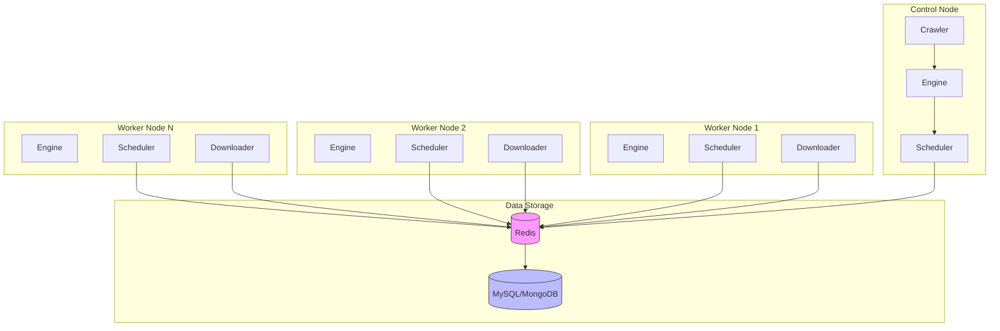

# Distributed Deployment

Crawlo supports distributed deployment, allowing multiple nodes to work together to handle large-scale crawling tasks. This document details how to configure and deploy a distributed crawler system.

## Overview

Distributed deployment implements task distribution and state sharing through Redis, supporting multi-node parallel crawling with good scalability and fault tolerance.

### Core Components

1. **Redis Server** - Used for task queues and state sharing
2. **Control Node** - Responsible for task distribution and coordination
3. **Worker Nodes** - Execute specific crawling tasks
4. **Data Storage** - Stores crawling results

## Architecture Design



## Environment Setup

### Redis Server

1. **Install Redis**
   ```bash
   # Ubuntu/Debian
   sudo apt-get update
   sudo apt-get install redis-server
   
   # CentOS/RHEL
   sudo yum install redis
   
   # macOS
   brew install redis
   ```

2. **Configure Redis**
   ```bash
   # Edit Redis configuration file
   sudo nano /etc/redis/redis.conf
   
   # Set password (optional but recommended)
   requirepass your_redis_password
   
   # Enable persistence (optional)
   save 900 1
   save 300 10
   save 60 10000
   ```

3. **Start Redis**
   ```bash
   # Start Redis service
   sudo systemctl start redis
   
   # Enable auto-start on boot
   sudo systemctl enable redis
   
   # Check Redis status
   sudo systemctl status redis
   ```

### Control Node Configuration

The control node is responsible for starting the crawler and distributing initial tasks.

```python
# settings_distributed.py
from crawlo.config import CrawloConfig

# Distributed configuration
config = CrawloConfig.distributed(
    project_name='distributed_project',
    redis_host='192.168.1.100',      # Redis server address
    redis_port=6379,                 # Redis port
    redis_password='your_password',  # Redis password
    redis_db=0,                      # Redis database number
    concurrency=10,                  # Control node concurrency
    download_delay=1.0               # Download delay
)
```

### Worker Node Configuration

Worker nodes are responsible for executing specific crawling tasks.

```python
# worker_settings.py
from crawlo.config import CrawloConfig

# Worker node configuration
config = CrawloConfig.distributed(
    project_name='distributed_project',
    redis_host='192.168.1.100',      # Redis server address
    redis_port=6379,                 # Redis port
    redis_password='your_password',  # Redis password
    redis_db=0,                      # Redis database number
    concurrency=20,                  # Worker node concurrency
    download_delay=0.5               # Download delay
)
```

## Deployment Steps

### 1. Deploy Control Node

```bash
# Create project on control node
crawlo startproject distributed_project
cd distributed_project

# Configure settings_distributed.py
# Edit spider file

# Start control node
crawlo run myspider --config settings_distributed.py
```

### 2. Deploy Worker Nodes

```bash
# Copy project code on worker nodes
git clone https://github.com/your-org/distributed_project.git
cd distributed_project

# Configure worker_settings.py

# Start worker node
crawlo run myspider --config worker_settings.py
```

### 3. Start Multiple Worker Nodes

```bash
# Start multiple worker nodes on different terminals or servers
# Terminal 1
crawlo run myspider --config worker_settings.py

# Terminal 2
crawlo run myspider --config worker_settings.py

# Terminal 3
crawlo run myspider --config worker_settings.py
```

## Configuration Options

The behavior of distributed deployment can be adjusted through the following configuration options:

| Configuration Item | Type | Default Value | Description |
|--------------------|------|---------------|-------------|
| REDIS_HOST | str | '127.0.0.1' | Redis server address |
| REDIS_PORT | int | 6379 | Redis port |
| REDIS_PASSWORD | str | None | Redis password |
| REDIS_DB | int | 0 | Redis database number |
| REDIS_CONNECTION_POOL_SIZE | int | 20 | Redis connection pool size |
| SCHEDULER_PERSIST | bool | True | Whether to persist scheduler state |
| QUEUE_PERSISTENCE | bool | True | Whether to persist queue data |
| STATS_PERSISTENCE | bool | True | Whether to persist statistics |

## Performance Optimization

### 1. Adjust Concurrency

```python
# Control node concurrency (lower)
config = CrawloConfig.distributed(concurrency=5)

# Worker node concurrency (higher)
config = CrawloConfig.distributed(concurrency=30)
```

### 2. Optimize Redis Configuration

```python
# Increase connection pool size
config = CrawloConfig.distributed(
    redis_connection_pool_size=50
)

# Enable Redis cluster mode (advanced configuration)
REDIS_CLUSTER_NODES = [
    '192.168.1.100:7000',
    '192.168.1.101:7000',
    '192.168.1.102:7000'
]
```

### 3. Load Balancing

```python
# Use different configurations for different worker nodes
# Worker Node 1 - High performance
config = CrawloConfig.distributed(concurrency=50, download_delay=0.1)

# Worker Node 2 - Medium performance
config = CrawloConfig.distributed(concurrency=20, download_delay=0.5)

# Worker Node 3 - Low performance (avoid being blocked)
config = CrawloConfig.distributed(concurrency=5, download_delay=2.0)
```

## Monitoring and Logging

### 1. Redis Monitoring

```bash
# Monitor Redis performance
redis-cli info

# Monitor Redis memory usage
redis-cli info memory

# Monitor Redis connections
redis-cli info clients
```

### 2. Crawler Monitoring

```python
# Enable distributed statistics extension
EXTENSIONS = [
    'crawlo.extensions.StatsExtension',
    'crawlo.extensions.LogStatsExtension',
]

# Set statistics log interval
LOG_STATS_INTERVAL = 30
```

### 3. Log Configuration

```python
# Configure distributed logging
LOG_LEVEL = 'INFO'
LOG_FILE = 'distributed_crawler.log'
LOG_MAX_BYTES = 10 * 1024 * 1024  # 10MB
LOG_BACKUP_COUNT = 5

# Include node identifier
LOG_INCLUDE_NODE_ID = True
```

## Troubleshooting

### 1. Redis Connection Issues

```bash
# Check Redis service status
sudo systemctl status redis

# Test Redis connection
redis-cli -h 192.168.1.100 -p 6379 ping

# Check firewall settings
sudo ufw status
```

### 2. Node Communication Issues

```python
# Enable detailed logging
LOG_LEVEL = 'DEBUG'

# Check network connection
import socket
sock = socket.socket(socket.AF_INET, socket.SOCK_STREAM)
result = sock.connect_ex(('192.168.1.100', 6379))
if result == 0:
    print("Port open")
else:
    print("Port closed")
sock.close()
```

### 3. Data Consistency Issues

```python
# Enable queue persistence
QUEUE_PERSISTENCE = True

# Enable statistics persistence
STATS_PERSISTENCE = True

# Regularly backup Redis data
# Add to crontab
# 0 2 * * * redis-cli bgsave
```

## Best Practices

### 1. Security Configuration

```python
# Use strong password
REDIS_PASSWORD = 'strong_password_here'

# Restrict Redis access
BIND_ADDRESS = '192.168.1.100'  # Bind to internal network address only

# Enable Redis authentication
REQUIREPASS = 'your_strong_password'
```

### 2. Resource Management

```python
# Reasonable concurrency settings
# Control node
config = CrawloConfig.distributed(concurrency=5)

# Worker node
config = CrawloConfig.distributed(concurrency=20)

# Set memory limit
MEMORY_LIMIT = '2GB'
```

### 3. Fault Tolerance

```python
# Configure retry mechanism
MAX_RETRY_TIMES = 5
RETRY_STATUS_CODES = [500, 502, 503, 504, 429]

# Enable auto-retry extension
EXTENSIONS = [
    'crawlo.extensions.RetryExtension',
]
```

### 4. Monitoring and Alerting

```python
# Configure monitoring extensions
EXTENSIONS = [
    'crawlo.extensions.StatsExtension',
    'crawlo.extensions.LogStatsExtension',
    'crawlo.extensions.MemoryUsageExtension',
]

# Set alert thresholds
MEMORY_USAGE_WARNING_THRESHOLD = 500  # 500MB
```

## Extended Deployment

### 1. Docker Deployment

```dockerfile
# Dockerfile
FROM python:3.9

WORKDIR /app

COPY requirements.txt .
RUN pip install -r requirements.txt

COPY . .

CMD ["crawlo", "run", "myspider"]
```

```bash
# Build image
docker build -t crawlo-worker .

# Run container
docker run -d --name worker1 crawlo-worker
```

### 2. Kubernetes Deployment

```yaml
# worker-deployment.yaml
apiVersion: apps/v1
kind: Deployment
metadata:
  name: crawlo-worker
spec:
  replicas: 3
  selector:
    matchLabels:
      app: crawlo-worker
  template:
    metadata:
      labels:
        app: crawlo-worker
    spec:
      containers:
      - name: worker
        image: crawlo-worker:latest
        env:
        - name: REDIS_HOST
          value: "redis-service"
        - name: CONCURRENCY
          value: "20"
```

Through the above configuration and deployment steps, you can successfully build an efficient and scalable distributed crawler system.