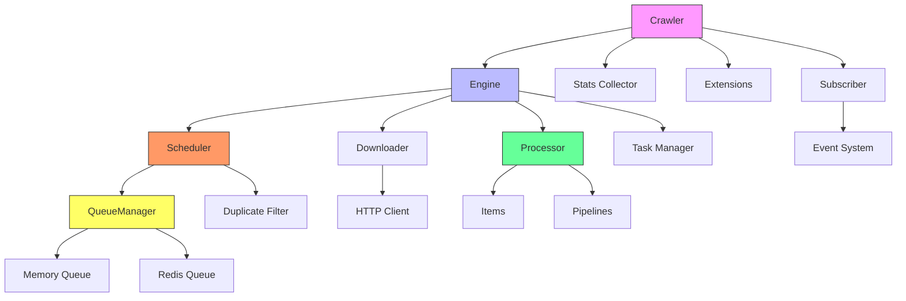

# 架构概述

Crawlo 是一个基于 asyncio 的现代异步网络爬虫框架，采用模块化设计，具有清晰的组件分离和良好的可扩展性。

## 核心架构

## 核心组件

### Crawler（爬虫控制器）
Crawler 是 Crawlo 框架的主要协调器，负责管理整个爬取作业的生命周期。它初始化和协调所有其他核心组件，包括引擎、调度器、下载器和处理器。

### Engine（引擎）
Engine 是 Crawlo 的核心执行单元，负责驱动整个爬取过程。它协调请求调度、页面下载和响应处理，确保数据在各个组件之间正确流动。

### Scheduler（调度器）
Scheduler 管理请求队列，实现基于优先级的调度和重复请求过滤。它与队列管理器和过滤器协同工作，确保请求按正确的顺序处理。

### Downloader（下载器）
Downloader 负责发送 HTTP 请求并获取网页内容。Crawlo 支持多种下载器实现，包括基于 aiohttp、httpx 和 curl-cffi 的下载器。

### Processor（处理器）
Processor 处理下载器返回的响应，调用用户定义的解析函数，并将提取的数据项路由到相应的数据管道。

### QueueManager（队列管理器）
QueueManager 提供统一的队列接口，支持内存队列和 Redis 队列的无缝切换，是实现分布式爬取的关键组件。

### Filter（过滤器）
Filter 实现请求去重功能，防止重复爬取相同的 URL。支持内存过滤器和基于 Redis 的分布式过滤器。

## 数据流

Crawlo 的数据流遵循以下过程：

1. **请求生成** - 爬虫或解析函数生成新的请求
2. **请求调度** - 调度器将请求添加到队列中
3. **请求获取** - 调度器从队列中获取下一个请求
4. **页面下载** - 下载器发送 HTTP 请求并获取响应
5. **响应处理** - 处理器调用用户定义的解析函数
6. **数据提取** - 解析函数提取数据项或生成新请求
7. **数据存储** - 数据项通过管道存储到目标位置

## 设计原则

### 模块化设计
Crawlo 采用模块化设计，各组件职责清晰，便于扩展和维护。核心模块包括引擎、下载器、调度器、中间件、管道、过滤器等。

### 异步非阻塞
基于 asyncio 实现异步非阻塞 I/O，充分利用系统资源，实现高并发处理能力。

### 可扩展性
通过中间件、管道和扩展机制，用户可以轻松定制和扩展框架功能。

### 配置驱动
提供强大的配置管理系统，支持通过配置文件灵活调整框架行为。

### 分布式支持
通过 Redis 实现任务分发与状态共享，支持多节点并行采集，具备良好的扩展性与容错能力。

## 性能特征

- **高并发** - 基于 asyncio 实现高并发请求处理
- **低延迟** - 异步非阻塞 I/O 减少等待时间
- **可扩展** - 支持水平扩展以处理大规模数据采集
- **资源优化** - 智能并发控制和背压机制优化资源使用