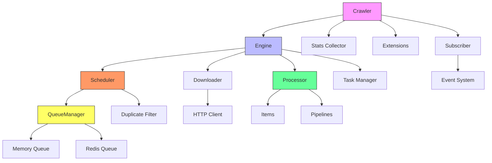

# Architecture Overview

Crawlo is a modern asynchronous web crawling framework based on asyncio, featuring a modular design with clear component separation and good extensibility.

## Core Architecture

## Core Components

### Crawler
Crawler is the main coordinator of the Crawlo framework, responsible for managing the entire crawling job lifecycle. It initializes and coordinates all other core components, including the engine, scheduler, downloader, and processor.

### Engine
Engine is the core execution unit of Crawlo, responsible for driving the entire crawling process. It coordinates request scheduling, page downloading, and response processing, ensuring data flows correctly between components.

### Scheduler
Scheduler manages request queues, implements priority-based scheduling, and filters duplicate requests. It works with the queue manager and filter to ensure requests are processed in the correct order.

### Downloader
Downloader is responsible for sending HTTP requests and fetching web content. Crawlo supports multiple downloader implementations, including aiohttp-based, httpx-based, and curl-cffi-based downloaders.

### Processor
Processor handles responses returned by the downloader, calls user-defined parsing functions, and routes extracted data items to the appropriate data pipelines.

### QueueManager
QueueManager provides a unified queue interface, supporting seamless switching between memory queues and Redis queues, which is a key component for implementing distributed crawling.

### Filter
Filter implements request deduplication functionality to prevent crawling the same URLs repeatedly. It supports both memory filters and Redis-based distributed filters.

## Data Flow

The data flow in Crawlo follows this process:

1. **Request Generation** - Spiders or parsing functions generate new requests
2. **Request Scheduling** - Scheduler adds requests to the queue
3. **Request Fetching** - Scheduler fetches the next request from the queue
4. **Page Downloading** - Downloader sends HTTP requests and fetches responses
5. **Response Processing** - Processor calls user-defined parsing functions
6. **Data Extraction** - Parsing functions extract data items or generate new requests
7. **Data Storage** - Data items are stored to target locations through pipelines

## Design Principles

### Modular Design
Crawlo adopts a modular design with clear responsibilities for each component, making it easy to extend and maintain. Core modules include engine, downloader, scheduler, middleware, pipeline, filter, etc.

### Asynchronous Non-blocking
Based on asyncio to implement asynchronous non-blocking I/O, fully utilizing system resources to achieve high-concurrency processing capabilities.

### Extensibility
Through middleware, pipeline, and extension mechanisms, users can easily customize and extend framework functionality.

### Configuration-driven
Provides a powerful configuration management system that supports flexible adjustment of framework behavior through configuration files.

### Distributed Support
Implements task distribution and state sharing through Redis, supporting multi-node parallel crawling with good scalability and fault tolerance.

## Performance Characteristics

- **High Concurrency** - High-concurrency request processing based on asyncio
- **Low Latency** - Asynchronous non-blocking I/O reduces waiting time
- **Scalability** - Supports horizontal scaling to handle large-scale data collection
- **Resource Optimization** - Intelligent concurrency control and backpressure mechanisms optimize resource usage