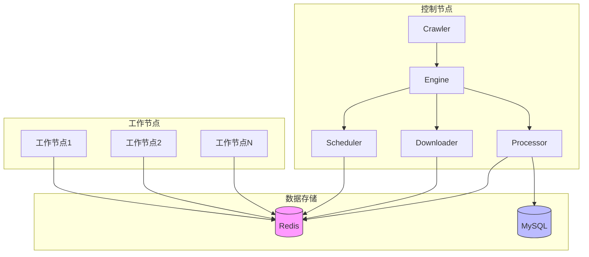

# 运行模式

Crawlo 支持两种主要的运行模式：单机模式和分布式模式。这两种模式在架构设计和使用场景上有显著差异。

## 单机模式

单机模式是 Crawlo 的默认运行模式，适用于小规模数据采集任务或开发测试环境。

### 特点

- **内存队列** - 使用内存中的优先级队列管理请求
- **内存过滤** - 使用内存中的集合进行请求去重
- **单进程** - 所有组件运行在单个进程中
- **简单配置** - 无需额外的外部服务依赖
- **快速启动** - 启动速度快，适合开发调试

### 适用场景

- 小规模数据采集（数千到数万条数据）
- 开发和测试阶段
- 不需要高并发的简单爬取任务
- 无法使用外部服务的环境

### 配置示例

```python
from crawlo.config import CrawloConfig

# 创建单机配置
config = CrawloConfig.standalone(
    project_name='my_standalone_project',
    concurrency=10,
    download_delay=1.0
)
```

## 分布式模式

分布式模式适用于大规模数据采集任务，支持多节点协同工作，具备良好的扩展性和容错能力。

### 特点

- **Redis 队列** - 使用 Redis 有序集合实现分布式任务队列
- **Redis 过滤** - 使用 Redis 集合实现分布式去重
- **多节点** - 支持多个工作节点并行处理
- **状态共享** - 通过 Redis 实现节点间状态同步
- **高可用** - 节点故障不影响整体任务执行

### 架构图



### 适用场景

- 大规模数据采集（数十万到数百万条数据）
- 需要高并发处理的爬取任务
- 长时间运行的爬虫项目
- 需要容错和高可用的生产环境

### 配置示例

```python
from crawlo.config import CrawloConfig

# 创建分布式配置
config = CrawloConfig.distributed(
    project_name='my_distributed_project',
    redis_host='127.0.0.1',
    redis_port=6379,
    redis_password='mypassword',
    concurrency=20,
    download_delay=0.5
)
```

## 模式切换

Crawlo 设计了灵活的模式切换机制，允许用户在不修改爬虫代码的情况下切换运行模式。

### 切换方式

1. **配置文件** - 通过不同的配置文件指定运行模式
2. **环境变量** - 通过环境变量动态切换模式
3. **命令行参数** - 通过命令行参数指定运行模式
4. **代码配置** - 通过 [CrawloConfig](../../api/crawlo_config.md) 类的工厂方法创建不同模式的配置

### 无缝切换示例

```python
# 爬虫代码保持不变
class MySpider(Spider):
    name = 'example'
    
    def parse(self, response):
        # 解析逻辑
        pass

# 通过配置切换模式
# 单机模式
config = CrawloConfig.standalone(project_name='example')

# 分布式模式
config = CrawloConfig.distributed(
    project_name='example',
    redis_host='127.0.0.1',
    redis_port=6379
)
```

## 性能对比

| 特性 | 单机模式 | 分布式模式 |
|------|----------|------------|
| **最大并发数** | 受单机资源限制 | 可通过增加节点无限扩展 |
| **去重能力** | 单机内存去重 | 分布式 Redis 去重 |
| **容错性** | 节点故障导致任务中断 | 节点故障不影响整体任务 |
| **资源利用率** | 单机资源利用 | 多机资源利用 |
| **配置复杂度** | 简单 | 需要 Redis 等外部服务 |
| **启动速度** | 快速 | 需要连接外部服务 |

## 最佳实践

### 选择运行模式的建议

1. **开发阶段** - 使用单机模式进行开发和调试
2. **小规模任务** - 数据量小于10万条时使用单机模式
3. **大规模任务** - 数据量超过10万条时考虑分布式模式
4. **生产环境** - 根据容错性要求选择合适的模式

### 模式迁移指南

从单机模式迁移到分布式模式时需要注意：

1. **配置调整** - 修改配置以使用 Redis 队列和过滤器
2. **Redis 部署** - 确保 Redis 服务可用且性能足够
3. **网络配置** - 确保所有节点能够访问 Redis 服务
4. **监控设置** - 配置分布式环境的监控和日志收集