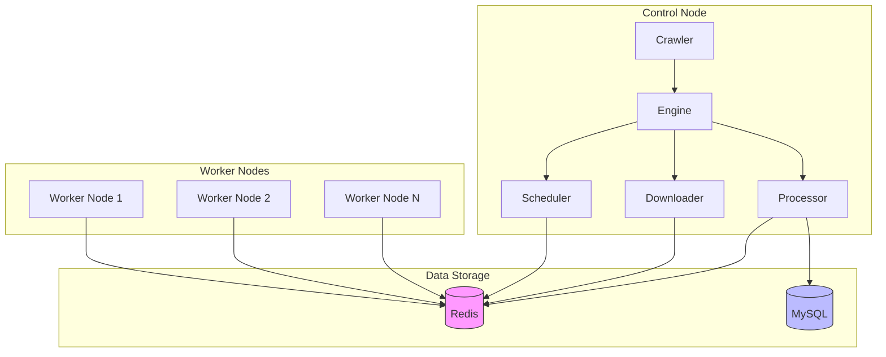

# Running Modes

Crawlo supports two main running modes: standalone mode and distributed mode. These modes have significant differences in architectural design and use cases.

## Standalone Mode

Standalone mode is the default running mode of Crawlo, suitable for small-scale data collection tasks or development and testing environments.

### Features

- **Memory Queue** - Uses in-memory priority queue to manage requests
- **Memory Filtering** - Uses in-memory sets for request deduplication
- **Single Process** - All components run in a single process
- **Simple Configuration** - No additional external service dependencies required
- **Fast Startup** - Quick startup, suitable for development and debugging

### Use Cases

- Small-scale data collection (thousands to tens of thousands of data items)
- Development and testing phase
- Simple crawling tasks that don't require high concurrency
- Environments where external services cannot be used

### Configuration Example

```python
from crawlo.config import CrawloConfig

# Create standalone configuration
config = CrawloConfig.standalone(
    project_name='my_standalone_project',
    concurrency=10,
    download_delay=1.0
)
```

## Distributed Mode

Distributed mode is suitable for large-scale data collection tasks, supporting multi-node collaborative work with good scalability and fault tolerance.

### Features

- **Redis Queue** - Uses Redis sorted sets to implement distributed task queues
- **Redis Filtering** - Uses Redis sets to implement distributed deduplication
- **Multi-node** - Supports multiple worker nodes processing in parallel
- **State Sharing** - Implements node-to-node state synchronization through Redis
- **High Availability** - Node failure does not affect overall task execution

### Architecture Diagram



### Use Cases

- Large-scale data collection (hundreds of thousands to millions of data items)
- Crawling tasks requiring high concurrency processing
- Long-running crawler projects
- Production environments requiring fault tolerance and high availability

### Configuration Example

```python
from crawlo.config import CrawloConfig

# Create distributed configuration
config = CrawloConfig.distributed(
    project_name='my_distributed_project',
    redis_host='127.0.0.1',
    redis_port=6379,
    redis_password='mypassword',
    concurrency=20,
    download_delay=0.5
)
```

## Mode Switching

Crawlo is designed with a flexible mode switching mechanism that allows users to switch running modes without modifying spider code.

### Switching Methods

1. **Configuration Files** - Specify running mode through different configuration files
2. **Environment Variables** - Dynamically switch modes through environment variables
3. **Command Line Arguments** - Specify running mode through command line arguments
4. **Code Configuration** - Create configurations for different modes through factory methods of the [CrawloConfig](../../api/crawlo_config.md) class

### Seamless Switching Example

```python
# Spider code remains unchanged
class MySpider(Spider):
    name = 'example'
    
    def parse(self, response):
        # Parsing logic
        pass

# Switch modes through configuration
# Standalone mode
config = CrawloConfig.standalone(project_name='example')

# Distributed mode
config = CrawloConfig.distributed(
    project_name='example',
    redis_host='127.0.0.1',
    redis_port=6379
)
```

## Performance Comparison

| Feature | Standalone Mode | Distributed Mode |
|---------|-----------------|------------------|
| **Maximum Concurrency** | Limited by single machine resources | Infinitely scalable by adding nodes |
| **Deduplication Capability** | Single-machine memory deduplication | Distributed Redis deduplication |
| **Fault Tolerance** | Node failure causes task interruption | Node failure does not affect overall tasks |
| **Resource Utilization** | Single-machine resource utilization | Multi-machine resource utilization |
| **Configuration Complexity** | Simple | Requires external services like Redis |
| **Startup Speed** | Fast | Requires connecting to external services |

## Best Practices

### Recommendations for Choosing Running Modes

1. **Development Phase** - Use standalone mode for development and debugging
2. **Small-scale Tasks** - Use standalone mode for data volumes less than 100,000 items
3. **Large-scale Tasks** - Consider distributed mode for data volumes exceeding 100,000 items
4. **Production Environment** - Choose the appropriate mode based on fault tolerance requirements

### Mode Migration Guide

When migrating from standalone mode to distributed mode, pay attention to:

1. **Configuration Adjustment** - Modify configuration to use Redis queues and filters
2. **Redis Deployment** - Ensure Redis service is available and performant
3. **Network Configuration** - Ensure all nodes can access Redis service
4. **Monitoring Setup** - Configure monitoring and log collection for distributed environment