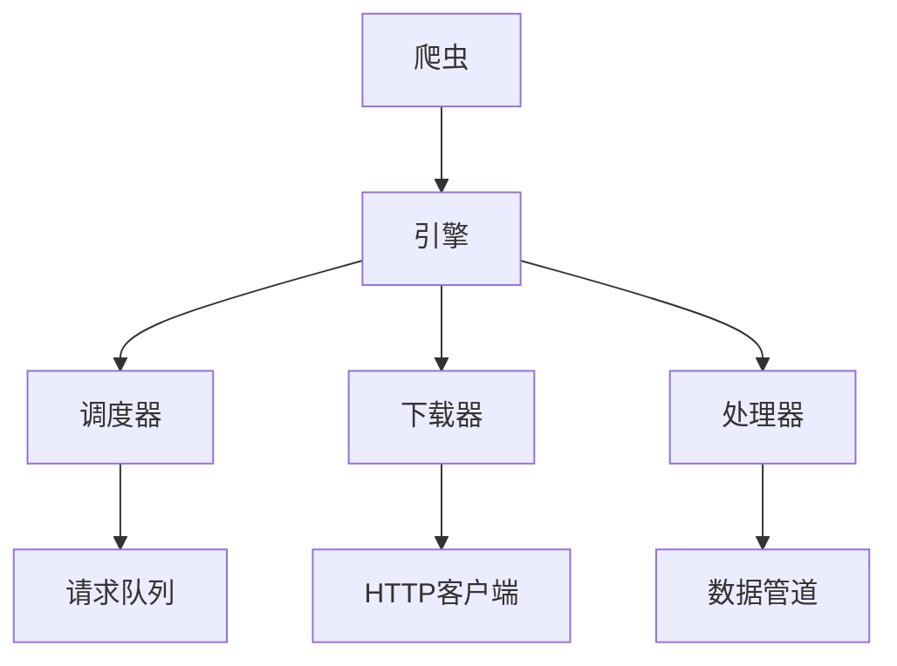

# 引擎

引擎是Crawlo框架的核心组件，负责协调整个爬取过程。它管理调度器、下载器和处理器组件之间的交互。

## 概述

引擎作为所有爬取活动的编排者。它负责：

- 初始化和管理爬取生命周期
- 协调不同组件（调度器、下载器、处理器）之间的工作
- 处理请求调度和响应处理
- 管理并发和背压
- 跟踪统计信息和性能指标

## 架构

引擎采用模块化设计，将特定职责委托给专门的组件：



## 主要特性

### 并发管理

引擎通过任务管理器管理并发操作，该管理器遵循配置的并发限制：

```python
# 配置
CONCURRENCY = 16  # 最大并发请求数
```

### 背压控制

引擎实现背压机制以防止系统过载：

- 队列大小监控
- 请求生成节流
- 基于系统负载的动态调整

### 请求处理流程

1. **请求生成**：引擎处理来自爬虫的起始请求
2. **请求调度**：请求通过调度器入队
3. **请求获取**：下载器从队列中获取请求
4. **响应处理**：响应由处理器处理
5. **数据项处理**：提取的数据项通过管道传递

## API参考

### `Engine(crawler)`

创建一个新的引擎实例。

**参数：**
- `crawler`：拥有此引擎的爬虫实例

### `async start_spider(spider)`

为特定爬虫初始化引擎组件。

**参数：**
- `spider`：要启动的爬虫实例

### `async crawl()`

启动爬取过程。此方法运行主爬取循环，该循环：
- 从调度器获取请求
- 通过下载器和处理器处理响应
- 继续执行直到所有工作完成

### `async close_spider()`

在爬取完成时清理资源并关闭所有组件。

## 配置选项

引擎可以通过各种设置进行配置：

| 设置 | 描述 | 默认值 |
|------|------|--------|
| `CONCURRENCY` | 最大并发请求数 | 8 |
| `DOWNLOAD_DELAY` | 请求之间的延迟 | 1.0 |
| `SCHEDULER_MAX_QUEUE_SIZE` | 最大队列大小 | 2000 |
| `BACKPRESSURE_RATIO` | 背压的队列满度阈值 | 0.8 |

## 使用示例

```python
from crawlo.core.engine import Engine

# 创建引擎实例
engine = Engine(crawler)

# 启动爬虫
await engine.start_spider(my_spider)

# 开始爬取
await engine.crawl()

# 清理
await engine.close_spider()
```

## 性能考虑

- 监控队列大小以避免内存问题
- 根据目标服务器容量调整并发设置
- 使用适当的下载延迟以尊重服务器
- 启用统计信息收集以进行性能监控