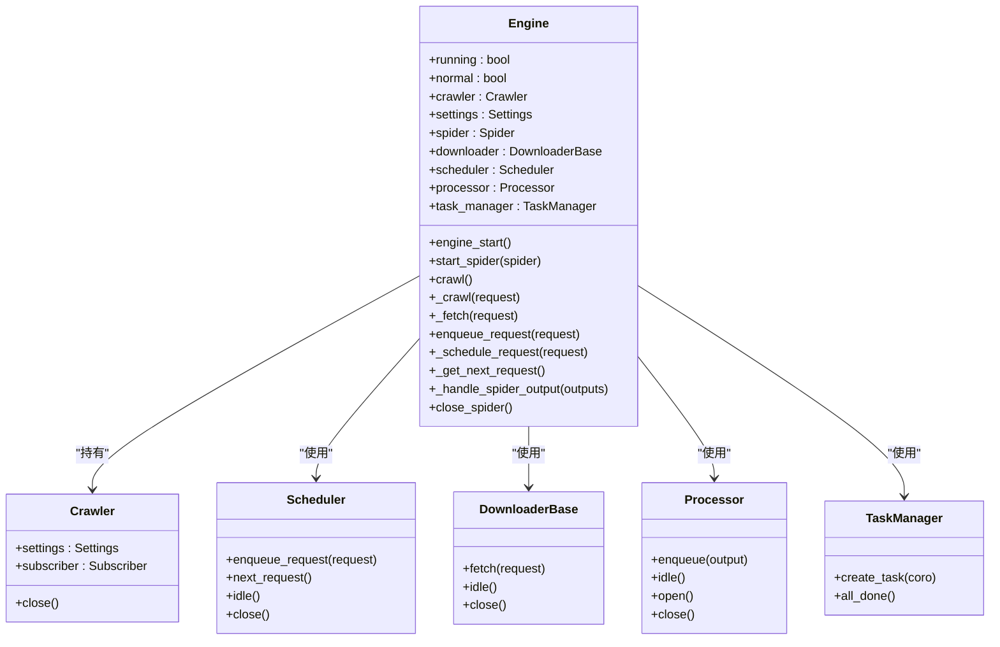
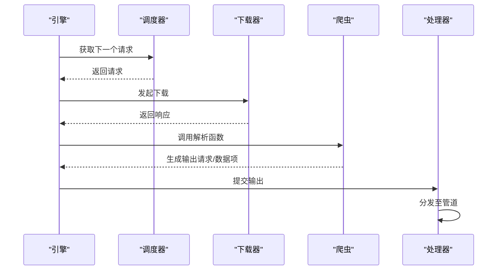

# 引擎 (Engine)

引擎是 Crawlo 框架的核心协调者，负责调度请求、管理下载与处理流程，是整个爬取过程的中央执行单元。

## 概述

引擎作为 Crawlo 的核心执行单元，通过协调请求获取、响应处理和项目处理来驱动爬取过程。它是连接调度器、下载器和处理器的中枢，确保数据在各个组件之间正确流动。

### 核心职责

1. **请求调度** - 从调度器获取下一个待处理的请求
2. **页面下载** - 调用下载器获取网页内容
3. **响应处理** - 将下载的响应传递给处理器进行解析
4. **任务管理** - 管理并发任务和资源分配
5. **生命周期管理** - 控制爬虫的启动、运行和关闭过程

## 类结构



## 工作流程

### 请求处理流程



### 启动流程

1. **初始化** - 创建引擎实例并初始化相关组件
2. **启动爬虫** - 调用 [start_spider()](#start_spider) 方法启动指定爬虫
3. **引擎启动** - 调用 [engine_start()](#engine_start) 方法启动引擎主循环
4. **任务执行** - 在主循环中不断获取请求、下载页面、处理响应
5. **关闭流程** - 爬取完成后执行关闭流程，释放资源

## 核心方法

### engine_start()

启动引擎主循环，开始处理请求。

```python
async def engine_start(self):
    """启动引擎主循环"""
    self.running = True
    while self.running:
        # 获取下一个请求
        request = await self._get_next_request()
        if request:
            # 处理请求
            await self._crawl(request)
        else:
            # 检查是否所有任务完成
            if self.task_manager.all_done():
                break
            # 等待一段时间后重试
            await asyncio.sleep(0.1)
```

### start_spider(spider)

启动指定的爬虫实例。

**参数:**
- `spider` - 要启动的爬虫实例

### crawl()

启动爬取过程，处理初始请求。

### _crawl(request)

处理单个请求的完整流程。

**参数:**
- `request` - 要处理的请求对象

### _fetch(request)

获取指定请求的响应。

**参数:**
- `request` - 要获取响应的请求对象

**返回:**
- 响应对象

### enqueue_request(request)

将请求添加到调度器队列。

**参数:**
- `request` - 要排队的请求对象

### _get_next_request()

从调度器获取下一个待处理的请求。

**返回:**
- 下一个请求对象，如果没有则返回 None

## 配置选项

引擎的行为可以通过以下配置项进行调整：

| 配置项 | 类型 | 默认值 | 说明 |
|--------|------|--------|------|
| CONCURRENCY | int | 16 | 并发请求数 |
| DOWNLOAD_DELAY | float | 0.5 | 下载延迟（秒） |
| DOWNLOAD_TIMEOUT | int | 30 | 下载超时时间（秒） |
| MAX_RETRY_TIMES | int | 3 | 最大重试次数 |

## 性能优化

### 并发控制

引擎通过任务管理器控制并发请求数，避免对目标网站造成过大压力：

```python
# 限制并发数
semaphore = asyncio.Semaphore(self.settings.CONCURRENCY)
async with semaphore:
    response = await self._fetch(request)
```

### 背压机制

当任务管理器负载过高时，引擎会自动暂停请求生成：

```python
# 检查任务管理器状态
if not self.task_manager.all_done():
    # 等待任务完成
    await self.task_manager.wait_for_done()
```

## 错误处理

### 异常捕获

引擎在处理请求时会捕获并处理各种异常：

```python
try:
    response = await self._fetch(request)
except asyncio.TimeoutError:
    # 处理超时
    self.logger.warning(f"请求超时: {request.url}")
except Exception as e:
    # 处理其他异常
    self.logger.error(f"请求失败: {request.url}, 错误: {e}")
```

### 重试机制

对于失败的请求，引擎支持自动重试：

```python
# 增加重试次数
request.retry_times += 1
if request.retry_times < self.settings.MAX_RETRY_TIMES:
    # 重新排队
    await self.enqueue_request(request)
else:
    # 记录失败请求
    self.logger.error(f"请求重试次数已达上限: {request.url}")
```

## 监控和日志

引擎集成了详细的日志记录和监控功能：

```python
# 记录请求处理日志
self.logger.info(f"开始处理请求: {request.url}")
self.logger.debug(f"请求详情: {request.to_dict()}")

# 记录响应信息
self.logger.info(f"响应状态码: {response.status_code}")
self.logger.debug(f"响应内容大小: {len(response.content)} bytes")
```

## 最佳实践

### 合理配置并发数

根据目标网站的承受能力和本地资源情况设置合适的并发数：

```python
# 对于高负载网站，降低并发数
config = CrawloConfig.standalone(concurrency=5)

# 对于低负载网站，可以提高并发数
config = CrawloConfig.standalone(concurrency=20)
```

### 设置适当的延迟

设置下载延迟以避免对目标网站造成过大压力：

```python
# 设置1秒延迟
config = CrawloConfig.standalone(download_delay=1.0)
```

### 监控引擎状态

定期监控引擎运行状态和性能指标：

```python
# 获取引擎状态
status = engine.get_status()
print(f"当前并发数: {status['concurrency']}")
print(f"待处理请求数: {status['pending_requests']}")
```