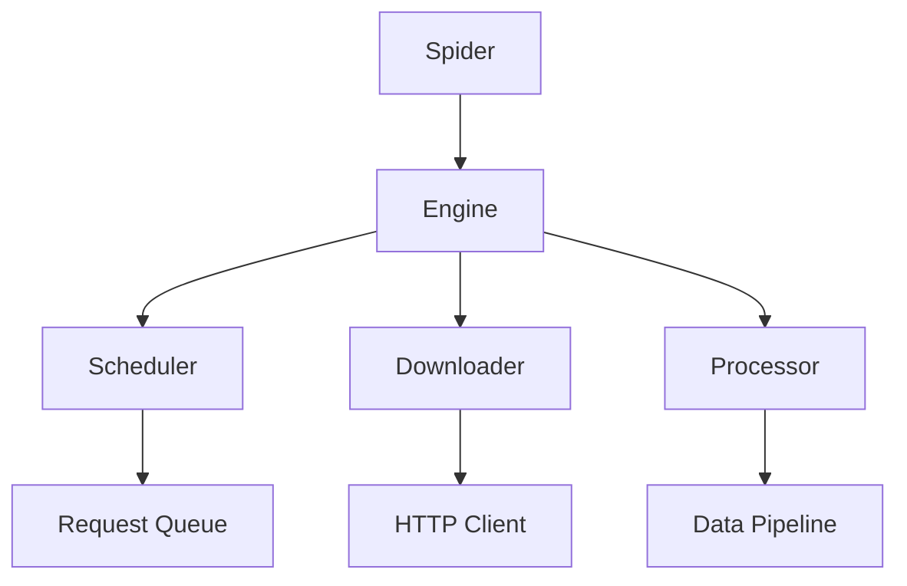

# Engine

The Engine is the central component of the Crawlo framework that coordinates the entire crawling process. It manages the interaction between the scheduler, downloader, and processor components.

## Overview

The Engine serves as the orchestrator for all crawling activities. It is responsible for:

- Initializing and managing the crawling lifecycle
- Coordinating between different components (scheduler, downloader, processor)
- Handling request scheduling and response processing
- Managing concurrency and backpressure
- Tracking statistics and performance metrics

## Architecture

The Engine follows a modular design where it delegates specific responsibilities to specialized components:



## Key Features

### Concurrency Management

The Engine manages concurrent operations through a task manager that respects the configured concurrency limits:

```python
# Configuration
CONCURRENCY = 16  # Maximum concurrent requests
```

### Backpressure Control

The Engine implements backpressure mechanisms to prevent overwhelming the system:

- Queue size monitoring
- Request generation throttling
- Dynamic adjustment based on system load

### Request Processing Flow

1. **Request Generation**: The Engine processes start requests from spiders
2. **Request Scheduling**: Requests are enqueued through the scheduler
3. **Request Fetching**: The downloader fetches requests from the queue
4. **Response Processing**: Responses are processed by the processor
5. **Item Handling**: Extracted items are passed through the pipeline

## API Reference

### `Engine(crawler)`

Creates a new Engine instance.

**Parameters:**
- `crawler`: The crawler instance that owns this engine

### `async start_spider(spider)`

Initializes the engine components for a specific spider.

**Parameters:**
- `spider`: The spider instance to start

### `async crawl()`

Starts the crawling process. This method runs the main crawling loop that:
- Fetches requests from the scheduler
- Processes responses through the downloader and processor
- Continues until all work is completed

### `async close_spider()`

Cleans up resources and closes all components when crawling is finished.

## Configuration Options

The Engine can be configured through various settings:

| Setting | Description | Default |
|---------|-------------|---------|
| `CONCURRENCY` | Maximum concurrent requests | 8 |
| `DOWNLOAD_DELAY` | Delay between requests | 1.0 |
| `SCHEDULER_MAX_QUEUE_SIZE` | Maximum queue size | 2000 |
| `BACKPRESSURE_RATIO` | Queue fullness threshold for backpressure | 0.8 |

## Example Usage

```python
from crawlo.core.engine import Engine

# Create engine instance
engine = Engine(crawler)

# Start spider
await engine.start_spider(my_spider)

# Begin crawling
await engine.crawl()

# Cleanup
await engine.close_spider()
```

## Performance Considerations

- Monitor queue sizes to avoid memory issues
- Adjust concurrency settings based on target server capacity
- Use appropriate download delays to be respectful to servers
- Enable statistics collection for performance monitoring