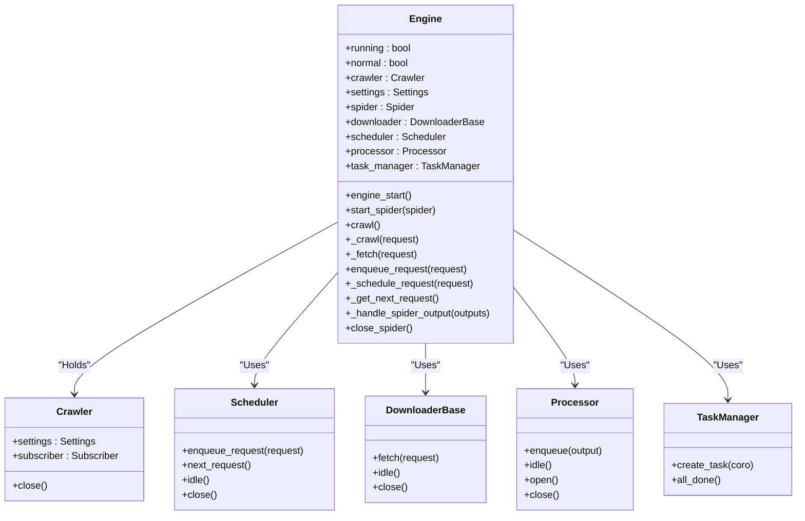
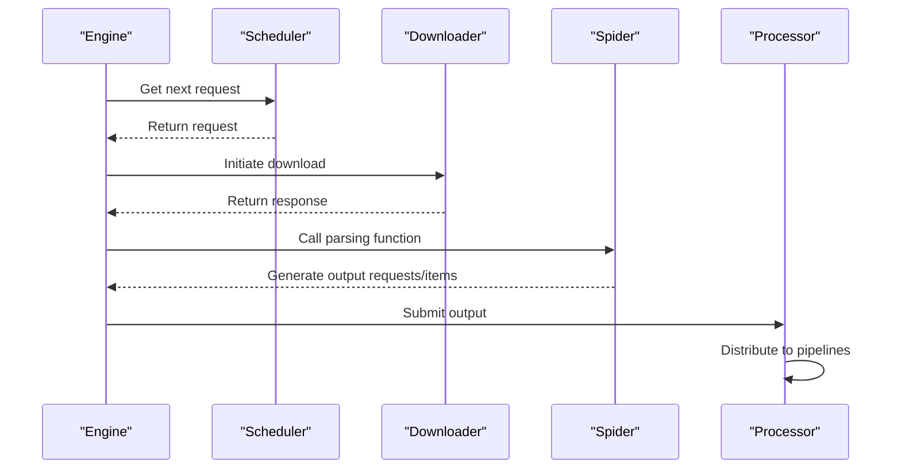

# Engine

The engine is the core coordinator of the Crawlo framework, responsible for scheduling requests, managing downloads and processing flows, and serves as the central execution unit of the entire crawling process.

## Overview

The engine acts as the core execution unit of Crawlo, driving the crawling process by coordinating request fetching, response processing, and item processing. It is the central hub connecting the scheduler, downloader, and processor, ensuring data flows correctly between components.

### Core Responsibilities

1. **Request Scheduling** - Get the next request to process from the scheduler
2. **Page Downloading** - Call the downloader to fetch web content
3. **Response Processing** - Pass the downloaded response to the processor for parsing
4. **Task Management** - Manage concurrent tasks and resource allocation
5. **Lifecycle Management** - Control the spider's start, run, and close processes

## Class Structure



## Workflow

### Request Processing Flow



### Startup Flow

1. **Initialization** - Create engine instance and initialize related components
2. **Start Spider** - Call [start_spider()](#start_spider) method to start the specified spider
3. **Engine Start** - Call [engine_start()](#engine_start) method to start the engine main loop
4. **Task Execution** - Continuously get requests, download pages, and process responses in the main loop
5. **Shutdown Process** - Execute shutdown process after crawling is complete to release resources

## Core Methods

### engine_start()

Start the engine main loop to begin processing requests.

```python
async def engine_start(self):
    """Start the engine main loop"""
    self.running = True
    while self.running:
        # Get the next request
        request = await self._get_next_request()
        if request:
            # Process request
            await self._crawl(request)
        else:
            # Check if all tasks are complete
            if self.task_manager.all_done():
                break
            # Wait for a while and retry
            await asyncio.sleep(0.1)
```

### start_spider(spider)

Start the specified spider instance.

**Parameters:**
- `spider` - The spider instance to start

### crawl()

Start the crawling process and handle initial requests.

### _crawl(request)

Process the complete flow of a single request.

**Parameters:**
- `request` - The request object to process

### _fetch(request)

Get the response for the specified request.

**Parameters:**
- `request` - The request object to get response for

**Returns:**
- Response object

### enqueue_request(request)

Add a request to the scheduler queue.

**Parameters:**
- `request` - The request object to queue

### _get_next_request()

Get the next request to process from the scheduler.

**Returns:**
- The next request object, or None if no requests available

## Configuration Options

The engine's behavior can be adjusted through the following configuration options:

| Configuration Item | Type | Default Value | Description |
|--------------------|------|---------------|-------------|
| CONCURRENCY | int | 16 | Concurrent requests |
| DOWNLOAD_DELAY | float | 0.5 | Download delay (seconds) |
| DOWNLOAD_TIMEOUT | int | 30 | Download timeout (seconds) |
| MAX_RETRY_TIMES | int | 3 | Maximum retry times |

## Performance Optimization

### Concurrency Control

The engine controls concurrent requests through the task manager to avoid putting excessive pressure on the target website:

```python
# Limit concurrency
semaphore = asyncio.Semaphore(self.settings.CONCURRENCY)
async with semaphore:
    response = await self._fetch(request)
```

### Backpressure Mechanism

When the task manager is overloaded, the engine automatically pauses request generation:

```python
# Check task manager status
if not self.task_manager.all_done():
    # Wait for tasks to complete
    await self.task_manager.wait_for_done()
```

## Error Handling

### Exception Capture

The engine captures and handles various exceptions when processing requests:

```python
try:
    response = await self._fetch(request)
except asyncio.TimeoutError:
    # Handle timeout
    self.logger.warning(f"Request timeout: {request.url}")
except Exception as e:
    # Handle other exceptions
    self.logger.error(f"Request failed: {request.url}, Error: {e}")
```

### Retry Mechanism

For failed requests, the engine supports automatic retry:

```python
# Increase retry count
request.retry_times += 1
if request.retry_times < self.settings.MAX_RETRY_TIMES:
    # Re-queue
    await self.enqueue_request(request)
else:
    # Log failed request
    self.logger.error(f"Request retry limit reached: {request.url}")
```

## Monitoring and Logging

The engine integrates detailed logging and monitoring features:

```python
# Log request processing
self.logger.info(f"Starting to process request: {request.url}")
self.logger.debug(f"Request details: {request.to_dict()}")

# Log response information
self.logger.info(f"Response status code: {response.status_code}")
self.logger.debug(f"Response content size: {len(response.content)} bytes")
```

## Best Practices

### Reasonable Concurrency Configuration

Set appropriate concurrency based on the target website's capacity and local resources:

```python
# For high-load websites, reduce concurrency
config = CrawloConfig.standalone(concurrency=5)

# For low-load websites, increase concurrency
config = CrawloConfig.standalone(concurrency=20)
```

### Set Appropriate Delays

Set download delays to avoid putting excessive pressure on the target website:

```python
# Set 1 second delay
config = CrawloConfig.standalone(download_delay=1.0)
```

### Monitor Engine Status

Regularly monitor engine runtime status and performance metrics:

```python
# Get engine status
status = engine.get_status()
print(f"Current concurrency: {status['concurrency']}")
print(f"Pending requests: {status['pending_requests']}")
```