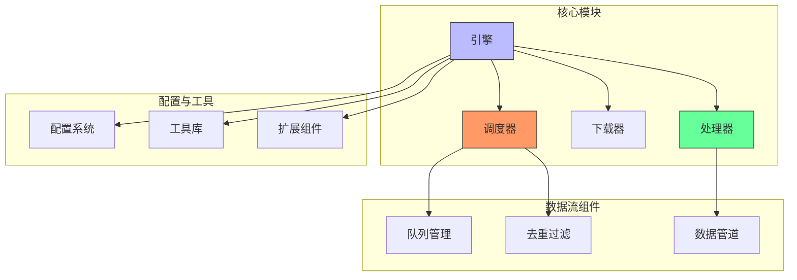

# 核心模块

核心模块是 Crawlo 框架的基础，包含引擎、调度器和处理器等关键组件，它们协同工作以执行网络爬取任务。

## 模块概述

Crawlo 的核心模块采用模块化、基于组件的设计，具有明确的关注点分离。系统基于事件驱动模型构建，能够实现响应式的生命周期管理和组件协调。

### 核心组件

1. [引擎 (Engine)](engine.md) - 中央执行单元，通过协调请求获取、响应处理和项目处理来驱动爬取过程
2. [调度器 (Scheduler)](scheduler.md) - 管理请求队列，实现基于优先级的调度和重复请求过滤
3. [处理器 (Processor)](processor.md) - 负责解析响应并将提取的数据转换为结构化项目
4. [爬虫基类 (Spider)](spider.md) - 爬虫基础类，定义爬虫的生命周期和接口

## 架构图



## 设计原则

### 模块化设计
核心模块采用模块化设计，各组件职责清晰，便于扩展和维护。每个组件都有明确的接口和职责，降低了组件间的耦合度。

### 异步非阻塞
基于 asyncio 实现异步非阻塞 I/O，充分利用系统资源，实现高并发处理能力。

### 可扩展性
通过中间件、管道和扩展机制，用户可以轻松定制和扩展框架功能。

### 事件驱动
采用事件驱动架构，组件通过事件进行通信和协调，提高了系统的灵活性和响应性。

## 组件交互

核心模块中的组件通过明确定义的接口进行交互，实现松耦合和可扩展性：

1. **Crawler** 作为主要协调器，管理爬取作业的生命周期并协调各组件
2. **Engine** 作为中央执行单元，通过协调请求获取、响应处理和项目处理来驱动爬取过程
3. **Scheduler** 管理请求队列，实现基于优先级的调度和重复请求过滤
4. **Processor** 负责解析响应并将提取的数据转换为结构化项目

## 性能特征

- **高并发处理** - 基于 asyncio 实现高并发请求处理
- **低延迟响应** - 异步非阻塞 I/O 减少等待时间
- **资源优化** - 智能并发控制和背压机制优化资源使用
- **可扩展架构** - 支持水平扩展以处理大规模数据采集

## 使用指南

### 初始化核心组件

```python
from crawlo.crawler import Crawler
from crawlo.config import CrawloConfig

# 创建配置
config = CrawloConfig.standalone(
    project_name='my_project',
    concurrency=10
)

# 初始化爬虫
crawler = Crawler(config)
```

### 启动爬取过程

```python
# 启动爬虫
await crawler.start_spider(my_spider)
```

## 最佳实践

### 组件配置

1. **合理设置并发数** - 根据目标网站的承受能力和本地资源情况设置合适的并发数
2. **配置适当的延迟** - 设置下载延迟以避免对目标网站造成过大压力
3. **调整超时时间** - 根据网络环境和目标网站响应速度调整超时时间

### 错误处理

1. **异常捕获** - 在关键组件中实现适当的异常捕获和处理机制
2. **重试机制** - 配置合理的重试次数和重试间隔
3. **日志记录** - 详细记录组件运行状态和错误信息

### 性能优化

1. **资源监控** - 监控系统资源使用情况，及时调整配置
2. **瓶颈识别** - 识别性能瓶颈并针对性优化
3. **扩展策略** - 根据业务需求选择合适的扩展策略