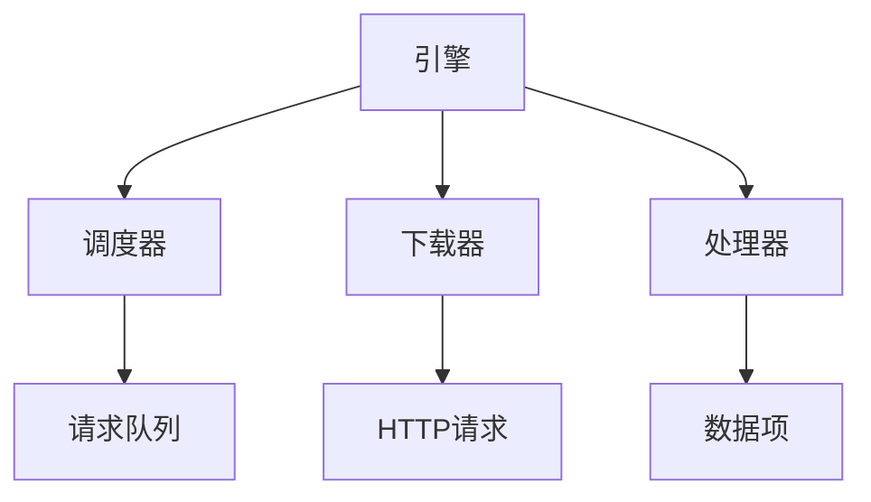

# 核心模块

核心模块是Crawlo框架的核心，提供协调整个爬取过程的基础组件。

## 目录
- [引擎](engine.md) - 编排爬取过程的核心引擎
- [调度器](scheduler.md) - 管理请求队列和去重
- [处理器](processor.md) - 处理响应和提取数据项
- [startproject 命令](cli_startproject.md) - 项目初始化命令

## 概述

核心模块由三个主要组件组成，它们协同工作以管理爬取工作流：

1. **引擎**：管理爬取生命周期的中央协调器
2. **调度器**：处理请求排队、优先级排序和去重
3. **处理器**：处理响应并提取数据项

## 架构



## 主要特性

- **异步处理**：基于asyncio构建，实现高性能并发操作
- **模块化设计**：每个组件都可以扩展或替换
- **事件驱动**：使用事件系统进行通知和监控
- **统计数据收集**：内置指标和性能跟踪
- **健康监控**：实时状态报告和诊断

## 配置

核心模块可以通过项目`settings.py`中的各种设置进行配置：

```python
# 引擎配置
CONCURRENCY = 16
DOWNLOAD_DELAY = 1.0

# 调度器配置
SCHEDULER_MAX_QUEUE_SIZE = 2000
QUEUE_TYPE = 'auto'

# 处理器配置
ITEM_PROCESSING_ENABLED = True
```

有关每个核心组件的详细信息，请参阅单独的文档页面。