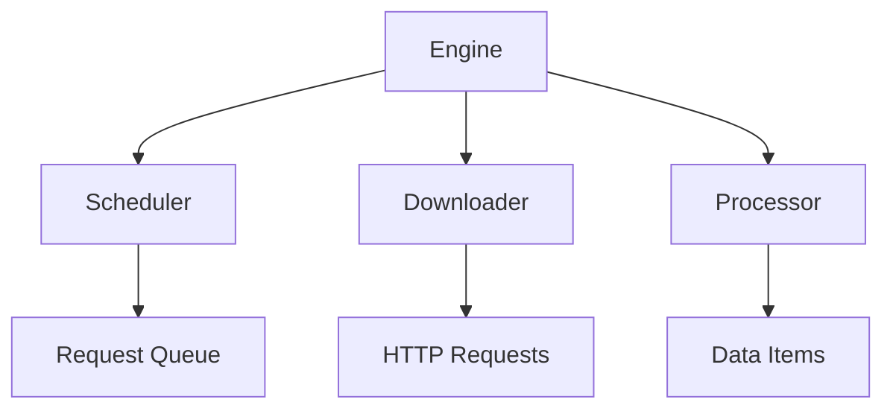

# Core Module

The core module is the heart of the Crawlo framework, providing the fundamental components that coordinate the entire crawling process.

## Table of Contents
- [Engine](engine_en.md) - The core engine that orchestrates the crawling process
- [Scheduler](scheduler_en.md) - Manages request queues and deduplication
- [Processor](processor_en.md) - Handles response processing and item extraction
- [startproject Command](cli_startproject_en.md) - Project initialization command

## Overview

The core module consists of three main components that work together to manage the crawling workflow:

1. **Engine**: The central coordinator that manages the crawling lifecycle
2. **Scheduler**: Handles request queuing, prioritization, and deduplication
3. **Processor**: Processes responses and extracts data items

## Architecture



## Key Features

- **Asynchronous Processing**: Built on asyncio for high-performance concurrent operations
- **Modular Design**: Each component can be extended or replaced
- **Event-Driven**: Uses an event system for notifications and monitoring
- **Statistics Collection**: Built-in metrics and performance tracking
- **Health Monitoring**: Real-time status reporting and diagnostics

## Configuration

The core module can be configured through various settings in your project's `settings.py`:

```python
# Engine configuration
CONCURRENCY = 16
DOWNLOAD_DELAY = 1.0

# Scheduler configuration
SCHEDULER_MAX_QUEUE_SIZE = 2000
QUEUE_TYPE = 'auto'

# Processor configuration
ITEM_PROCESSING_ENABLED = True
```

For detailed information about each core component, see the individual documentation pages.