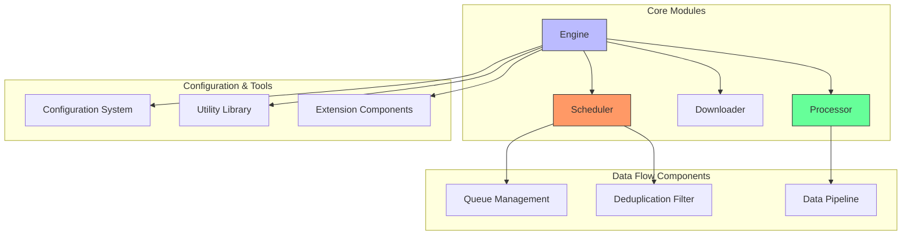

# Core Modules

The core modules are the foundation of the Crawlo framework, containing key components such as the engine, scheduler, and processor that work together to perform web crawling tasks.

## Module Overview

Crawlo's core modules adopt a modular, component-based design with clear separation of concerns. The system is built on an event-driven model that enables responsive lifecycle management and component coordination.

### Core Components

1. [Engine](engine_en.md) - Central execution unit that drives the crawling process by coordinating request fetching, response processing, and item processing
2. [Scheduler](scheduler_en.md) - Manages request queues, implements priority-based scheduling and duplicate request filtering
3. [Processor](processor_en.md) - Responsible for parsing responses and converting extracted data into structured items
4. [Spider Base Class](spider_en.md) - Spider base class that defines the spider's lifecycle and interface

## Architecture Diagram



## Design Principles

### Modular Design
The core modules adopt a modular design with clear component responsibilities, making them easy to extend and maintain. Each component has a clear interface and responsibility, reducing coupling between components.

### Asynchronous Non-blocking
Based on asyncio to implement asynchronous non-blocking I/O, fully utilizing system resources to achieve high-concurrency processing capabilities.

### Extensibility
Through middleware, pipeline, and extension mechanisms, users can easily customize and extend framework functionality.

### Event-driven
Adopting an event-driven architecture, components communicate and coordinate through events, improving system flexibility and responsiveness.

## Component Interaction

Components in the core modules interact through clearly defined interfaces, achieving loose coupling and extensibility:

1. **Crawler** acts as the main coordinator, managing the lifecycle of crawling jobs and coordinating components
2. **Engine** acts as the central execution unit, driving the crawling process by coordinating request fetching, response processing, and item processing
3. **Scheduler** manages request queues, implementing priority-based scheduling and duplicate request filtering
4. **Processor** is responsible for parsing responses and converting extracted data into structured items

## Performance Characteristics

- **High-concurrency Processing** - High-concurrency request processing based on asyncio
- **Low-latency Response** - Asynchronous non-blocking I/O reduces waiting time
- **Resource Optimization** - Intelligent concurrency control and backpressure mechanisms optimize resource usage
- **Scalable Architecture** - Supports horizontal scaling to handle large-scale data collection

## Usage Guide

### Initializing Core Components

```python
from crawlo.crawler import Crawler
from crawlo.config import CrawloConfig

# Create configuration
config = CrawloConfig.standalone(
    project_name='my_project',
    concurrency=10
)

# Initialize crawler
crawler = Crawler(config)
```

### Starting the Crawling Process

```python
# Start the spider
await crawler.start_spider(my_spider)
```

## Best Practices

### Component Configuration

1. **Reasonable Concurrency Settings** - Set appropriate concurrency based on the target website's capacity and local resources
2. **Appropriate Delay Configuration** - Set download delays to avoid putting excessive pressure on the target website
3. **Timeout Adjustment** - Adjust timeout settings based on network environment and target website response speed

### Error Handling

1. **Exception Capture** - Implement appropriate exception capture and handling mechanisms in key components
2. **Retry Mechanism** - Configure reasonable retry attempts and intervals
3. **Logging** - Detailed logging of component runtime status and error information

### Performance Optimization

1. **Resource Monitoring** - Monitor system resource usage and adjust configurations in a timely manner
2. **Bottleneck Identification** - Identify performance bottlenecks and optimize them specifically
3. **Scaling Strategy** - Choose appropriate scaling strategies based on business requirements