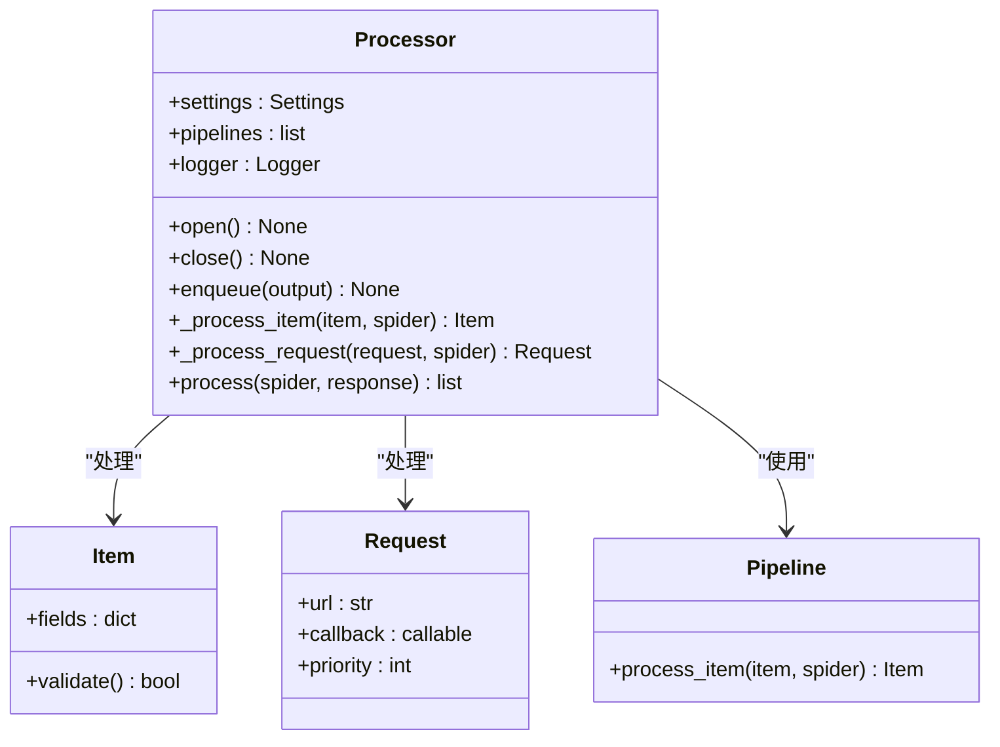
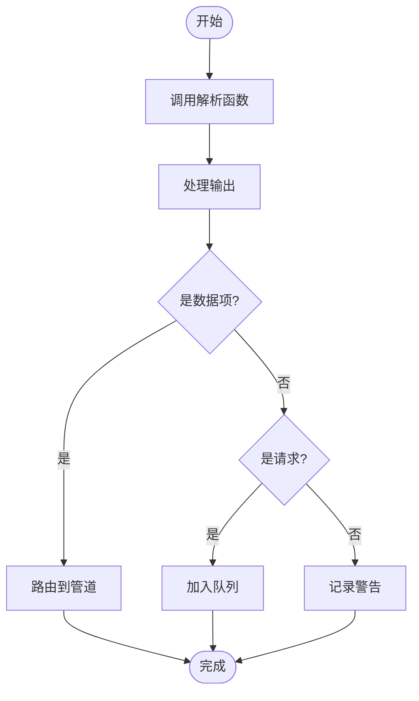
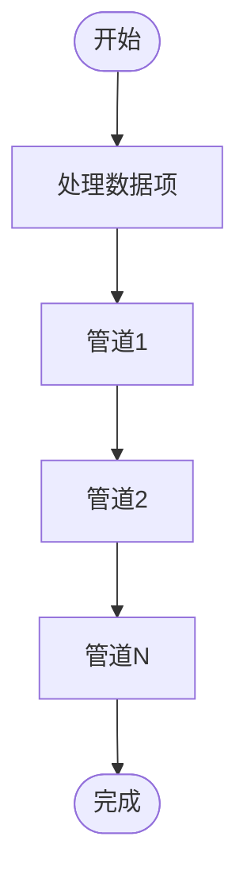

# 处理器 (Processor)

处理器是 Crawlo 框架中负责解析响应并将提取的数据转换为结构化项目的核心组件。它连接了下载器和数据管道，是数据流转的关键环节。

## 概述

处理器作为响应处理的核心，负责调用用户定义的解析函数，处理解析函数生成的输出（请求或数据项），并将数据项传递给数据管道进行存储。

### 核心职责

1. **响应解析** - 调用爬虫的解析函数处理响应
2. **输出处理** - 处理解析函数生成的请求和数据项
3. **数据路由** - 将数据项路由到相应的数据管道
4. **错误处理** - 处理解析过程中的异常

## 类结构



## 工作流程

### 响应处理流程



### 数据项处理流程



## 核心方法

### process(spider, response)

处理爬虫对响应的解析。

**参数:**
- `spider` - 爬虫实例
- `response` - 响应对象

**返回:**
- 解析函数生成的输出列表

```python
async def process(self, spider, response):
    """处理爬虫对响应的解析"""
    outputs = []
    
    # 调用爬虫的解析函数
    try:
        parse_output = spider.parse(response)
        if inspect.isasyncgen(parse_output):
            # 异步生成器
            async for output in parse_output:
                outputs.append(output)
        elif inspect.isgenerator(parse_output):
            # 同步生成器
            for output in parse_output:
                outputs.append(output)
        else:
            # 单个输出
            if parse_output is not None:
                outputs.append(parse_output)
    except Exception as e:
        self.logger.error(f"解析函数执行失败: {e}")
        return []
    
    return outputs
```

### enqueue(output)

将输出加入处理队列。

**参数:**
- `output` - 解析函数生成的输出（请求或数据项）

```python
def enqueue(self, output):
    """将输出加入处理队列"""
    if isinstance(output, Item):
        # 处理数据项
        self._process_item(output)
    elif isinstance(output, Request):
        # 处理请求
        self._process_request(output)
    else:
        self.logger.warning(f"未知的输出类型: {type(output)}")
```

### _process_item(item)

处理数据项并路由到管道。

**参数:**
- `item` - 要处理的数据项

```python
def _process_item(self, item):
    """处理数据项并路由到管道"""
    # 验证数据项
    if not item.validate():
        self.logger.warning(f"数据项验证失败: {item}")
        return
    
    # 通过管道处理
    for pipe in self.pipelines:
        try:
            item = pipe.process_item(item, self.spider)
            if item is None:
                # 管道返回 None 表示丢弃该数据项
                return
        except Exception as e:
            self.logger.error(f"管道处理失败: {e}")
            return
```

### _process_request(request)

处理请求并加入调度器队列。

**参数:**
- `request` - 要处理的请求

```python
def _process_request(self, request):
    """处理请求并加入调度器队列"""
    # 可以在这里对请求进行额外处理
    # 例如：添加默认头部、设置优先级等
    
    # 加入调度器队列
    self.scheduler.enqueue_request(request)
```

### open()

打开处理器，初始化相关资源。

### close()

关闭处理器，释放相关资源。

## 管道集成

处理器与数据管道紧密集成，支持多种类型的管道：

### 内置管道

1. **ConsolePipeline** - 将数据项输出到控制台
2. **JsonPipeline** - 将数据项保存为 JSON 格式
3. **CsvPipeline** - 将数据项保存为 CSV 格式
4. **MySQLPipeline** - 将数据项存储到 MySQL 数据库
5. **MongoPipeline** - 将数据项存储到 MongoDB 数据库

### 自定义管道

用户可以创建自定义管道来处理特定的数据处理需求：

```python
class CustomPipeline:
    def process_item(self, item, spider):
        """处理数据项"""
        # 自定义处理逻辑
        item.processed = True
        return item
```

## 错误处理

### 解析函数异常

处理器会捕获并处理解析函数执行中的异常：

```python
try:
    parse_output = spider.parse(response)
except Exception as e:
    self.logger.error(f"解析函数执行失败: {response.url}, 错误: {e}")
    # 可以选择重试或记录失败
```

### 管道处理异常

处理器会捕获并处理管道处理中的异常：

```python
for pipe in self.pipelines:
    try:
        item = pipe.process_item(item, self.spider)
    except Exception as e:
        self.logger.error(f"管道处理失败: {pipe.__class__.__name__}, 错误: {e}")
        # 继续处理下一个管道
```

## 配置选项

处理器的行为可以通过以下配置项进行调整：

| 配置项 | 类型 | 默认值 | 说明 |
|--------|------|--------|------|
| PIPELINES | list | [] | 数据管道列表 |
| ITEM_PROCESSOR_DEBUG | bool | False | 是否启用数据项处理调试模式 |

## 性能优化

### 批量处理

对于大量数据项的场景，可以使用批量处理提高效率：

```python
# 批量处理数据项
items = [Item(data=i) for i in range(100)]
for item in items:
    processor.enqueue(item)
```

### 异步处理

支持异步解析函数以提高处理效率：

```python
class MySpider(Spider):
    async def parse(self, response):
        # 异步处理逻辑
        async for item in self.extract_items(response):
            yield item
```

## 监控和日志

处理器集成了详细的日志记录功能：

```python
# 记录解析结果
self.logger.info(f"解析完成: {response.url}, 生成 {len(outputs)} 个输出")

# 记录数据项处理
self.logger.debug(f"数据项已处理: {item}")

# 记录请求处理
self.logger.debug(f"请求已加入队列: {request.url}")
```

## 最佳实践

### 管道配置

合理配置数据管道以满足不同的数据存储需求：

```python
# 配置多个管道
PIPELINES = [
    'crawlo.pipelines.ConsolePipeline',
    'crawlo.pipelines.JsonPipeline',
    'crawlo.pipelines.MySQLPipeline',
]
```

### 数据项验证

在数据项中实现验证逻辑确保数据质量：

```python
class ProductItem(Item):
    def validate(self):
        """验证数据项"""
        if not self.get('name'):
            return False
        if not self.get('price'):
            return False
        return True
```

### 异常处理

在解析函数中实现适当的异常处理：

```python
def parse(self, response):
    """解析响应"""
    try:
        # 解析逻辑
        yield ProductItem(
            name=response.extract_text('h1'),
            price=response.extract_text('.price')
        )
    except Exception as e:
        self.logger.error(f"解析失败: {response.url}, 错误: {e}")
        # 可以选择重试或跳过
```