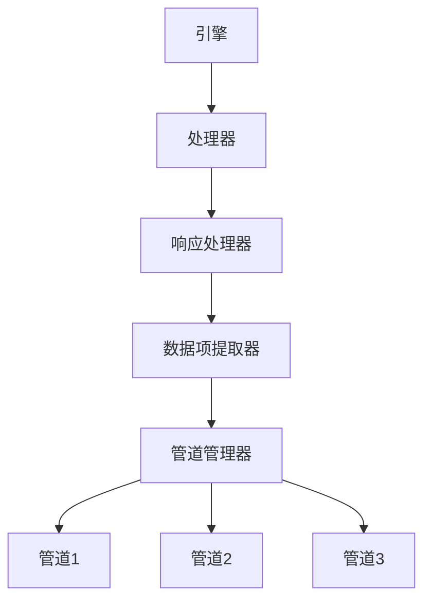

# 处理器

处理器负责处理响应处理和数据项提取。它管理从下载器到管道系统的响应流。

## 概述

处理器作为下载器和管道系统之间的桥梁。其主要职责包括：

- 处理来自下载器的响应
- 从响应中提取数据项
- 管理数据项处理管道
- 处理数据项去重和过滤

## 架构

处理器与管道管理器协同工作以处理数据项：



## 主要特性

### 响应处理

处理器处理来自下载器的响应：

- 解析响应内容
- 根据爬虫回调提取数据
- 管理提取的数据项到管道的流动

### 数据项管理

处理器通过管道系统管理数据项：

- 将数据项路由到配置的管道
- 处理数据项去重
- 跟踪数据项处理统计信息

### 与管道集成

处理器与管道模块集成以提供：

- 顺序数据项处理
- 可配置的管道链
- 错误处理和数据项过滤

## API参考

### `Processor(crawler)`

创建一个新的处理器实例。

**参数：**
- `crawler`：拥有此处理器的爬虫实例

### `async enqueue(item_or_request)`

将数据项或请求添加到处理队列中。

**参数：**
- `item_or_request`：要处理的数据项或请求

### `idle()`

检查处理器是否空闲（无待处理数据项）。

**返回：**
- `bool`：如果处理器空闲则为True

### `async close()`

在不再需要处理器时清理资源。

## 配置选项

处理器与管道配置协同工作：

| 设置 | 描述 | 默认值 |
|------|------|--------|
| `PIPELINES` | 要使用的管道类列表 | [] |
| `ITEM_PROCESSING_ENABLED` | 是否启用数据项处理 | True |

## 使用示例

```python
from crawlo.core.processor import Processor

# 创建处理器实例
processor = Processor(crawler)

# 入队数据项进行处理
await processor.enqueue(item)

# 检查是否空闲
if processor.idle():
    print("无待处理数据项")

# 清理
await processor.close()
```

## 性能考虑

- 监控管道处理时间以识别瓶颈
- 为数据存储需求使用适当的管道配置
- 实现高效的数据项去重以避免处理重复数据
- 为大数据集配置管道批处理以获得更好的性能