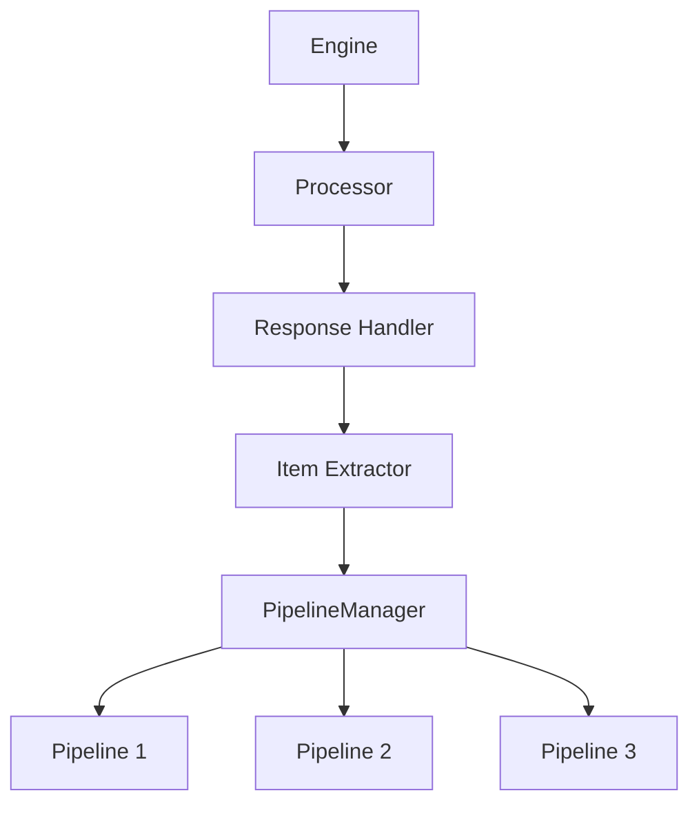

# Processor

The Processor is responsible for handling response processing and item extraction. It manages the flow of responses from the downloader to the pipeline system.

## Overview

The Processor serves as the bridge between the downloader and the pipeline system. Its main responsibilities include:

- Processing responses from the downloader
- Extracting data items from responses
- Managing the item processing pipeline
- Handling item deduplication and filtering

## Architecture

The Processor works with the pipeline manager to process items:



## Key Features

### Response Processing

The Processor handles responses from the downloader:

- Parses response content
- Extracts data according to spider callbacks
- Manages the flow of extracted items to pipelines

### Item Management

The Processor manages items through the pipeline system:

- Routes items to configured pipelines
- Handles item deduplication
- Tracks item processing statistics

### Integration with Pipelines

The Processor integrates with the pipeline module to provide:

- Sequential item processing
- Configurable pipeline chains
- Error handling and item filtering

## API Reference

### `Processor(crawler)`

Creates a new Processor instance.

**Parameters:**
- `crawler`: The crawler instance that owns this processor

### `async enqueue(item_or_request)`

Adds an item or request to the processing queue.

**Parameters:**
- `item_or_request`: The item or request to process

### `idle()`

Checks if the processor is idle (no pending items).

**Returns:**
- `bool`: True if processor is idle

### `async close()`

Cleans up resources when the processor is no longer needed.

## Configuration Options

The Processor works with the pipeline configuration:

| Setting | Description | Default |
|---------|-------------|---------|
| `PIPELINES` | List of pipeline classes to use | [] |
| `ITEM_PROCESSING_ENABLED` | Whether item processing is enabled | True |

## Example Usage

```python
from crawlo.core.processor import Processor

# Create processor instance
processor = Processor(crawler)

# Enqueue an item for processing
await processor.enqueue(item)

# Check if idle
if processor.idle():
    print("No pending items")

# Cleanup
await processor.close()
```

## Performance Considerations

- Monitor pipeline processing times to identify bottlenecks
- Use appropriate pipeline configurations for your data storage needs
- Implement efficient item deduplication to avoid processing duplicate data
- Configure pipeline batch processing for better performance with large datasets