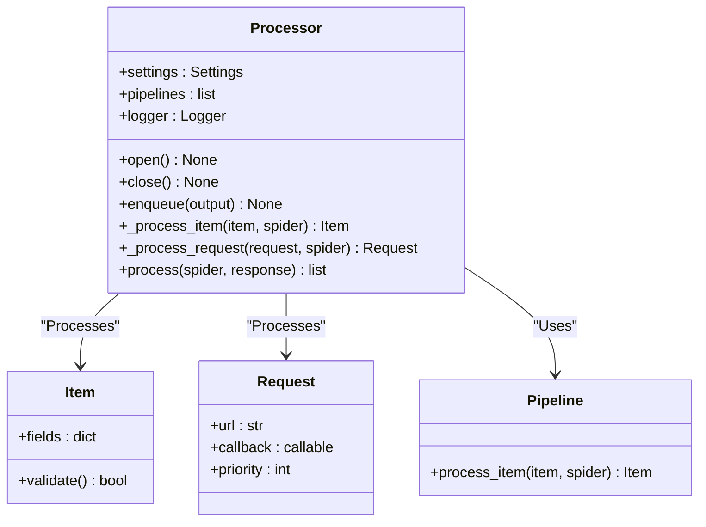
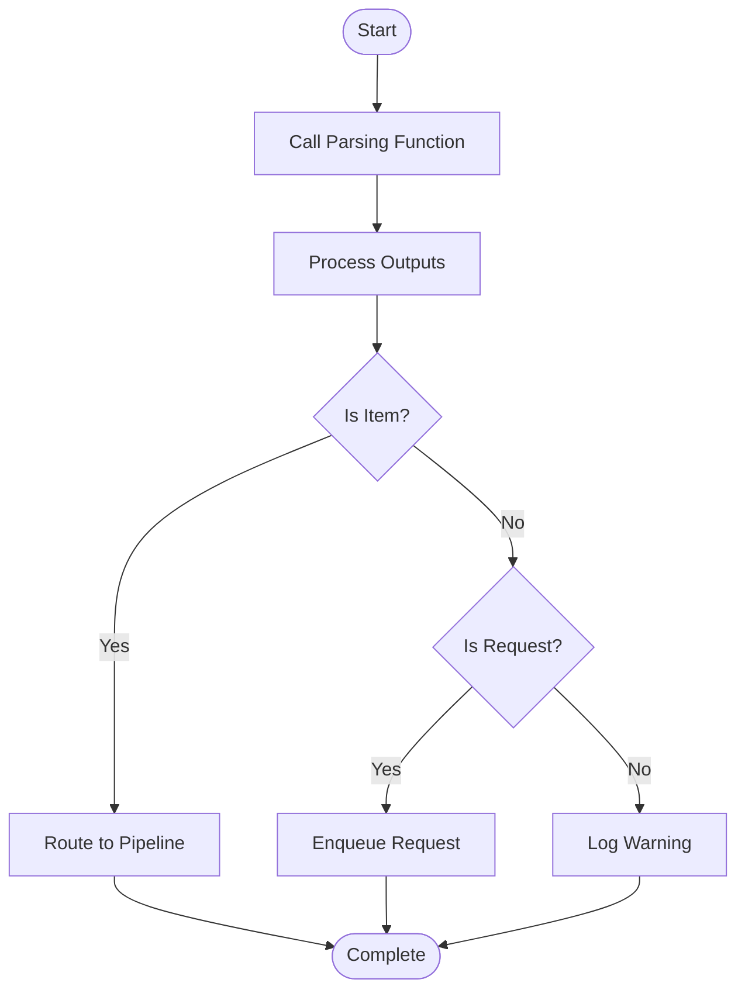
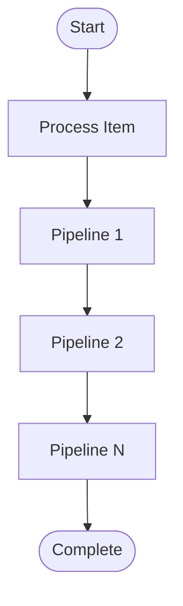

# Processor

The processor is the core component in the Crawlo framework responsible for parsing responses and converting extracted data into structured items. It connects the downloader and data pipelines, serving as a key link in data flow.

## Overview

The processor acts as the core of response processing, responsible for calling user-defined parsing functions, processing the outputs generated by parsing functions (requests or data items), and passing data items to data pipelines for storage.

### Core Responsibilities

1. **Response Parsing** - Call the spider's parsing function to process responses
2. **Output Processing** - Process requests and data items generated by parsing functions
3. **Data Routing** - Route data items to appropriate data pipelines
4. **Error Handling** - Handle exceptions during the parsing process

## Class Structure



## Workflow

### Response Processing Flow



### Item Processing Flow



## Core Methods

### process(spider, response)

Process the spider's parsing of the response.

**Parameters:**
- `spider` - Spider instance
- `response` - Response object

**Returns:**
- List of outputs generated by the parsing function

```python
async def process(self, spider, response):
    """Process the spider's parsing of the response"""
    outputs = []
    
    # Call the spider's parsing function
    try:
        parse_output = spider.parse(response)
        if inspect.isasyncgen(parse_output):
            # Async generator
            async for output in parse_output:
                outputs.append(output)
        elif inspect.isgenerator(parse_output):
            # Sync generator
            for output in parse_output:
                outputs.append(output)
        else:
            # Single output
            if parse_output is not None:
                outputs.append(parse_output)
    except Exception as e:
        self.logger.error(f"Parsing function execution failed: {e}")
        return []
    
    return outputs
```

### enqueue(output)

Enqueue the output for processing.

**Parameters:**
- `output` - Output generated by the parsing function (request or item)

```python
def enqueue(self, output):
    """Enqueue the output for processing"""
    if isinstance(output, Item):
        # Process item
        self._process_item(output)
    elif isinstance(output, Request):
        # Process request
        self._process_request(output)
    else:
        self.logger.warning(f"Unknown output type: {type(output)}")
```

### _process_item(item)

Process the item and route it to pipelines.

**Parameters:**
- `item` - The item to process

```python
def _process_item(self, item):
    """Process the item and route it to pipelines"""
    # Validate item
    if not item.validate():
        self.logger.warning(f"Item validation failed: {item}")
        return
    
    # Process through pipelines
    for pipe in self.pipelines:
        try:
            item = pipe.process_item(item, self.spider)
            if item is None:
                # Pipeline returning None means discarding the item
                return
        except Exception as e:
            self.logger.error(f"Pipeline processing failed: {e}")
            return
```

### _process_request(request)

Process the request and add it to the scheduler queue.

**Parameters:**
- `request` - The request to process

```python
def _process_request(self, request):
    """Process the request and add it to the scheduler queue"""
    # Additional processing can be done here
    # For example: add default headers, set priority, etc.
    
    # Add to scheduler queue
    self.scheduler.enqueue_request(request)
```

### open()

Open the processor and initialize related resources.

### close()

Close the processor and release related resources.

## Pipeline Integration

The processor is tightly integrated with data pipelines, supporting multiple types of pipelines:

### Built-in Pipelines

1. **ConsolePipeline** - Output items to the console
2. **JsonPipeline** - Save items in JSON format
3. **CsvPipeline** - Save items in CSV format
4. **MySQLPipeline** - Store items in MySQL database
5. **MongoPipeline** - Store items in MongoDB database

### Custom Pipelines

Users can create custom pipelines to handle specific data processing needs:

```python
class CustomPipeline:
    def process_item(self, item, spider):
        """Process item"""
        # Custom processing logic
        item.processed = True
        return item
```

## Error Handling

### Parsing Function Exceptions

The processor captures and handles exceptions during parsing function execution:

```python
try:
    parse_output = spider.parse(response)
except Exception as e:
    self.logger.error(f"Parsing function execution failed: {response.url}, Error: {e}")
    # Can choose to retry or log failure
```

### Pipeline Processing Exceptions

The processor captures and handles exceptions during pipeline processing:

```python
for pipe in self.pipelines:
    try:
        item = pipe.process_item(item, self.spider)
    except Exception as e:
        self.logger.error(f"Pipeline processing failed: {pipe.__class__.__name__}, Error: {e}")
        # Continue processing next pipeline
```

## Configuration Options

The processor's behavior can be adjusted through the following configuration options:

| Configuration Item | Type | Default Value | Description |
|--------------------|------|---------------|-------------|
| PIPELINES | list | [] | List of data pipelines |
| ITEM_PROCESSOR_DEBUG | bool | False | Whether to enable item processing debug mode |

## Performance Optimization

### Batch Processing

For scenarios with large numbers of items, batch processing can improve efficiency:

```python
# Batch process items
items = [Item(data=i) for i in range(100)]
for item in items:
    processor.enqueue(item)
```

### Async Processing

Support async parsing functions to improve processing efficiency:

```python
class MySpider(Spider):
    async def parse(self, response):
        # Async processing logic
        async for item in self.extract_items(response):
            yield item
```

## Monitoring and Logging

The processor integrates detailed logging functionality:

```python
# Log parsing results
self.logger.info(f"Parsing completed: {response.url}, Generated {len(outputs)} outputs")

# Log item processing
self.logger.debug(f"Item processed: {item}")

# Log request processing
self.logger.debug(f"Request queued: {request.url}")
```

## Best Practices

### Pipeline Configuration

Configure data pipelines appropriately to meet different data storage needs:

```python
# Configure multiple pipelines
PIPELINES = [
    'crawlo.pipelines.ConsolePipeline',
    'crawlo.pipelines.JsonPipeline',
    'crawlo.pipelines.MySQLPipeline',
]
```

### Item Validation

Implement validation logic in items to ensure data quality:

```python
class ProductItem(Item):
    def validate(self):
        """Validate item"""
        if not self.get('name'):
            return False
        if not self.get('price'):
            return False
        return True
```

### Exception Handling

Implement appropriate exception handling in parsing functions:

```python
def parse(self, response):
    """Parse response"""
    try:
        # Parsing logic
        yield ProductItem(
            name=response.extract_text('h1'),
            price=response.extract_text('.price')
        )
    except Exception as e:
        self.logger.error(f"Parsing failed: {response.url}, Error: {e}")
        # Can choose to retry or skip
```