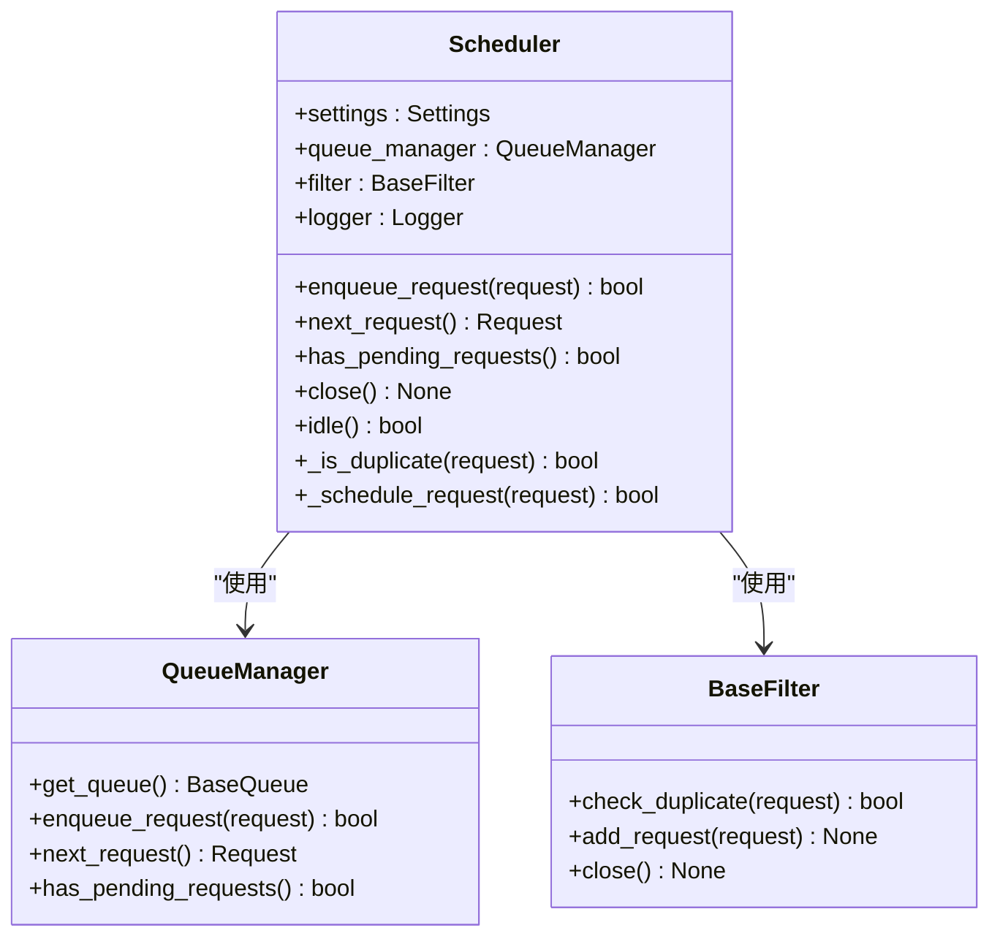
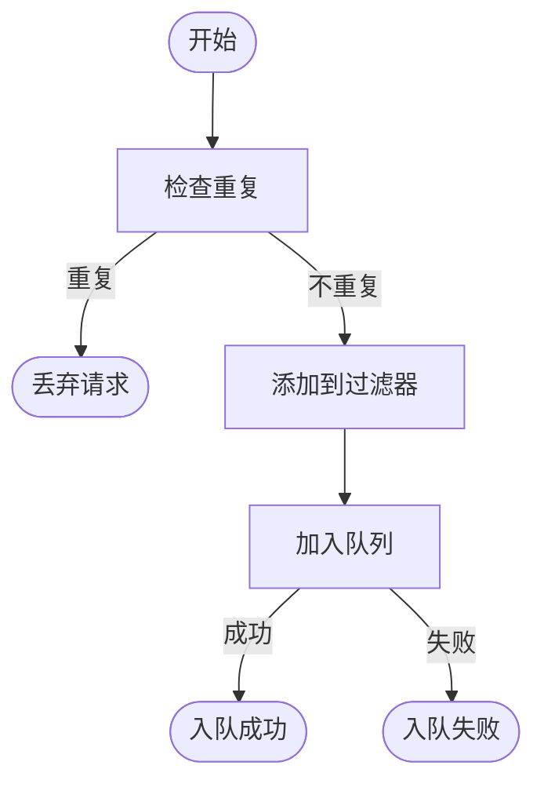
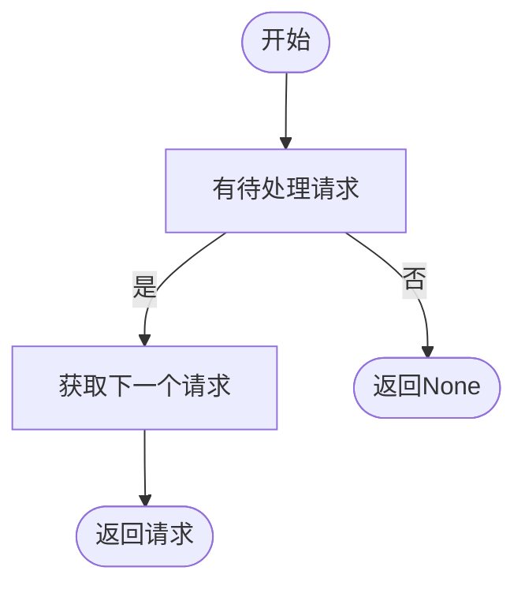

# 调度器 (Scheduler)

调度器是 Crawlo 框架中负责管理请求队列和实现重复请求过滤的核心组件。它确保请求按正确的顺序处理，并防止重复爬取相同的 URL。

## 概述

调度器作为请求管理的核心，负责将爬虫生成的请求添加到队列中，并按优先级顺序提供给引擎处理。它与队列管理器和过滤器紧密协作，实现高效的请求调度和去重功能。

### 核心职责

1. **请求排队** - 将新生成的请求添加到队列中
2. **请求调度** - 按优先级顺序提供请求给引擎处理
3. **重复过滤** - 防止重复请求被添加到队列中
4. **队列管理** - 管理请求队列的状态和大小

## 类结构



## 工作流程

### 请求入队流程



### 请求出队流程



## 核心方法

### enqueue_request(request)

将请求添加到调度器队列中。

**参数:**
- `request` - 要排队的请求对象

**返回:**
- 布尔值，表示请求是否成功入队

```python
def enqueue_request(self, request):
    """将请求添加到调度器队列"""
    # 检查是否为重复请求
    if self._is_duplicate(request):
        self.logger.debug(f"重复请求已过滤: {request.url}")
        return False
    
    # 将请求添加到队列
    result = self.queue_manager.enqueue_request(request)
    if result:
        self.logger.debug(f"请求已入队: {request.url}")
    else:
        self.logger.warning(f"请求入队失败: {request.url}")
    
    return result
```

### next_request()

获取下一个待处理的请求。

**返回:**
- 下一个请求对象，如果没有待处理请求则返回 None

```python
def next_request(self):
    """获取下一个待处理的请求"""
    return self.queue_manager.next_request()
```

### has_pending_requests()

检查是否有待处理的请求。

**返回:**
- 布尔值，表示是否有待处理请求

### close()

关闭调度器，释放相关资源。

### idle()

检查调度器是否空闲。

**返回:**
- 布尔值，表示调度器是否空闲

### _is_duplicate(request)

检查请求是否重复。

**参数:**
- `request` - 要检查的请求对象

**返回:**
- 布尔值，表示请求是否重复

## 队列管理

调度器通过队列管理器与不同类型的队列进行交互，支持内存队列和 Redis 队列。

### 内存队列

适用于单机模式，使用内存存储请求队列：

```python
# 内存队列配置
QUEUE_TYPE = 'memory'
SCHEDULER_MAX_QUEUE_SIZE = 10000
```

### Redis 队列

适用于分布式模式，使用 Redis 存储请求队列：

```python
# Redis 队列配置
QUEUE_TYPE = 'redis'
REDIS_HOST = '127.0.0.1'
REDIS_PORT = 6379
REDIS_PASSWORD = 'password'
```

## 过滤机制

调度器使用过滤器实现请求去重功能，防止重复爬取相同的 URL。

### 内存过滤器

适用于单机模式，使用内存中的集合存储已处理请求的指纹：

```python
# 内存过滤器配置
FILTER_TYPE = 'memory'
```

### Redis 过滤器

适用于分布式模式，使用 Redis 集合存储已处理请求的指纹：

```python
# Redis 过滤器配置
FILTER_TYPE = 'redis'
REDIS_HOST = '127.0.0.1'
REDIS_PORT = 6379
```

## 优先级调度

调度器支持基于优先级的请求调度，确保高优先级的请求优先处理：

```python
# 设置请求优先级
request = Request(
    url='http://example.com',
    priority=10  # 数值越大优先级越高
)
```

## 配置选项

调度器的行为可以通过以下配置项进行调整：

| 配置项 | 类型 | 默认值 | 说明 |
|--------|------|--------|------|
| QUEUE_TYPE | str | 'memory' | 队列类型（memory/redis） |
| SCHEDULER_MAX_QUEUE_SIZE | int | 10000 | 调度器最大队列大小 |
| FILTER_TYPE | str | 'memory' | 过滤器类型（memory/redis） |
| REDIS_HOST | str | '127.0.0.1' | Redis 主机地址 |
| REDIS_PORT | int | 6379 | Redis 端口 |

## 性能优化

### 队列大小控制

通过配置 [SCHEDULER_MAX_QUEUE_SIZE](#配置选项) 控制队列大小，防止内存溢出：

```python
# 设置最大队列大小
SCHEDULER_MAX_QUEUE_SIZE = 50000
```

### 批量操作

对于大量请求的场景，可以使用批量操作提高效率：

```python
# 批量入队
requests = [Request(url=f"http://example.com/{i}") for i in range(100)]
for request in requests:
    scheduler.enqueue_request(request)
```

## 错误处理

### 队列异常处理

调度器会捕获并处理队列操作中的异常：

```python
try:
    result = self.queue_manager.enqueue_request(request)
except QueueFullException:
    self.logger.warning("队列已满")
except QueueConnectionException:
    self.logger.error("队列连接失败")
```

### 过滤器异常处理

调度器会捕获并处理过滤器操作中的异常：

```python
try:
    is_duplicate = self.filter.check_duplicate(request)
except FilterConnectionException:
    self.logger.error("过滤器连接失败")
    # 可以选择跳过过滤直接入队
    is_duplicate = False
```

## 监控和日志

调度器集成了详细的日志记录功能：

```python
# 记录请求入队日志
self.logger.info(f"请求入队: {request.url}, 优先级: {request.priority}")

# 记录重复请求日志
self.logger.debug(f"重复请求已过滤: {request.url}")

# 记录队列状态
self.logger.debug(f"当前队列大小: {self.queue_manager.size()}")
```

## 最佳实践

### 合理配置队列类型

根据运行模式选择合适的队列类型：

```python
# 单机模式使用内存队列
config = CrawloConfig.standalone(queue_type='memory')

# 分布式模式使用 Redis 队列
config = CrawloConfig.distributed(queue_type='redis')
```

### 设置适当的队列大小

根据内存资源和爬取需求设置合适的队列大小：

```python
# 小规模爬取
SCHEDULER_MAX_QUEUE_SIZE = 1000

# 大规模爬取
SCHEDULER_MAX_QUEUE_SIZE = 100000
```

### 使用优先级调度

对于重要的 URL，设置较高的优先级：

```python
# 首页设置高优先级
homepage_request = Request(url='http://example.com', priority=100)

# 列表页设置中等优先级
list_request = Request(url='http://example.com/list', priority=50)

# 详情页设置低优先级
detail_request = Request(url='http://example.com/detail', priority=10)
```