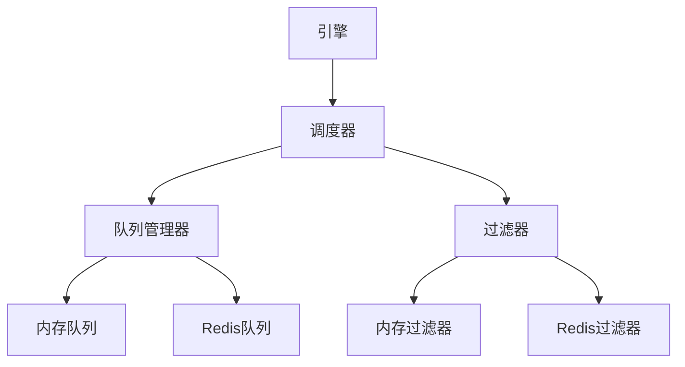

# 调度器

调度器负责管理请求队列和处理请求去重。它是Crawlo框架中的中央队列管理器。

## 概述

调度器通过以下方式管理爬取过程中的请求流：

- 维护支持优先级的请求队列
- 处理请求去重以避免多次处理相同URL
- 与队列模块协调以实现不同的队列实现
- 管理从入队到出队的请求生命周期

## 架构

调度器与队列模块协同工作，提供灵活的队列系统：



## 主要特性

### 请求队列

调度器支持基于优先级的队列，可以为请求分配不同的优先级：

```python
# 按优先级入队请求
await scheduler.enqueue_request(request, priority=10)
```

### 去重

调度器与过滤器模块集成以防止重复请求：

- 使用请求指纹生成唯一标识符
- 在入队请求前检查过滤器
- 支持内存和基于Redis的去重

### 队列管理

调度器支持多种队列实现：

- **内存队列**：用于独立爬取
- **Redis队列**：用于分布式爬取
- **自动选择**：根据配置自动选择

## API参考

### `Scheduler.create_instance(crawler)`

创建一个新的调度器实例。

**参数：**
- `crawler`：拥有此调度器的爬虫实例

### `async enqueue_request(request, priority=0)`

将请求添加到队列中。

**参数：**
- `request`：要入队的请求
- `priority`：优先级（数字越大优先级越高）

**返回：**
- `bool`：如果请求已入队则为True，如果是重复请求则为False

### `async next_request()`

从队列中获取下一个请求。

**返回：**
- `Request`：要处理的下一个请求，如果队列为空则为None

### `idle()`

检查调度器是否空闲（无待处理请求）。

**返回：**
- `bool`：如果调度器空闲则为True

### `async close()`

在不再需要调度器时清理资源。

## 配置选项

调度器可以通过各种设置进行配置：

| 设置 | 描述 | 默认值 |
|------|------|--------|
| `QUEUE_TYPE` | 要使用的队列实现 | 'auto' |
| `SCHEDULER_MAX_QUEUE_SIZE` | 最大队列大小 | 2000 |
| `FILTER_CLASS` | 要使用的过滤器实现 | 'crawlo.filters.memory_filter.MemoryFilter' |

## 使用示例

```python
from crawlo.core.scheduler import Scheduler

# 创建调度器实例
scheduler = Scheduler.create_instance(crawler)

# 入队请求
await scheduler.enqueue_request(request, priority=5)

# 获取下一个请求
next_request = await scheduler.next_request()

# 检查是否空闲
if scheduler.idle():
    print("无待处理请求")

# 清理
await scheduler.close()
```

## 性能考虑

- 监控队列大小以避免独立模式下的内存问题
- 使用Redis队列进行分布式爬取以共享工作负载
- 配置适当的过滤器TTL设置以控制内存使用
- 根据系统资源调整队列大小限制