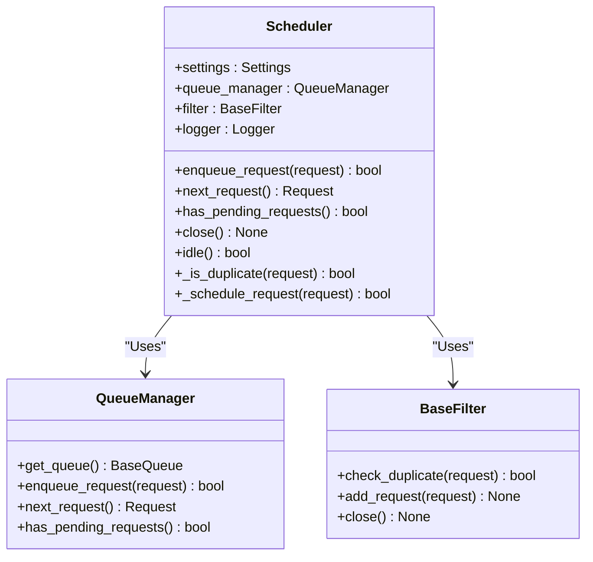
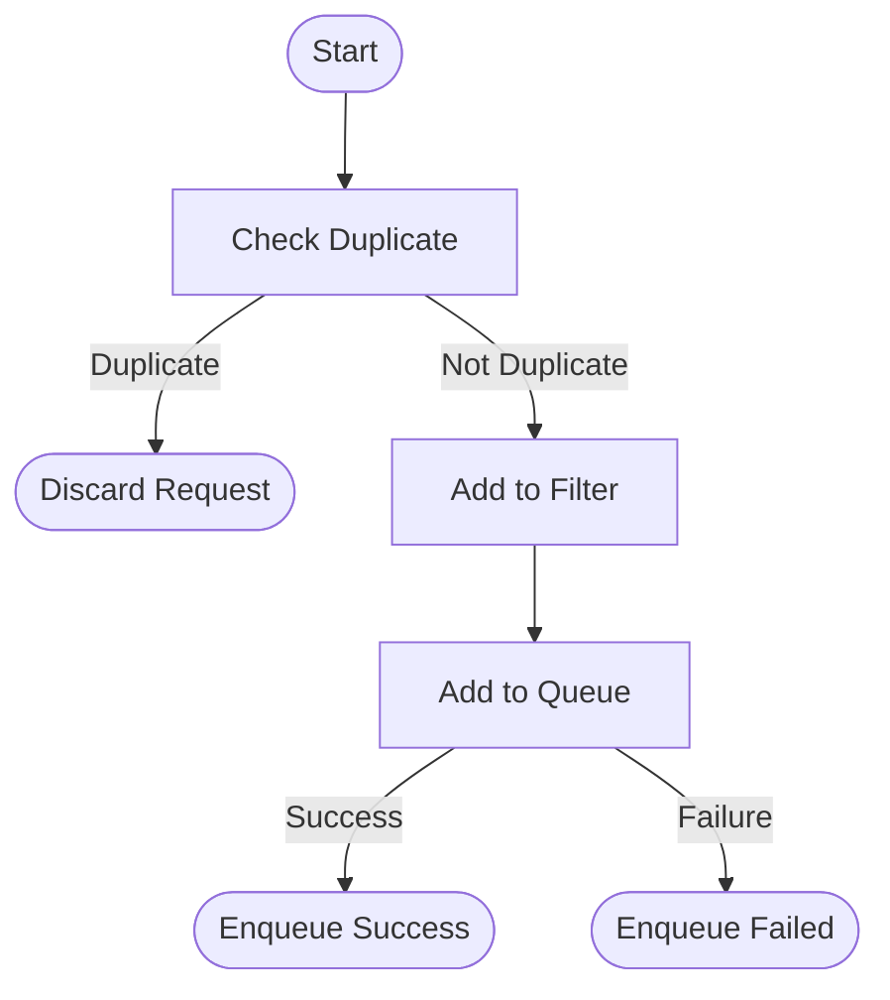
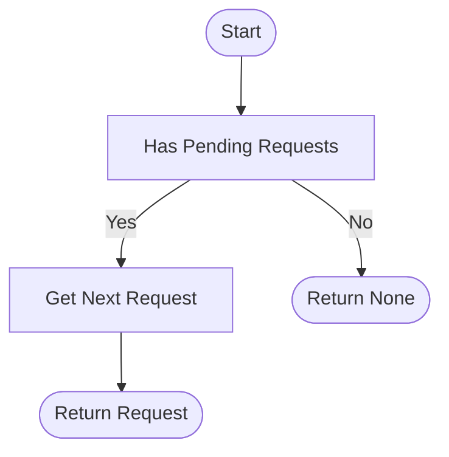

# Scheduler

The scheduler is the core component in the Crawlo framework responsible for managing request queues and implementing duplicate request filtering. It ensures requests are processed in the correct order and prevents crawling the same URLs repeatedly.

## Overview

The scheduler acts as the core of request management, responsible for adding requests generated by spiders to the queue and providing them to the engine for processing in priority order. It works closely with the queue manager and filter to implement efficient request scheduling and deduplication.

### Core Responsibilities

1. **Request Queuing** - Add newly generated requests to the queue
2. **Request Scheduling** - Provide requests to the engine for processing in priority order
3. **Duplicate Filtering** - Prevent duplicate requests from being added to the queue
4. **Queue Management** - Manage the status and size of the request queue

## Class Structure



## Workflow

### Request Enqueueing Flow



### Request Dequeueing Flow



## Core Methods

### enqueue_request(request)

Add a request to the scheduler queue.

**Parameters:**
- `request` - The request object to queue

**Returns:**
- Boolean indicating whether the request was successfully queued

```python
def enqueue_request(self, request):
    """Add a request to the scheduler queue"""
    # Check if it's a duplicate request
    if self._is_duplicate(request):
        self.logger.debug(f"Duplicate request filtered: {request.url}")
        return False
    
    # Add request to queue
    result = self.queue_manager.enqueue_request(request)
    if result:
        self.logger.debug(f"Request queued: {request.url}")
    else:
        self.logger.warning(f"Failed to queue request: {request.url}")
    
    return result
```

### next_request()

Get the next request to process.

**Returns:**
- The next request object, or None if no pending requests

```python
def next_request(self):
    """Get the next request to process"""
    return self.queue_manager.next_request()
```

### has_pending_requests()

Check if there are pending requests.

**Returns:**
- Boolean indicating whether there are pending requests

### close()

Close the scheduler and release related resources.

### idle()

Check if the scheduler is idle.

**Returns:**
- Boolean indicating whether the scheduler is idle

### _is_duplicate(request)

Check if the request is a duplicate.

**Parameters:**
- `request` - The request object to check

**Returns:**
- Boolean indicating whether the request is a duplicate

## Queue Management

The scheduler interacts with different types of queues through the queue manager, supporting both memory queues and Redis queues.

### Memory Queue

Suitable for standalone mode, uses memory to store the request queue:

```python
# Memory queue configuration
QUEUE_TYPE = 'memory'
SCHEDULER_MAX_QUEUE_SIZE = 10000
```

### Redis Queue

Suitable for distributed mode, uses Redis to store the request queue:

```python
# Redis queue configuration
QUEUE_TYPE = 'redis'
REDIS_HOST = '127.0.0.1'
REDIS_PORT = 6379
REDIS_PASSWORD = 'password'
```

## Filtering Mechanism

The scheduler uses filters to implement request deduplication, preventing crawling the same URLs repeatedly.

### Memory Filter

Suitable for standalone mode, uses an in-memory set to store fingerprints of processed requests:

```python
# Memory filter configuration
FILTER_TYPE = 'memory'
```

### Redis Filter

Suitable for distributed mode, uses a Redis set to store fingerprints of processed requests:

```python
# Redis filter configuration
FILTER_TYPE = 'redis'
REDIS_HOST = '127.0.0.1'
REDIS_PORT = 6379
```

## Priority Scheduling

The scheduler supports priority-based request scheduling, ensuring high-priority requests are processed first:

```python
# Set request priority
request = Request(
    url='http://example.com',
    priority=10  # Higher number means higher priority
)
```

## Configuration Options

The scheduler's behavior can be adjusted through the following configuration options:

| Configuration Item | Type | Default Value | Description |
|--------------------|------|---------------|-------------|
| QUEUE_TYPE | str | 'memory' | Queue type (memory/redis) |
| SCHEDULER_MAX_QUEUE_SIZE | int | 10000 | Maximum scheduler queue size |
| FILTER_TYPE | str | 'memory' | Filter type (memory/redis) |
| REDIS_HOST | str | '127.0.0.1' | Redis host address |
| REDIS_PORT | int | 6379 | Redis port |

## Performance Optimization

### Queue Size Control

Control queue size through [SCHEDULER_MAX_QUEUE_SIZE](#configuration-options) configuration to prevent memory overflow:

```python
# Set maximum queue size
SCHEDULER_MAX_QUEUE_SIZE = 50000
```

### Batch Operations

For scenarios with large numbers of requests, batch operations can improve efficiency:

```python
# Batch enqueueing
requests = [Request(url=f"http://example.com/{i}") for i in range(100)]
for request in requests:
    scheduler.enqueue_request(request)
```

## Error Handling

### Queue Exception Handling

The scheduler captures and handles exceptions in queue operations:

```python
try:
    result = self.queue_manager.enqueue_request(request)
except QueueFullException:
    self.logger.warning("Queue is full")
except QueueConnectionException:
    self.logger.error("Queue connection failed")
```

### Filter Exception Handling

The scheduler captures and handles exceptions in filter operations:

```python
try:
    is_duplicate = self.filter.check_duplicate(request)
except FilterConnectionException:
    self.logger.error("Filter connection failed")
    # Can choose to skip filtering and enqueue directly
    is_duplicate = False
```

## Monitoring and Logging

The scheduler integrates detailed logging functionality:

```python
# Log request enqueueing
self.logger.info(f"Request queued: {request.url}, Priority: {request.priority}")

# Log duplicate requests
self.logger.debug(f"Duplicate request filtered: {request.url}")

# Log queue status
self.logger.debug(f"Current queue size: {self.queue_manager.size()}")
```

## Best Practices

### Reasonable Queue Type Configuration

Choose the appropriate queue type based on running mode:

```python
# Use memory queue for standalone mode
config = CrawloConfig.standalone(queue_type='memory')

# Use Redis queue for distributed mode
config = CrawloConfig.distributed(queue_type='redis')
```

### Set Appropriate Queue Size

Set appropriate queue size based on memory resources and crawling needs:

```python
# Small-scale crawling
SCHEDULER_MAX_QUEUE_SIZE = 1000

# Large-scale crawling
SCHEDULER_MAX_QUEUE_SIZE = 100000
```

### Use Priority Scheduling

Set higher priorities for important URLs:

```python
# Set high priority for homepage
homepage_request = Request(url='http://example.com', priority=100)

# Set medium priority for list page
list_request = Request(url='http://example.com/list', priority=50)

# Set low priority for detail page
detail_request = Request(url='http://example.com/detail', priority=10)
```