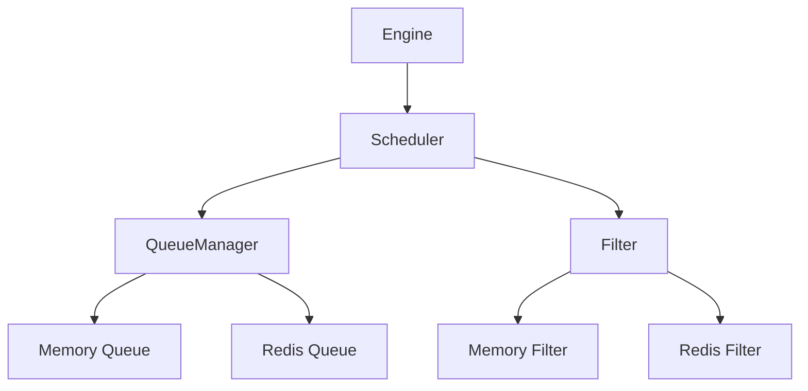

# Scheduler

The Scheduler is responsible for managing request queues and handling request deduplication. It acts as the central queue manager in the Crawlo framework.

## Overview

The Scheduler manages the flow of requests in the crawling process by:

- Maintaining request queues with priority support
- Handling request deduplication to avoid processing the same URLs multiple times
- Coordinating with the queue module for different queue implementations
- Managing the request lifecycle from enqueue to dequeue

## Architecture

The Scheduler works in conjunction with the queue module to provide a flexible queuing system:



## Key Features

### Request Queuing

The Scheduler supports priority-based queuing where requests can be assigned different priority levels:

```python
# Enqueue request with priority
await scheduler.enqueue_request(request, priority=10)
```

### Deduplication

The Scheduler integrates with the filter module to prevent duplicate requests:

- Uses request fingerprinting to generate unique identifiers
- Checks against filter before enqueuing requests
- Supports both memory and Redis-based deduplication

### Queue Management

The Scheduler supports multiple queue implementations:

- **Memory Queue**: For standalone crawling
- **Redis Queue**: For distributed crawling
- **Auto Selection**: Automatically chooses based on configuration

## API Reference

### `Scheduler.create_instance(crawler)`

Creates a new Scheduler instance.

**Parameters:**
- `crawler`: The crawler instance that owns this scheduler

### `async enqueue_request(request, priority=0)`

Adds a request to the queue.

**Parameters:**
- `request`: The request to enqueue
- `priority`: Priority level (higher numbers = higher priority)

**Returns:**
- `bool`: True if request was enqueued, False if duplicate

### `async next_request()`

Retrieves the next request from the queue.

**Returns:**
- `Request`: The next request to process, or None if queue is empty

### `idle()`

Checks if the scheduler is idle (no pending requests).

**Returns:**
- `bool`: True if scheduler is idle

### `async close()`

Cleans up resources when the scheduler is no longer needed.

## Configuration Options

The Scheduler can be configured through various settings:

| Setting | Description | Default |
|---------|-------------|---------|
| `QUEUE_TYPE` | Queue implementation to use | 'auto' |
| `SCHEDULER_MAX_QUEUE_SIZE` | Maximum queue size | 2000 |
| `FILTER_CLASS` | Filter implementation to use | 'crawlo.filters.memory_filter.MemoryFilter' |

## Example Usage

```python
from crawlo.core.scheduler import Scheduler

# Create scheduler instance
scheduler = Scheduler.create_instance(crawler)

# Enqueue a request
await scheduler.enqueue_request(request, priority=5)

# Get next request
next_request = await scheduler.next_request()

# Check if idle
if scheduler.idle():
    print("No pending requests")

# Cleanup
await scheduler.close()
```

## Performance Considerations

- Monitor queue sizes to avoid memory issues in standalone mode
- Use Redis queues for distributed crawling to share workload
- Configure appropriate filter TTL settings to control memory usage
- Adjust queue size limits based on system resources