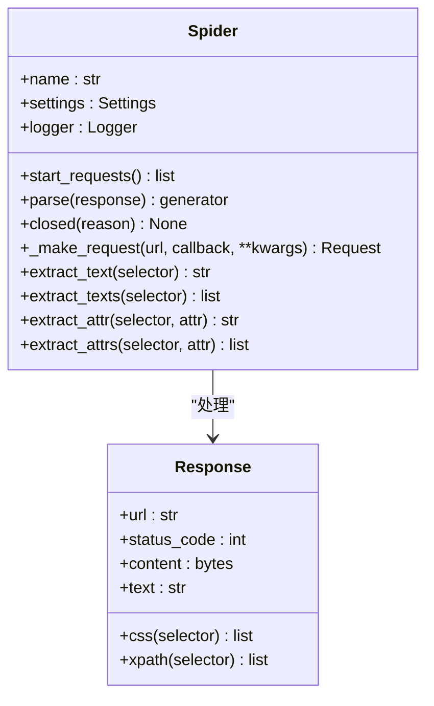

# 爬虫基类 (Spider)

爬虫基类是 Crawlo 框架中所有爬虫的基类，定义了爬虫的基本结构、生命周期和核心接口。它为用户提供了创建自定义爬虫的框架。

## 概述

爬虫基类作为所有爬虫的父类，提供了统一的接口和生命周期管理。用户通过继承该类并实现相应的解析方法来创建自定义爬虫。

### 核心职责

1. **生命周期管理** - 管理爬虫的启动、运行和关闭过程
2. **请求生成** - 提供生成初始请求的接口
3. **响应解析** - 定义解析响应的接口
4. **配置管理** - 管理爬虫的配置和元数据

## 类结构



## 生命周期

### 启动阶段

1. **初始化** - 创建爬虫实例并初始化配置
2. **开始请求** - 调用 [start_requests()](#start_requests) 方法生成初始请求
3. **引擎启动** - 引擎开始处理请求

### 运行阶段

1. **请求处理** - 引擎下载请求并获取响应
2. **响应解析** - 调用 [parse()](#parse) 方法解析响应
3. **输出生成** - 解析函数生成新的请求或数据项
4. **循环处理** - 重复上述过程直到所有请求处理完成

### 关闭阶段

1. **关闭通知** - 调用 [closed()](#closed) 方法通知爬虫关闭
2. **资源释放** - 释放爬虫占用的资源

## 核心方法

### __init__(name, **kwargs)

初始化爬虫实例。

**参数:**
- `name` - 爬虫名称
- `**kwargs` - 其他配置参数

```python
def __init__(self, name, **kwargs):
    """初始化爬虫实例"""
    self.name = name
    self.settings = kwargs.get('settings', {})
    self.logger = get_logger(f"spider.{name}")
```

### start_requests()

生成爬虫的初始请求。

**返回:**
- 初始请求列表

```python
def start_requests(self):
    """生成爬虫的初始请求"""
    # 默认实现，用户可以重写
    urls = getattr(self, 'start_urls', [])
    return [Request(url=url) for url in urls]
```

### parse(response)

解析响应并生成输出（请求或数据项）。

**参数:**
- `response` - 响应对象

**返回:**
- 生成器，产生请求或数据项

```python
def parse(self, response):
    """解析响应并生成输出"""
    # 用户必须实现此方法
    raise NotImplementedError("爬虫必须实现 parse 方法")
```

### closed(reason)

爬虫关闭时调用的回调方法。

**参数:**
- `reason` - 关闭原因

```python
def closed(self, reason):
    """爬虫关闭时调用的回调方法"""
    self.logger.info(f"爬虫 {self.name} 已关闭，原因: {reason}")
```

### _make_request(url, callback, **kwargs)

创建请求对象的辅助方法。

**参数:**
- `url` - 请求 URL
- `callback` - 回调函数
- `**kwargs` - 其他请求参数

**返回:**
- 请求对象

## 内置方法

### extract_text(selector)

从响应中提取单个元素的文本内容。

**参数:**
- `selector` - CSS 或 XPath 选择器

**返回:**
- 提取的文本内容

```python
def extract_text(self, selector):
    """提取单个元素的文本内容"""
    elements = self.css(selector) if not selector.startswith('/') else self.xpath(selector)
    return elements[0].text.strip() if elements else ''
```

### extract_texts(selector)

从响应中提取多个元素的文本内容。

**参数:**
- `selector` - CSS 或 XPath 选择器

**返回:**
- 提取的文本内容列表

### extract_attr(selector, attr)

从响应中提取单个元素的属性值。

**参数:**
- `selector` - CSS 或 XPath 选择器
- `attr` - 属性名称

**返回:**
- 提取的属性值

### extract_attrs(selector, attr)

从响应中提取多个元素的属性值。

**参数:**
- `selector` - CSS 或 XPath 选择器
- `attr` - 属性名称

**返回:**
- 提取的属性值列表

## 使用示例

### 基本爬虫

```python
from crawlo.spider import Spider
from crawlo.items import Item

class MySpider(Spider):
    name = 'my_spider'
    start_urls = ['http://example.com']
    
    def parse(self, response):
        # 提取数据
        title = response.extract_text('h1')
        links = response.extract_attrs('a', 'href')
        
        # 生成数据项
        yield Item(
            title=title,
            links=links
        )
        
        # 生成新请求
        for link in links:
            yield Request(url=link, callback=self.parse_detail)
    
    def parse_detail(self, response):
        # 解析详情页
        content = response.extract_text('.content')
        yield Item(
            content=content
        )
```

### 异步爬虫

```python
class AsyncSpider(Spider):
    name = 'async_spider'
    
    async def parse(self, response):
        # 异步处理
        async for item in self.process_response_async(response):
            yield item
    
    async def process_response_async(self, response):
        # 异步处理逻辑
        await asyncio.sleep(0.1)
        yield Item(data=response.text)
```

## 配置选项

爬虫的行为可以通过以下配置项进行调整：

| 配置项 | 类型 | 默认值 | 说明 |
|--------|------|--------|------|
| SPIDER_NAME | str | '' | 爬虫名称 |
| START_URLS | list | [] | 初始 URL 列表 |
| CUSTOM_SETTINGS | dict | {} | 自定义配置 |

## 最佳实践

### 爬虫命名

为爬虫提供有意义的名称：

```python
class ProductSpider(Spider):
    name = 'product_spider'  # 清晰描述爬虫功能
```

### 错误处理

在解析函数中实现适当的错误处理：

```python
def parse(self, response):
    try:
        # 解析逻辑
        yield Item(data=response.text)
    except Exception as e:
        self.logger.error(f"解析失败: {response.url}, 错误: {e}")
```

### 请求去重

合理使用请求优先级和去重机制：

```python
# 重要页面设置高优先级
request = Request(url='http://example.com/important', priority=100)

# 使用指纹去重
request.dont_filter = False  # 默认值，启用去重
```

### 资源管理

在爬虫关闭时释放资源：

```python
def closed(self, reason):
    """释放资源"""
    if hasattr(self, 'file'):
        self.file.close()
    super().closed(reason)
```