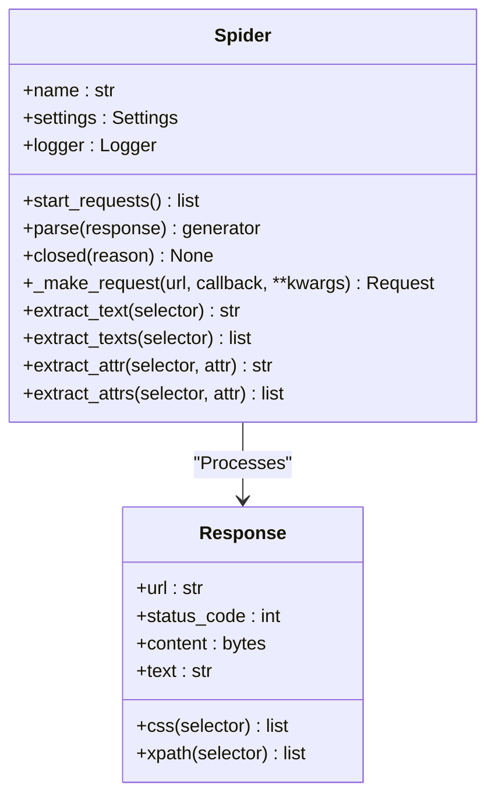

# Spider Base Class

The spider base class is the base class for all spiders in the Crawlo framework, defining the basic structure, lifecycle, and core interfaces of spiders. It provides a framework for users to create custom spiders.

## Overview

The spider base class acts as the parent class for all spiders, providing unified interfaces and lifecycle management. Users create custom spiders by inheriting this class and implementing corresponding parsing methods.

### Core Responsibilities

1. **Lifecycle Management** - Manage the spider's start, run, and close processes
2. **Request Generation** - Provide interfaces for generating initial requests
3. **Response Parsing** - Define interfaces for parsing responses
4. **Configuration Management** - Manage the spider's configuration and metadata

## Class Structure



## Lifecycle

### Startup Phase

1. **Initialization** - Create spider instance and initialize configuration
2. **Start Requests** - Call [start_requests()](#start_requests) method to generate initial requests
3. **Engine Start** - Engine begins processing requests

### Running Phase

1. **Request Processing** - Engine downloads requests and gets responses
2. **Response Parsing** - Call [parse()](#parse) method to parse responses
3. **Output Generation** - Parsing function generates new requests or items
4. **Loop Processing** - Repeat the above process until all requests are processed

### Shutdown Phase

1. **Shutdown Notification** - Call [closed()](#closed) method to notify spider shutdown
2. **Resource Release** - Release resources occupied by the spider

## Core Methods

### __init__(name, **kwargs)

Initialize the spider instance.

**Parameters:**
- `name` - Spider name
- `**kwargs` - Other configuration parameters

```python
def __init__(self, name, **kwargs):
    """Initialize the spider instance"""
    self.name = name
    self.settings = kwargs.get('settings', {})
    self.logger = get_logger(f"spider.{name}")
```

### start_requests()

Generate the spider's initial requests.

**Returns:**
- List of initial requests

```python
def start_requests(self):
    """Generate the spider's initial requests"""
    # Default implementation, users can override
    urls = getattr(self, 'start_urls', [])
    return [Request(url=url) for url in urls]
```

### parse(response)

Parse the response and generate outputs (requests or items).

**Parameters:**
- `response` - Response object

**Returns:**
- Generator that yields requests or items

```python
def parse(self, response):
    """Parse the response and generate outputs"""
    # Users must implement this method
    raise NotImplementedError("Spider must implement parse method")
```

### closed(reason)

Callback method called when the spider is closed.

**Parameters:**
- `reason` - Reason for closing

```python
def closed(self, reason):
    """Callback method called when the spider is closed"""
    self.logger.info(f"Spider {self.name} closed, reason: {reason}")
```

### _make_request(url, callback, **kwargs)

Helper method to create request objects.

**Parameters:**
- `url` - Request URL
- `callback` - Callback function
- `**kwargs` - Other request parameters

**Returns:**
- Request object

## Built-in Methods

### extract_text(selector)

Extract text content from a single element in the response.

**Parameters:**
- `selector` - CSS or XPath selector

**Returns:**
- Extracted text content

```python
def extract_text(self, selector):
    """Extract text content from a single element"""
    elements = self.css(selector) if not selector.startswith('/') else self.xpath(selector)
    return elements[0].text.strip() if elements else ''
```

### extract_texts(selector)

Extract text content from multiple elements in the response.

**Parameters:**
- `selector` - CSS or XPath selector

**Returns:**
- List of extracted text content

### extract_attr(selector, attr)

Extract attribute value from a single element in the response.

**Parameters:**
- `selector` - CSS or XPath selector
- `attr` - Attribute name

**Returns:**
- Extracted attribute value

### extract_attrs(selector, attr)

Extract attribute values from multiple elements in the response.

**Parameters:**
- `selector` - CSS or XPath selector
- `attr` - Attribute name

**Returns:**
- List of extracted attribute values

## Usage Examples

### Basic Spider

```python
from crawlo.spider import Spider
from crawlo.items import Item

class MySpider(Spider):
    name = 'my_spider'
    start_urls = ['http://example.com']
    
    def parse(self, response):
        # Extract data
        title = response.extract_text('h1')
        links = response.extract_attrs('a', 'href')
        
        # Generate items
        yield Item(
            title=title,
            links=links
        )
        
        # Generate new requests
        for link in links:
            yield Request(url=link, callback=self.parse_detail)
    
    def parse_detail(self, response):
        # Parse detail page
        content = response.extract_text('.content')
        yield Item(
            content=content
        )
```

### Async Spider

```python
class AsyncSpider(Spider):
    name = 'async_spider'
    
    async def parse(self, response):
        # Async processing
        async for item in self.process_response_async(response):
            yield item
    
    async def process_response_async(self, response):
        # Async processing logic
        await asyncio.sleep(0.1)
        yield Item(data=response.text)
```

## Configuration Options

Spider behavior can be adjusted through the following configuration options:

| Configuration Item | Type | Default Value | Description |
|--------------------|------|---------------|-------------|
| SPIDER_NAME | str | '' | Spider name |
| START_URLS | list | [] | Initial URL list |
| CUSTOM_SETTINGS | dict | {} | Custom configuration |

## Best Practices

### Spider Naming

Provide meaningful names for spiders:

```python
class ProductSpider(Spider):
    name = 'product_spider'  # Clear description of spider functionality
```

### Error Handling

Implement appropriate error handling in parsing functions:

```python
def parse(self, response):
    try:
        # Parsing logic
        yield Item(data=response.text)
    except Exception as e:
        self.logger.error(f"Parsing failed: {response.url}, Error: {e}")
```

### Request Deduplication

Use request priorities and deduplication mechanisms appropriately:

```python
# Set high priority for important pages
request = Request(url='http://example.com/important', priority=100)

# Use fingerprint deduplication
request.dont_filter = False  # Default value, enable deduplication
```

### Resource Management

Release resources when the spider closes:

```python
def closed(self, reason):
    """Release resources"""
    if hasattr(self, 'file'):
        self.file.close()
    super().closed(reason)
```