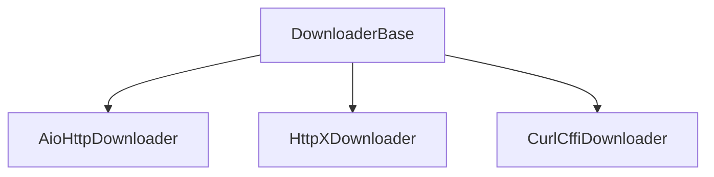

# 下载器模块

下载器模块提供多种高性能异步下载器用于获取网页内容。它支持各种协议和技术来处理不同类型的网页内容。

## 目录
- [AioHttpDownloader](aiohttp.md) - 基于aiohttp的高性能下载器
- [HttpXDownloader](httpx.md) - 支持HTTP/2的httpx下载器
- [CurlCffiDownloader](curl_cffi.md) - 浏览器指纹模拟

## 概述

下载器模块提供多种下载器来处理不同的网页爬取场景：

1. **协议下载器**：用于静态内容（AioHttp、HttpX、CurlCffi）

## 架构



## 主要特性

- **多种实现**：为您的需求选择合适的下载器
- **中间件集成**：通过中间件处理请求和响应
- **会话管理**：重用连接以获得更好的性能
- **统计跟踪**：监控下载性能和错误
- **健康监控**：自动健康检查和错误处理

## 配置

可以在项目的[settings.py](https://github.com/crawl-coder/Crawlo/blob/master/examples/api_data_collection/api_data_collection/settings.py)中配置下载器：

```python
# 下载器选择
DOWNLOADER = "crawlo.downloader.httpx_downloader.HttpXDownloader"

# 下载器设置
DOWNLOAD_TIMEOUT = 30
VERIFY_SSL = True
USE_SESSION = True

# 性能设置
CONNECTION_POOL_LIMIT = 50
DOWNLOAD_MAXSIZE = 10 * 1024 * 1024
```

## 下载器类型

### 协议下载器

- **AioHttpDownloader**：默认高性能下载器
- **HttpXDownloader**：支持HTTP/2协议
- **CurlCffiDownloader**：浏览器指纹模拟

## 使用示例

```python
from crawlo.downloader import get_downloader_class

# 按名称获取下载器
downloader_cls = get_downloader_class('httpx')
downloader = downloader_cls(crawler)

# 或在settings.py中配置
DOWNLOADER = "crawlo.downloader.httpx_downloader.HttpXDownloader"
```

有关每个下载器实现的详细信息，请参阅单独的文档页面。