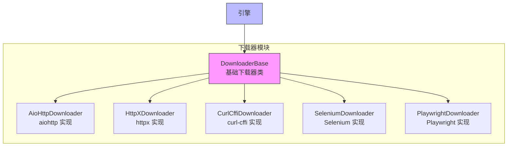

# 下载器模块

下载器模块是 Crawlo 框架中负责获取网页内容的核心组件。它提供了多种 HTTP 客户端实现，支持不同的使用场景和需求。

## 模块概述

下载器模块采用插件化设计，支持多种 HTTP 客户端实现，包括 aiohttp、httpx 和 curl-cffi。用户可以根据具体需求选择合适的下载器。

### 核心组件

1. [AioHttpDownloader](aiohttp.md) - 基于 aiohttp 的高性能下载器
2. [HttpXDownloader](httpx.md) - 支持 HTTP/2 的下载器
3. [CurlCffiDownloader](curl_cffi.md) - 支持浏览器指纹模拟的下载器
4. [SeleniumDownloader](selenium.md) - 基于 Selenium 的浏览器自动化下载器
5. [PlaywrightDownloader](playwright.md) - 基于 Playwright 的现代浏览器自动化下载器

## 架构设计



## 下载器选择指南

### AioHttpDownloader

**适用场景:**
- 高性能、高并发的简单网页抓取
- 不需要浏览器指纹模拟的场景
- 对资源消耗有严格要求的环境

**特点:**
- 基于 asyncio，性能优异
- 资源消耗低
- 支持连接池和会话复用

### HttpXDownloader

**适用场景:**
- 需要 HTTP/2 支持的网站
- 需要更好的异步支持
- 对现代 HTTP 特性有要求的场景

**特点:**
- 支持 HTTP/1.1 和 HTTP/2
- 更好的异步支持
- 现代化的 API 设计

### CurlCffiDownloader

**适用场景:**
- 需要绕过基本反爬虫机制
- 需要模拟真实浏览器指纹
- 目标网站有严格的请求头检查

**特点:**
- 模拟真实浏览器指纹
- 绕过基本反爬虫检测
- 支持 TLS 指纹模拟

### SeleniumDownloader

**适用场景:**
- 需要执行 JavaScript 的复杂网页
- 需要模拟用户交互的场景
- 需要完整浏览器环境的爬取任务

**特点:**
- 完整的浏览器环境
- 支持 JavaScript 执行
- 支持用户交互模拟

### PlaywrightDownloader

**适用场景:**
- 需要现代浏览器功能的爬取任务
- 需要更好的性能和稳定性
- 需要跨浏览器支持的场景

**特点:**
- 现代化的浏览器自动化
- 更好的性能和稳定性
- 支持多种浏览器

## 配置选项

下载器模块的行为可以通过以下配置项进行调整：

| 配置项 | 类型 | 默认值 | 说明 |
|--------|------|--------|------|
| DOWNLOADER_TYPE | str | 'aiohttp' | 下载器类型 |
| DOWNLOAD_TIMEOUT | int | 30 | 下载超时时间（秒） |
| DOWNLOAD_DELAY | float | 0.5 | 下载延迟（秒） |
| DOWNLOADER_MIDDLEWARES | list | [] | 下载器中间件列表 |
| USER_AGENT | str | '' | 用户代理字符串 |

## 使用示例

### 基本使用

```python
from crawlo.config import CrawloConfig
from crawlo.downloader import AioHttpDownloader

# 配置使用 aiohttp 下载器
config = CrawloConfig.standalone(
    downloader_type='aiohttp',
    download_timeout=30
)

# 创建下载器实例
downloader = AioHttpDownloader(config)
```

### 切换下载器

```python
# 切换到 httpx 下载器
config = CrawloConfig.standalone(downloader_type='httpx')

# 切换到 curl-cffi 下载器
config = CrawloConfig.standalone(downloader_type='curl-cffi')
```

## 性能对比

| 下载器 | 性能 | 资源消耗 | 反爬虫绕过 | JavaScript 支持 |
|--------|------|----------|------------|-----------------|
| AioHttpDownloader | 高 | 低 | 基本 | 不支持 |
| HttpXDownloader | 高 | 低 | 基本 | 不支持 |
| CurlCffiDownloader | 中 | 中 | 强 | 不支持 |
| SeleniumDownloader | 低 | 高 | 强 | 完整 |
| PlaywrightDownloader | 中 | 高 | 强 | 完整 |

## 最佳实践

### 根据需求选择下载器

```python
# 简单网页抓取使用 aiohttp
config = CrawloConfig.standalone(downloader_type='aiohttp')

# 需要绕过反爬虫使用 curl-cffi
config = CrawloConfig.standalone(downloader_type='curl-cffi')

# 需要执行 JavaScript 使用 playwright
config = CrawloConfig.standalone(downloader_type='playwright')
```

### 合理配置超时和延迟

```python
# 配置适当的超时时间
config = CrawloConfig.standalone(
    download_timeout=60,  # 60秒超时
    download_delay=1.0    # 1秒延迟
)
```

### 使用中间件增强功能

```python
# 配置下载器中间件
DOWNLOADER_MIDDLEWARES = [
    'crawlo.middleware.UserAgentMiddleware',
    'crawlo.middleware.ProxyMiddleware',
    'crawlo.middleware.RetryMiddleware',
]