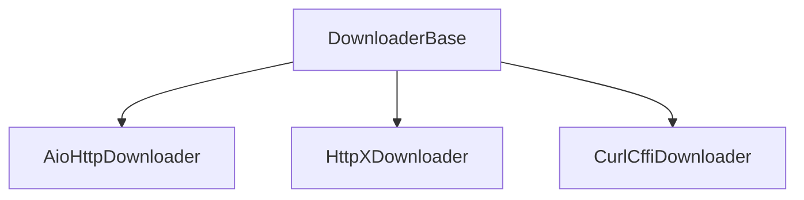

# Downloader Module

The downloader module provides multiple high-performance asynchronous downloaders for fetching web content. It supports various protocols and technologies to handle different types of web content.

## Table of Contents
- [AioHttpDownloader](aiohttp_en.md) - High-performance downloader based on aiohttp
- [HttpXDownloader](httpx_en.md) - HTTP/2 support with httpx
- [CurlCffiDownloader](curl_cffi_en.md) - Browser fingerprint simulation

## Overview

The downloader module offers a variety of downloaders to handle different web scraping scenarios:

1. **Protocol Downloaders**: For static content (AioHttp, HttpX, CurlCffi)

## Architecture



## Key Features

- **Multiple Implementations**: Choose the right downloader for your needs
- **Middleware Integration**: Process requests and responses through middleware
- **Session Management**: Reuse connections for better performance
- **Statistics Tracking**: Monitor download performance and errors
- **Health Monitoring**: Automatic health checks and error handling

## Configuration

The downloader can be configured in your project's `settings.py`:

```python
# Downloader selection
DOWNLOADER = "crawlo.downloader.httpx_downloader.HttpXDownloader"

# Downloader settings
DOWNLOAD_TIMEOUT = 30
VERIFY_SSL = True
USE_SESSION = True

# Performance settings
CONNECTION_POOL_LIMIT = 50
DOWNLOAD_MAXSIZE = 10 * 1024 * 1024
```

## Downloader Types

### Protocol Downloaders

- **AioHttpDownloader**: Default high-performance downloader
- **HttpXDownloader**: Supports HTTP/2 protocol
- **CurlCffiDownloader**: Browser fingerprint simulation

## Usage Example

```python
from crawlo.downloader import get_downloader_class

# Get downloader by name
downloader_cls = get_downloader_class('httpx')
downloader = downloader_cls(crawler)

# Or configure in settings.py
DOWNLOADER = "crawlo.downloader.httpx_downloader.HttpXDownloader"
```

For detailed information about each downloader implementation, see the individual documentation pages.