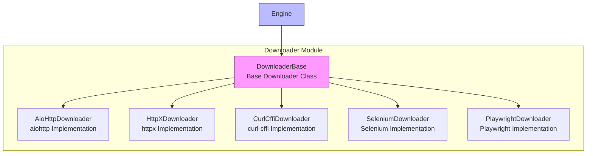

# Downloader Module

The downloader module is the core component in the Crawlo framework responsible for fetching web content. It provides multiple HTTP client implementations to support different use cases and requirements.

## Module Overview

The downloader module adopts a plugin-based design, supporting multiple HTTP client implementations including aiohttp, httpx, and curl-cffi. Users can choose the appropriate downloader based on specific needs.

### Core Components

1. [AioHttpDownloader](aiohttp_en.md) - High-performance downloader based on aiohttp
2. [HttpXDownloader](httpx_en.md) - Downloader supporting HTTP/2
3. [CurlCffiDownloader](curl_cffi_en.md) - Downloader supporting browser fingerprint simulation
4. [SeleniumDownloader](selenium_en.md) - Browser automation downloader based on Selenium
5. [PlaywrightDownloader](playwright_en.md) - Modern browser automation downloader based on Playwright

## Architecture Design



## Downloader Selection Guide

### AioHttpDownloader

**Use Cases:**
- High-performance, high-concurrency simple web scraping
- Scenarios that don't require browser fingerprint simulation
- Environments with strict resource consumption requirements

**Features:**
- Based on asyncio, excellent performance
- Low resource consumption
- Supports connection pooling and session reuse

### HttpXDownloader

**Use Cases:**
- Websites requiring HTTP/2 support
- Need for better asynchronous support
- Scenarios requiring modern HTTP features

**Features:**
- Supports HTTP/1.1 and HTTP/2
- Better asynchronous support
- Modern API design

### CurlCffiDownloader

**Use Cases:**
- Need to bypass basic anti-crawling mechanisms
- Need to simulate real browser fingerprints
- Target websites with strict request header checks

**Features:**
- Simulates real browser fingerprints
- Bypasses basic anti-crawling detection
- Supports TLS fingerprint simulation

### SeleniumDownloader

**Use Cases:**
- Complex web pages requiring JavaScript execution
- Scenarios requiring user interaction simulation
- Crawling tasks requiring a complete browser environment

**Features:**
- Complete browser environment
- Supports JavaScript execution
- Supports user interaction simulation

### PlaywrightDownloader

**Use Cases:**
- Crawling tasks requiring modern browser features
- Need for better performance and stability
- Scenarios requiring cross-browser support

**Features:**
- Modern browser automation
- Better performance and stability
- Supports multiple browsers

## Configuration Options

The behavior of the downloader module can be adjusted through the following configuration options:

| Configuration Item | Type | Default Value | Description |
|--------------------|------|---------------|-------------|
| DOWNLOADER_TYPE | str | 'aiohttp' | Downloader type |
| DOWNLOAD_TIMEOUT | int | 30 | Download timeout (seconds) |
| DOWNLOAD_DELAY | float | 0.5 | Download delay (seconds) |
| DOWNLOADER_MIDDLEWARES | list | [] | Downloader middleware list |
| USER_AGENT | str | '' | User agent string |

## Usage Examples

### Basic Usage

```python
from crawlo.config import CrawloConfig
from crawlo.downloader import AioHttpDownloader

# Configure to use aiohttp downloader
config = CrawloConfig.standalone(
    downloader_type='aiohttp',
    download_timeout=30
)

# Create downloader instance
downloader = AioHttpDownloader(config)
```

### Switching Downloaders

```python
# Switch to httpx downloader
config = CrawloConfig.standalone(downloader_type='httpx')

# Switch to curl-cffi downloader
config = CrawloConfig.standalone(downloader_type='curl-cffi')
```

## Performance Comparison

| Downloader | Performance | Resource Consumption | Anti-crawling Bypass | JavaScript Support |
|------------|-------------|---------------------|---------------------|-------------------|
| AioHttpDownloader | High | Low | Basic | Not supported |
| HttpXDownloader | High | Low | Basic | Not supported |
| CurlCffiDownloader | Medium | Medium | Strong | Not supported |
| SeleniumDownloader | Low | High | Strong | Full |
| PlaywrightDownloader | Medium | High | Strong | Full |

## Best Practices

### Choosing Downloaders Based on Requirements

```python
# Use aiohttp for simple web scraping
config = CrawloConfig.standalone(downloader_type='aiohttp')

# Use curl-cffi to bypass anti-crawling
config = CrawloConfig.standalone(downloader_type='curl-cffi')

# Use playwright for JavaScript execution
config = CrawloConfig.standalone(downloader_type='playwright')
```

### Reasonable Timeout and Delay Configuration

```python
# Configure appropriate timeout
config = CrawloConfig.standalone(
    download_timeout=60,  # 60 second timeout
    download_delay=1.0    # 1 second delay
)
```

### Using Middleware to Enhance Functionality

```python
# Configure downloader middleware
DOWNLOADER_MIDDLEWARES = [
    'crawlo.middleware.UserAgentMiddleware',
    'crawlo.middleware.ProxyMiddleware',
    'crawlo.middleware.RetryMiddleware',
]