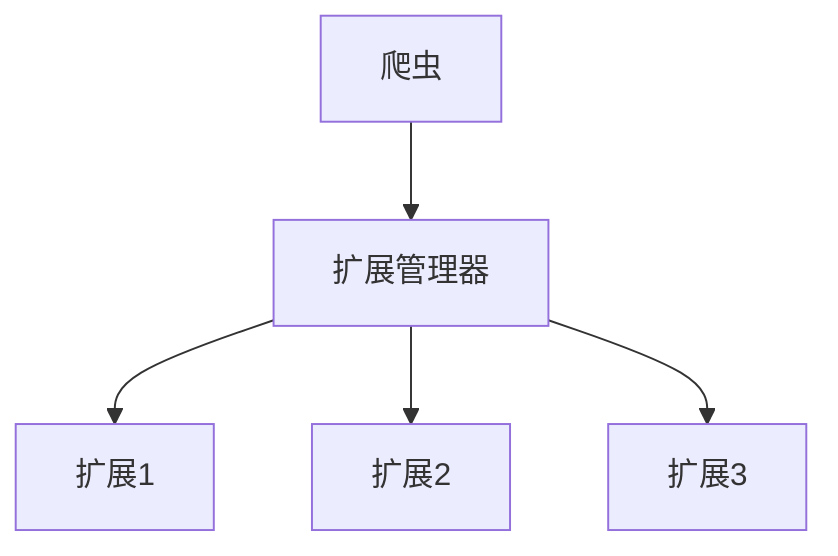

# 扩展模块

扩展模块提供了一个框架，用于向爬取过程添加额外功能。扩展可以监控、记录日志、分析性能并扩展Crawlo框架的功能。

## 目录
- [ExtensionManager](manager.md) - 核心扩展管理系统
- [内置扩展](built_in.md) - 内置扩展组件概述
- [内存监控扩展](memory_monitor.md) - 内存监控扩展详细说明

## 概述

扩展是扩展Crawlo框架功能的组件，不直接参与请求/响应处理周期。它们可以监控爬取过程、收集统计信息、记录日志信息并执行其他辅助任务。

## 架构



## 主要特性

- **事件驱动**：扩展响应爬虫事件
- **灵活配置**：通过设置启用/禁用扩展
- **低开销**：扩展不干扰核心处理
- **可扩展**：易于创建自定义扩展

## 内置扩展

Crawlo提供了几个内置扩展组件：

| 扩展 | 用途 |
|------|------|
| `LogIntervalExtension` | 定期记录爬取进度 |
| `LogStats` | 爬取完成时记录最终统计信息 |
| `CustomLoggerExtension` | 自定义日志功能 |
| `MemoryMonitorExtension` | 监控爬取过程中的内存使用 |
| `RequestRecorderExtension` | 记录所有请求用于调试 |
| `PerformanceProfilerExtension` | 分析爬取过程的性能 |
| `HealthCheckExtension` | 监控爬取过程的健康状况 |

## 配置

扩展组件在项目的[settings.py](https://github.com/crawl-coder/Crawlo/blob/master/examples/api_data_collection/api_data_collection/settings.py)中配置：

```python
EXTENSIONS = [
    'crawlo.extension.log_interval.LogIntervalExtension',
    'crawlo.extension.log_stats.LogStats',
    'crawlo.extension.logging_extension.CustomLoggerExtension',
    'crawlo.extension.memory_monitor.MemoryMonitorExtension',  # 内存监控扩展
]
```

## 扩展生命周期

扩展可以挂钩到各种爬虫事件：

1. **初始化**：爬虫启动时
2. **爬虫打开**：爬虫开始爬取时
3. **请求调度**：请求添加到队列时
4. **响应接收**：响应接收时
5. **数据项处理**：数据项成功处理时
6. **爬虫关闭**：爬虫完成爬取时
7. **爬虫关闭**：爬虫关闭时

## 内存监控扩展

MemoryMonitorExtension是一个用于监控爬虫进程内存使用情况的扩展组件。它定期检查进程的内存使用率，并在超过预设阈值时发出警告或严重警告。

详细信息请参阅[内存监控扩展文档](memory_monitor.md)。

## 创建自定义扩展

要创建自定义扩展，请继承[BaseExtension](https://github.com/crawl-coder/Crawlo/blob/master/crawlo/extension/base.py#L24)并实现所需的事件处理程序：

```python
from crawlo.extension import BaseExtension

class CustomExtension(BaseExtension):
    def __init__(self, crawler):
        super().__init__(crawler)
        # 初始化扩展
        
    def spider_opened(self, spider):
        # 处理爬虫打开事件
        
    def response_received(self, response, spider):
        # 处理响应接收事件
        
    def item_successful(self, item, spider):
        # 处理数据项处理事件
```

有关扩展管理器和特定扩展实现的详细信息，请参阅单独的文档页面。