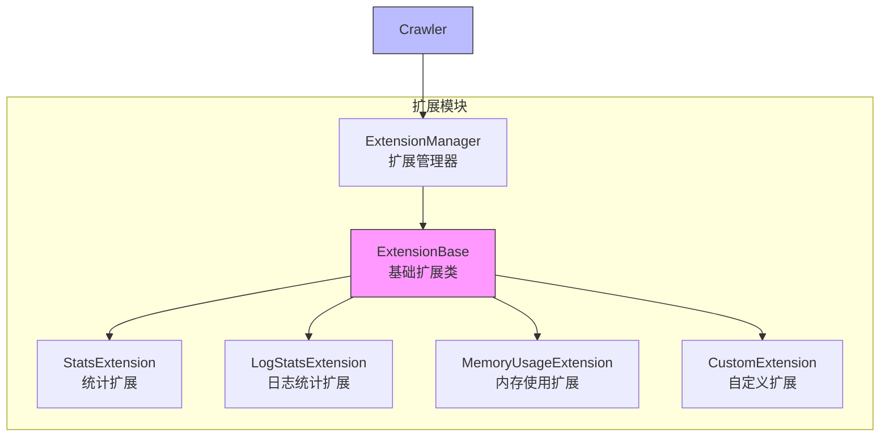

# 扩展模块

扩展模块是 Crawlo 框架中用于增强功能和监控的组件。它提供了一个插件机制，允许用户在爬虫生命周期的关键节点执行自定义逻辑。

## 模块概述

扩展模块采用插件化设计，支持多种扩展实现。用户可以通过配置扩展列表来增强框架功能，实现监控、统计、日志记录等附加功能。

### 核心组件

1. [ExtensionManager](manager.md) - 扩展管理器
2. [内置扩展](built_in.md) - 框架提供的内置扩展
3. [自定义扩展](custom.md) - 用户自定义的扩展

## 架构设计



## 扩展类型

### StatsExtension

**功能:**
- 收集爬虫运行统计信息
- 提供详细的性能指标

**配置选项:**
```python
# 统计扩展无需特殊配置
EXTENSIONS = [
    'crawlo.extensions.StatsExtension',
]
```

### LogStatsExtension

**功能:**
- 定期记录统计信息到日志
- 提供运行状态监控

**配置选项:**
```python
# 设置日志统计间隔（秒）
LOG_STATS_INTERVAL = 60

# 配置扩展
EXTENSIONS = [
    'crawlo.extensions.LogStatsExtension',
]
```

### MemoryUsageExtension

**功能:**
- 监控内存使用情况
- 提供内存使用警告

**配置选项:**
```python
# 设置内存使用警告阈值（MB）
MEMORY_USAGE_WARNING_THRESHOLD = 100

# 设置内存使用检查间隔（秒）
MEMORY_USAGE_CHECK_INTERVAL = 30

# 配置扩展
EXTENSIONS = [
    'crawlo.extensions.MemoryUsageExtension',
]
```

## 配置选项

扩展模块的行为可以通过以下配置项进行调整：

| 配置项 | 类型 | 默认值 | 说明 |
|--------|------|--------|------|
| EXTENSIONS | list | [] | 扩展列表 |
| LOG_STATS_INTERVAL | int | 60 | 日志统计间隔（秒） |
| MEMORY_USAGE_WARNING_THRESHOLD | int | 100 | 内存使用警告阈值（MB） |
| MEMORY_USAGE_CHECK_INTERVAL | int | 30 | 内存使用检查间隔（秒） |
| STATS_DUMP_INTERVAL | int | 300 | 统计信息转储间隔（秒） |

## 使用示例

### 配置扩展

```python
# 在配置文件中配置扩展
EXTENSIONS = [
    'crawlo.extensions.StatsExtension',
    'crawlo.extensions.LogStatsExtension',
    'crawlo.extensions.MemoryUsageExtension',
]

# 配置扩展参数
LOG_STATS_INTERVAL = 30
MEMORY_USAGE_WARNING_THRESHOLD = 200
```

### 创建自定义扩展

```python
from crawlo.extensions import ExtensionBase

class CustomExtension(ExtensionBase):
    def __init__(self, crawler):
        super().__init__(crawler)
        self.counter = 0
    
    def open(self):
        """扩展启动时调用"""
        self.logger.info("自定义扩展已启动")
        # 注册事件监听器
        self.crawler.subscribe('request_sent', self.on_request_sent)
        self.crawler.subscribe('item_scraped', self.on_item_scraped)
    
    def close(self):
        """扩展关闭时调用"""
        self.logger.info(f"自定义扩展已关闭，总共处理了 {self.counter} 个事件")
    
    def on_request_sent(self, request):
        """请求发送事件处理"""
        self.counter += 1
        self.logger.debug(f"请求已发送: {request.url}")
    
    def on_item_scraped(self, item):
        """数据项抓取事件处理"""
        self.counter += 1
        self.logger.debug(f"数据项已抓取: {item}")
```

## 生命周期钩子

扩展可以实现以下生命周期钩子方法：

1. **[open()](../../api/crawlo_extension.md)** - 扩展启动时调用
2. **[close()](../../api/crawlo_extension.md)** - 扩展关闭时调用
3. **[from_crawler()](../../api/crawlo_extension.md)** - 从爬虫创建扩展实例

## 事件系统

扩展可以通过事件系统监听爬虫运行过程中的各种事件：

```python
class EventExtension(ExtensionBase):
    def open(self):
        # 订阅事件
        self.crawler.subscribe('spider_opened', self.on_spider_opened)
        self.crawler.subscribe('spider_closed', self.on_spider_closed)
        self.crawler.subscribe('request_scheduled', self.on_request_scheduled)
        self.crawler.subscribe('response_received', self.on_response_received)
        self.crawler.subscribe('item_scraped', self.on_item_scraped)
    
    def on_spider_opened(self, spider):
        """爬虫启动事件"""
        self.logger.info(f"爬虫已启动: {spider.name}")
    
    def on_spider_closed(self, spider, reason):
        """爬虫关闭事件"""
        self.logger.info(f"爬虫已关闭: {spider.name}, 原因: {reason}")
    
    def on_request_scheduled(self, request):
        """请求调度事件"""
        self.logger.debug(f"请求已调度: {request.url}")
    
    def on_response_received(self, response):
        """响应接收事件"""
        self.logger.debug(f"响应已接收: {response.url}, 状态码: {response.status_code}")
    
    def on_item_scraped(self, item):
        """数据项抓取事件"""
        self.logger.debug(f"数据项已抓取: {item}")
```

## 性能监控

### 内置监控扩展

```python
# 启用性能监控扩展
EXTENSIONS = [
    'crawlo.extensions.StatsExtension',        # 基础统计
    'crawlo.extensions.LogStatsExtension',     # 日志统计
    'crawlo.extensions.MemoryUsageExtension',  # 内存使用监控
]
```

### 自定义监控扩展

```python
class PerformanceMonitorExtension(ExtensionBase):
    def __init__(self, crawler):
        super().__init__(crawler)
        self.start_time = None
        self.request_times = []
    
    def open(self):
        self.start_time = time.time()
        self.crawler.subscribe('request_sent', self.on_request_sent)
        self.crawler.subscribe('response_received', self.on_response_received)
    
    def close(self):
        elapsed_time = time.time() - self.start_time
        avg_response_time = sum(self.request_times) / len(self.request_times) if self.request_times else 0
        
        self.logger.info(f"爬取总耗时: {elapsed_time:.2f}秒")
        self.logger.info(f"平均响应时间: {avg_response_time:.2f}秒")
    
    def on_request_sent(self, request):
        request.start_time = time.time()
    
    def on_response_received(self, response):
        if hasattr(response.request, 'start_time'):
            response_time = time.time() - response.request.start_time
            self.request_times.append(response_time)
```

## 错误处理

### 扩展异常处理

```python
def open(self):
    try:
        # 初始化逻辑
        self.initialize_resources()
    except Exception as e:
        self.logger.error(f"扩展初始化失败: {e}")
        # 可以选择继续运行或抛出异常
```

## 监控和日志

扩展模块集成了详细的监控和日志功能：

```python
# 记录扩展操作日志
logger.info(f"扩展已启动: {extension_name}")
logger.debug(f"扩展处理事件: {event_type}")

# 记录异常日志
logger.error(f"扩展执行失败: {e}")
```

## 最佳实践

### 合理配置扩展

```python
# 生产环境配置
EXTENSIONS = [
    'crawlo.extensions.StatsExtension',        # 基础统计
    'crawlo.extensions.LogStatsExtension',     # 日志统计
    'crawlo.extensions.MemoryUsageExtension',  # 内存监控
]

# 开发环境配置
EXTENSIONS = [
    'crawlo.extensions.StatsExtension',        # 基础统计
]
```

### 扩展性能优化

```python
class EfficientExtension(ExtensionBase):
    def __init__(self, crawler):
        super().__init__(crawler)
        # 使用高效的数据结构
        self.stats = collections.defaultdict(int)
        # 缓存计算结果
        self.cache = {}
    
    def on_event(self, event):
        # 避免重复计算
        if event.type not in self.cache:
            self.cache[event.type] = self.expensive_calculation(event)
        result = self.cache[event.type]
        # 更新统计
        self.stats[event.type] += 1
```

### 资源管理最佳实践

```python
class ResourceExtension(ExtensionBase):
    def __init__(self, crawler):
        super().__init__(crawler)
        self.resources = []
    
    def open(self):
        """初始化资源"""
        try:
            resource = self.create_resource()
            self.resources.append(resource)
        except Exception as e:
            self.logger.error(f"资源初始化失败: {e}")
    
    def close(self):
        """释放资源"""
        for resource in self.resources:
            try:
                resource.close()
            except Exception as e:
                self.logger.error(f"资源释放失败: {e}")
        self.resources.clear()
```