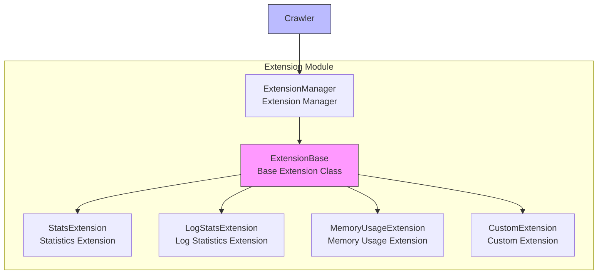

# Extension Module

The extension module is the component in the Crawlo framework used to enhance functionality and monitoring. It provides a plugin mechanism that allows users to execute custom logic at key points in the crawler lifecycle.

## Module Overview

The extension module adopts a plugin-based design, supporting multiple extension implementations. Users can enhance framework functionality by configuring an extension list to implement monitoring, statistics, logging, and other additional features.

### Core Components

1. [ExtensionManager](manager_en.md) - Extension manager
2. [Built-in Extensions](built_in_en.md) - Built-in extensions provided by the framework
3. [Custom Extensions](custom_en.md) - User-defined extensions

## Architecture Design



## Extension Types

### StatsExtension

**Function:**
- Collect crawler runtime statistics
- Provide detailed performance metrics

**Configuration Options:**
```python
# Statistics extension requires no special configuration
EXTENSIONS = [
    'crawlo.extensions.StatsExtension',
]
```

### LogStatsExtension

**Function:**
- Periodically log statistics to logs
- Provide runtime status monitoring

**Configuration Options:**
```python
# Set log statistics interval (seconds)
LOG_STATS_INTERVAL = 60

# Configure extension
EXTENSIONS = [
    'crawlo.extensions.LogStatsExtension',
]
```

### MemoryUsageExtension

**Function:**
- Monitor memory usage
- Provide memory usage warnings

**Configuration Options:**
```python
# Set memory usage warning threshold (MB)
MEMORY_USAGE_WARNING_THRESHOLD = 100

# Set memory usage check interval (seconds)
MEMORY_USAGE_CHECK_INTERVAL = 30

# Configure extension
EXTENSIONS = [
    'crawlo.extensions.MemoryUsageExtension',
]
```

## Configuration Options

The extension module's behavior can be adjusted through the following configuration options:

| Configuration Item | Type | Default Value | Description |
|--------------------|------|---------------|-------------|
| EXTENSIONS | list | [] | Extension list |
| LOG_STATS_INTERVAL | int | 60 | Log statistics interval (seconds) |
| MEMORY_USAGE_WARNING_THRESHOLD | int | 100 | Memory usage warning threshold (MB) |
| MEMORY_USAGE_CHECK_INTERVAL | int | 30 | Memory usage check interval (seconds) |
| STATS_DUMP_INTERVAL | int | 300 | Statistics dump interval (seconds) |

## Usage Examples

### Configure Extensions

```python
# Configure extensions in configuration file
EXTENSIONS = [
    'crawlo.extensions.StatsExtension',
    'crawlo.extensions.LogStatsExtension',
    'crawlo.extensions.MemoryUsageExtension',
]

# Configure extension parameters
LOG_STATS_INTERVAL = 30
MEMORY_USAGE_WARNING_THRESHOLD = 200
```

### Create Custom Extension

```python
from crawlo.extensions import ExtensionBase

class CustomExtension(ExtensionBase):
    def __init__(self, crawler):
        super().__init__(crawler)
        self.counter = 0
    
    def open(self):
        """Called when extension starts"""
        self.logger.info("Custom extension started")
        # Register event listeners
        self.crawler.subscribe('request_sent', self.on_request_sent)
        self.crawler.subscribe('item_scraped', self.on_item_scraped)
    
    def close(self):
        """Called when extension closes"""
        self.logger.info(f"Custom extension closed, processed {self.counter} events in total")
    
    def on_request_sent(self, request):
        """Handle request sent event"""
        self.counter += 1
        self.logger.debug(f"Request sent: {request.url}")
    
    def on_item_scraped(self, item):
        """Handle item scraped event"""
        self.counter += 1
        self.logger.debug(f"Item scraped: {item}")
```

## Lifecycle Hooks

Extensions can implement the following lifecycle hook methods:

1. **[open()](../../api/crawlo_extension.md)** - Called when extension starts
2. **[close()](../../api/crawlo_extension.md)** - Called when extension closes
3. **[from_crawler()](../../api/crawlo_extension.md)** - Create extension instance from crawler

## Event System

Extensions can listen to various events during crawler runtime through the event system:

```python
class EventExtension(ExtensionBase):
    def open(self):
        # Subscribe to events
        self.crawler.subscribe('spider_opened', self.on_spider_opened)
        self.crawler.subscribe('spider_closed', self.on_spider_closed)
        self.crawler.subscribe('request_scheduled', self.on_request_scheduled)
        self.crawler.subscribe('response_received', self.on_response_received)
        self.crawler.subscribe('item_scraped', self.on_item_scraped)
    
    def on_spider_opened(self, spider):
        """Spider opened event"""
        self.logger.info(f"Spider opened: {spider.name}")
    
    def on_spider_closed(self, spider, reason):
        """Spider closed event"""
        self.logger.info(f"Spider closed: {spider.name}, Reason: {reason}")
    
    def on_request_scheduled(self, request):
        """Request scheduled event"""
        self.logger.debug(f"Request scheduled: {request.url}")
    
    def on_response_received(self, response):
        """Response received event"""
        self.logger.debug(f"Response received: {response.url}, Status code: {response.status_code}")
    
    def on_item_scraped(self, item):
        """Item scraped event"""
        self.logger.debug(f"Item scraped: {item}")
```

## Performance Monitoring

### Built-in Monitoring Extensions

```python
# Enable performance monitoring extensions
EXTENSIONS = [
    'crawlo.extensions.StatsExtension',        # Basic statistics
    'crawlo.extensions.LogStatsExtension',     # Log statistics
    'crawlo.extensions.MemoryUsageExtension',  # Memory usage monitoring
]
```

### Custom Monitoring Extension

```python
class PerformanceMonitorExtension(ExtensionBase):
    def __init__(self, crawler):
        super().__init__(crawler)
        self.start_time = None
        self.request_times = []
    
    def open(self):
        self.start_time = time.time()
        self.crawler.subscribe('request_sent', self.on_request_sent)
        self.crawler.subscribe('response_received', self.on_response_received)
    
    def close(self):
        elapsed_time = time.time() - self.start_time
        avg_response_time = sum(self.request_times) / len(self.request_times) if self.request_times else 0
        
        self.logger.info(f"Total crawling time: {elapsed_time:.2f} seconds")
        self.logger.info(f"Average response time: {avg_response_time:.2f} seconds")
    
    def on_request_sent(self, request):
        request.start_time = time.time()
    
    def on_response_received(self, response):
        if hasattr(response.request, 'start_time'):
            response_time = time.time() - response.request.start_time
            self.request_times.append(response_time)
```

## Error Handling

### Extension Exception Handling

```python
def open(self):
    try:
        # Initialization logic
        self.initialize_resources()
    except Exception as e:
        self.logger.error(f"Extension initialization failed: {e}")
        # Can choose to continue running or raise exception
```

## Monitoring and Logging

The extension module integrates detailed monitoring and logging functionality:

```python
# Log extension operations
logger.info(f"Extension started: {extension_name}")
logger.debug(f"Extension processing event: {event_type}")

# Log exception information
logger.error(f"Extension execution failed: {e}")
```

## Best Practices

### Reasonable Extension Configuration

```python
# Production environment configuration
EXTENSIONS = [
    'crawlo.extensions.StatsExtension',        # Basic statistics
    'crawlo.extensions.LogStatsExtension',     # Log statistics
    'crawlo.extensions.MemoryUsageExtension',  # Memory monitoring
]

# Development environment configuration
EXTENSIONS = [
    'crawlo.extensions.StatsExtension',        # Basic statistics
]
```

### Extension Performance Optimization

```python
class EfficientExtension(ExtensionBase):
    def __init__(self, crawler):
        super().__init__(crawler)
        # Use efficient data structures
        self.stats = collections.defaultdict(int)
        # Cache calculation results
        self.cache = {}
    
    def on_event(self, event):
        # Avoid repeated calculations
        if event.type not in self.cache:
            self.cache[event.type] = self.expensive_calculation(event)
        result = self.cache[event.type]
        # Update statistics
        self.stats[event.type] += 1
```

### Resource Management Best Practices

```python
class ResourceExtension(ExtensionBase):
    def __init__(self, crawler):
        super().__init__(crawler)
        self.resources = []
    
    def open(self):
        """Initialize resources"""
        try:
            resource = self.create_resource()
            self.resources.append(resource)
        except Exception as e:
            self.logger.error(f"Resource initialization failed: {e}")
    
    def close(self):
        """Release resources"""
        for resource in self.resources:
            try:
                resource.close()
            except Exception as e:
                self.logger.error(f"Resource release failed: {e}")
        self.resources.clear()
```