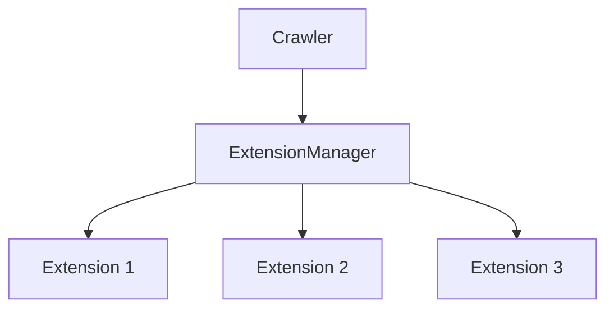

# Extension Module

The extension module provides a framework for adding additional functionality to the crawling process. Extensions can monitor, log, profile, and extend the capabilities of the Crawlo framework.

## Table of Contents
- [ExtensionManager](manager_en.md) - Core extension management system
- [Built-in Extensions](built_in_en.md) - Overview of built-in extension components

## Overview

Extensions are components that extend the functionality of the Crawlo framework without being directly involved in the request/response processing cycle. They can monitor the crawling process, collect statistics, log information, and perform other auxiliary tasks.

## Architecture



## Key Features

- **Event-Driven**: Extensions respond to crawler events
- **Flexible Configuration**: Enable/disable extensions through settings
- **Low Overhead**: Extensions don't interfere with core processing
- **Extensible**: Easy to create custom extensions

## Built-in Extensions

Crawlo provides several built-in extension components:

| Extension | Purpose |
|-----------|---------|
| `LogIntervalExtension` | Logs crawling progress at regular intervals |
| `LogStats` | Logs final statistics when crawling completes |
| `CustomLoggerExtension` | Custom logging functionality |
| `MemoryMonitorExtension` | Monitors memory usage during crawling |
| `RequestRecorderExtension` | Records all requests for debugging |
| `PerformanceProfilerExtension` | Profiles performance of the crawling process |
| `HealthCheckExtension` | Monitors the health of the crawling process |

## Configuration

Extension components are configured in your project's `settings.py`:

```python
EXTENSIONS = [
    'crawlo.extension.log_interval.LogIntervalExtension',
    'crawlo.extension.log_stats.LogStats',
    'crawlo.extension.logging_extension.CustomLoggerExtension',
]
```

## Extension Lifecycle

Extensions can hook into various crawler events:

1. **Initialization**: When the crawler starts
2. **Spider Opened**: When a spider begins crawling
3. **Request Scheduled**: When a request is added to the queue
4. **Response Received**: When a response is received
5. **Item Processed**: When an item is successfully processed
6. **Spider Closed**: When a spider finishes crawling
7. **Crawler Closed**: When the crawler shuts down

## Creating Custom Extensions

To create a custom extension, inherit from `BaseExtension` and implement the desired event handlers:

```python
from crawlo.extension import BaseExtension

class CustomExtension(BaseExtension):
    def __init__(self, crawler):
        super().__init__(crawler)
        # Initialize extension
        
    def spider_opened(self, spider):
        # Handle spider opened event
        
    def response_received(self, response, spider):
        # Handle response received event
        
    def item_successful(self, item, spider):
        # Handle item processed event
```

For detailed information about the extension manager and specific extension implementations, see the individual documentation pages.