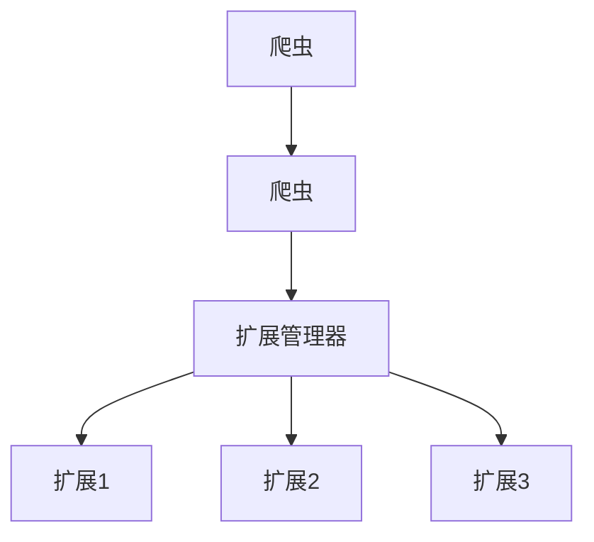

# 扩展管理器

扩展管理器是Crawlo框架中管理扩展加载和生命周期的核心组件。它在各种爬虫事件期间协调扩展的执行。

## 概述

扩展管理器负责：

- 加载和初始化扩展组件
- 箨理扩展生命周期事件
- 协调扩展执行
- 与爬虫和爬虫组件集成

## 架构

扩展管理器编排扩展执行：



## 主要特性

### 动态扩展加载

扩展组件根据配置动态加载：

```python
# 在settings.py中
EXTENSIONS = [
    'crawlo.extension.log_interval.LogIntervalExtension',
    'crawlo.extension.log_stats.LogStats',
    # ... 更多扩展
]
```

### 事件驱动执行

扩展响应各种爬虫事件：

- 爬虫初始化
- 爬虫打开/关闭
- 请求调度
- 响应接收
- 数据项处理
- 爬虫关闭

### 异步处理

所有扩展处理都是异步执行以保持性能：

- 非阻塞扩展执行
- 并发事件处理
- 适当的异常处理和传播

## API参考

### `ExtensionManager(crawler)`

创建一个新的扩展管理器实例。

**参数：**
- `crawler`：拥有此管理器的爬虫实例

### `create_instance(*args, **kwargs)`

创建扩展管理器实例的类方法。

### `async _add_extensions(extensions)`

加载和初始化扩展组件。

**参数：**
- `extensions`：扩展类路径列表

## 扩展生命周期事件

### 爬虫事件

1. **爬虫初始化**：爬虫创建时
2. **爬虫启动**：爬虫开始处理时
3. **爬虫关闭**：爬虫关闭时

### 爬虫事件

1. **爬虫打开**：爬虫开始爬取时
2. **爬虫关闭**：爬虫完成爬取时

### 处理事件

1. **请求调度**：请求添加到队列时
2. **响应接收**：响应接收时
3. **数据项成功**：数据项成功处理时
4. **数据项丢弃**：数据项丢弃时

## 配置

扩展管理器使用[EXTENSIONS](https://github.com/crawl-coder/Crawlo/blob/master/examples/api_data_collection/api_data_collection/settings.py#L46)设置来确定要加载的扩展：

```python
EXTENSIONS = [
    # 日志扩展
    'crawlo.extension.log_interval.LogIntervalExtension',
    'crawlo.extension.log_stats.LogStats',
    
    # 监控扩展
    'crawlo.extension.memory_monitor.MemoryMonitorExtension',
    'crawlo.extension.performance_profiler.PerformanceProfilerExtension',
    
    # 实用扩展
    'crawlo.extension.request_recorder.RequestRecorderExtension',
    'crawlo.extension.health_check.HealthCheckExtension',
]
```

## 使用示例

```python
from crawlo.extension import ExtensionManager

# 扩展管理器通常由爬虫自动创建，但也可以手动创建：

manager = ExtensionManager.create_instance(crawler)

# 扩展根据配置自动加载并响应爬虫事件
```

## 错误处理

扩展管理器处理各种错误情况：

- **加载错误**：扩展类加载失败
- **初始化错误**：扩展初始化失败
- **执行错误**：扩展执行期间的异常
- **优雅降级**：即使扩展失败也继续操作

## 性能考虑

- 扩展执行应该是轻量级的，以避免影响爬取性能
- 最小化扩展事件处理程序中的阻塞操作
- 为扩展状态使用高效的数据结构
- 监控扩展执行时间以识别瓶颈