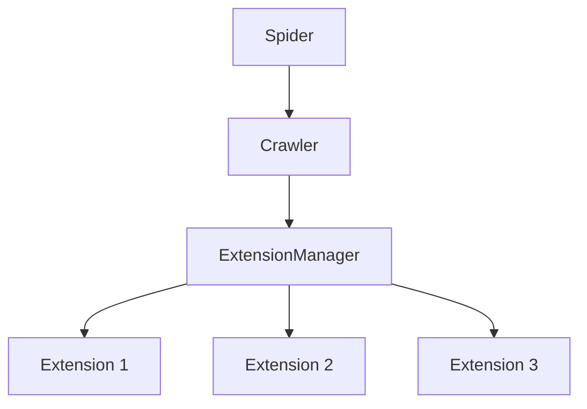

# ExtensionManager

The ExtensionManager is the core component that manages extension loading and lifecycle in the Crawlo framework. It coordinates the execution of extensions during various crawler events.

## Overview

The ExtensionManager is responsible for:

- Loading and initializing extension components
- Managing extension lifecycle events
- Coordinating extension execution
- Integrating with the crawler and spider components

## Architecture

The ExtensionManager orchestrates extension execution:



## Key Features

### Dynamic Extension Loading

Extension components are loaded dynamically based on configuration:

```python
# In settings.py
EXTENSIONS = [
    'crawlo.extension.log_interval.LogIntervalExtension',
    'crawlo.extension.log_stats.LogStats',
    # ... more extensions
]
```

### Event-Driven Execution

Extensions respond to various crawler events:

- Crawler initialization
- Spider opened/closed
- Request scheduled
- Response received
- Item processed
- Crawler closed

### Asynchronous Processing

All extension processing is performed asynchronously to maintain performance:

- Non-blocking extension execution
- Concurrent event handling
- Proper exception handling and propagation

## API Reference

### `ExtensionManager(crawler)`

Creates a new ExtensionManager instance.

**Parameters:**
- `crawler`: The crawler instance that owns this manager

### `create_instance(*args, **kwargs)`

Class method to create an ExtensionManager instance.

### `async _add_extensions(extensions)`

Loads and initializes extension components.

**Parameters:**
- `extensions`: List of extension class paths

## Extension Lifecycle Events

### Crawler Events

1. **Crawler Initialization**: When the crawler is created
2. **Crawler Started**: When the crawler begins processing
3. **Crawler Closed**: When the crawler shuts down

### Spider Events

1. **Spider Opened**: When a spider begins crawling
2. **Spider Closed**: When a spider finishes crawling

### Processing Events

1. **Request Scheduled**: When a request is added to the queue
2. **Response Received**: When a response is received
3. **Item Successful**: When an item is successfully processed
4. **Item Discard**: When an item is discarded

## Configuration

The ExtensionManager uses the `EXTENSIONS` setting to determine which extensions to load:

```python
EXTENSIONS = [
    # Logging extensions
    'crawlo.extension.log_interval.LogIntervalExtension',
    'crawlo.extension.log_stats.LogStats',
    
    # Monitoring extensions
    'crawlo.extension.memory_monitor.MemoryMonitorExtension',
    'crawlo.extension.performance_profiler.PerformanceProfilerExtension',
    
    # Utility extensions
    'crawlo.extension.request_recorder.RequestRecorderExtension',
    'crawlo.extension.health_check.HealthCheckExtension',
]
```

## Example Usage

```python
from crawlo.extension import ExtensionManager

# The ExtensionManager is typically created automatically
# by the crawler, but can be created manually:

manager = ExtensionManager.create_instance(crawler)

# Extensions are automatically loaded based on configuration
# and respond to crawler events
```

## Error Handling

The ExtensionManager handles various error conditions:

- **Loading Errors**: Failed to load extension classes
- **Initialization Errors**: Failed to initialize extensions
- **Execution Errors**: Exceptions during extension execution
- **Graceful Degradation**: Continue operation even if extensions fail

## Performance Considerations

- Extension execution should be lightweight to avoid impacting crawling performance
- Minimize blocking operations in extension event handlers
- Use efficient data structures for extension state
- Monitor extension execution times to identify bottlenecks