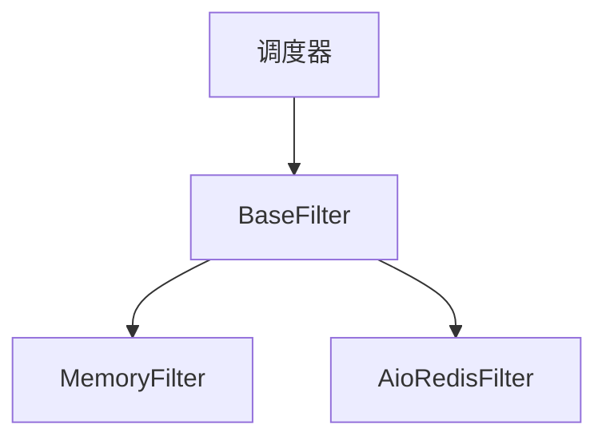

# 基础过滤器

基础过滤器是定义Crawlo框架中所有过滤器实现接口的抽象基类。它提供所有过滤器必须遵循的通用功能和结构。

## 概述

基础过滤器定义了请求去重功能的契约。所有过滤器实现都必须继承此类并实现所需的方法。

## 架构

基础过滤器为所有过滤器实现提供基础：



## 主要特性

### 抽象接口

基础过滤器定义了所有过滤器必须实现的抽象接口：

- [requested(request)](https://github.com/crawl-coder/Crawlo/blob/master/crawlo/filters/base.py#L34)：检查请求是否之前见过
- [add_fingerprint(fp)](https://github.com/crawl-coder/Crawlo/blob/master/crawlo/filters/base.py#L47)：向过滤器添加指纹
- [close()](https://github.com/crawl-coder/Crawlo/blob/master/crawlo/filters/base.py#L71)：过滤器不再需要时清理资源

### 通用功能

基础过滤器为所有过滤器提供通用功能：

- 请求指纹识别
- 统计跟踪
- 日志记录
- 调试模式支持

### 可扩展性

基础过滤器设计为易于扩展：

- 简单的继承模型
- 清晰的方法签名
- 一致的错误处理
- 灵活的配置

## API参考

### `BaseFilter(logger, stats, debug=False)`

创建一个新的基础过滤器实例。

**参数：**
- `logger`：用于记录消息的日志记录器实例
- `stats`：用于跟踪过滤器性能的统计收集器
- `debug`：启用调试模式以获得额外日志

### `async requested(request)`

检查请求是否之前见过。

**参数：**
- `request`：要检查的请求

**返回：**
- `bool`：如果请求之前见过则为True，否则为False

### `async add_fingerprint(fp)`

向过滤器添加指纹。

**参数：**
- `fp`：要添加的指纹

**返回：**
- `bool`：如果指纹已添加则为True，如果已存在则为False

### `create_instance(crawler)`

从爬虫创建过滤器实例的类方法。

**参数：**
- `crawler`：爬虫实例

**返回：**
- 新的过滤器实例

### `async close(reason=None)`

过滤器不再需要时清理资源。

**参数：**
- `reason`：关闭过滤器的原因

### `get_stats()`

获取过滤器统计信息。

**返回：**
- `dict`：关于过滤器性能的统计信息

## 实现要求

所有过滤器实现必须：

1. 继承基础过滤器
2. 实现[requested](https://github.com/crawl-coder/Crawlo/blob/master/crawlo/filters/base.py#L34)方法
3. 实现[add_fingerprint](https://github.com/crawl-coder/Crawlo/blob/master/crawlo/filters/base.py#L47)方法
4. 实现[create_instance](https://github.com/crawl-coder/Crawlo/blob/master/crawlo/filters/base.py#L57)类方法
5. 调用父构造函数
6. 适当处理异常

## 实现示例

```python
from crawlo.filters import BaseFilter

class CustomFilter(BaseFilter):
    def __init__(self, logger, stats, debug=False):
        super().__init__(logger, stats, debug)
        # 初始化自定义过滤器状态
        
    @classmethod
    def create_instance(cls, crawler):
        # 从爬虫配置创建实例
        return cls(
            logger=crawler.logger,
            stats=crawler.stats,
            debug=crawler.settings.get_bool('FILTER_DEBUG', False)
        )
        
    async def requested(self, request):
        # 检查请求是否见过
        fp = self._request_fingerprint(request)
        if await self._exists(fp):
            return True
        await self.add_fingerprint(fp)
        return False
        
    async def add_fingerprint(self, fp):
        # 向过滤器添加指纹
        # 如果添加则返回True，如果已存在则返回False
        pass
        
    async def _exists(self, fp):
        # 检查指纹是否存在
        pass
```

## 性能考虑

- 最小化过滤器方法中的阻塞操作
- 为指纹存储使用高效的数据结构
- 实现适当的缓存机制
- 监控过滤器性能和内存使用
- 适当处理大规模场景

## 错误处理

基础过滤器提供基本的错误处理：

- 错误和异常的日志记录
- 可能时的优雅降级
- 适当的资源清理
- 错误的统计跟踪

## 扩展点

基础过滤器可以通过以下几种方式扩展：

1. **存储后端**：实现不同的存储机制
2. **指纹识别**：自定义请求指纹识别算法
3. **过期**：添加TTL或过期机制
4. **统计**：增强统计收集
5. **配置**：添加自定义配置选项