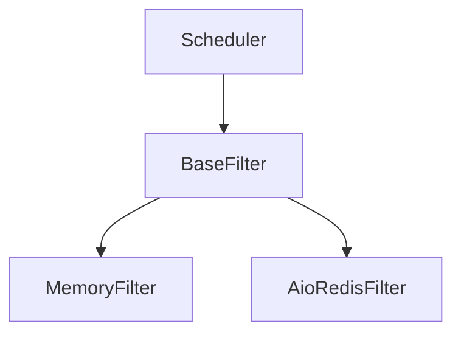

# BaseFilter

The BaseFilter is the abstract base class that defines the interface for all filter implementations in the Crawlo framework. It provides the common functionality and structure that all filters must follow.

## Overview

The BaseFilter defines the contract for request deduplication functionality. All filter implementations must inherit from this class and implement the required methods.

## Architecture

The BaseFilter provides the foundation for all filter implementations:



## Key Features

### Abstract Interface

The BaseFilter defines the abstract interface that all filters must implement:

- `requested(request)`: Check if a request has been seen before
- `add_fingerprint(fp)`: Add a fingerprint to the filter
- `close()`: Clean up resources when the filter is no longer needed

### Common Functionality

The BaseFilter provides common functionality for all filters:

- Request fingerprinting
- Statistics tracking
- Logging
- Debug mode support

### Extensibility

The BaseFilter is designed to be easily extended:

- Simple inheritance model
- Clear method signatures
- Consistent error handling
- Flexible configuration

## API Reference

### `BaseFilter(logger, stats, debug=False)`

Creates a new BaseFilter instance.

**Parameters:**
- `logger`: Logger instance for logging messages
- `stats`: Statistics collector for tracking filter performance
- `debug`: Enable debug mode for additional logging

### `async requested(request)`

Checks if a request has been seen before.

**Parameters:**
- `request`: The request to check

**Returns:**
- `bool`: True if the request has been seen before, False otherwise

### `async add_fingerprint(fp)`

Adds a fingerprint to the filter.

**Parameters:**
- `fp`: The fingerprint to add

**Returns:**
- `bool`: True if the fingerprint was added, False if it already existed

### `create_instance(crawler)`

Class method to create a filter instance from a crawler.

**Parameters:**
- `crawler`: The crawler instance

**Returns:**
- A new filter instance

### `async close(reason=None)`

Cleans up resources when the filter is no longer needed.

**Parameters:**
- `reason`: Reason for closing the filter

### `get_stats()`

Gets filter statistics.

**Returns:**
- `dict`: Statistics about filter performance

## Implementation Requirements

All filter implementations must:

1. Inherit from BaseFilter
2. Implement the `requested` method
3. Implement the `add_fingerprint` method
4. Implement the `create_instance` class method
5. Call the parent constructor
6. Handle exceptions appropriately

## Example Implementation

```python
from crawlo.filters import BaseFilter

class CustomFilter(BaseFilter):
    def __init__(self, logger, stats, debug=False):
        super().__init__(logger, stats, debug)
        # Initialize custom filter state
        
    @classmethod
    def create_instance(cls, crawler):
        # Create instance from crawler configuration
        return cls(
            logger=crawler.logger,
            stats=crawler.stats,
            debug=crawler.settings.get_bool('FILTER_DEBUG', False)
        )
        
    async def requested(self, request):
        # Check if request has been seen
        fp = self._request_fingerprint(request)
        if await self._exists(fp):
            return True
        await self.add_fingerprint(fp)
        return False
        
    async def add_fingerprint(self, fp):
        # Add fingerprint to filter
        # Return True if added, False if already existed
        pass
        
    async def _exists(self, fp):
        # Check if fingerprint exists
        pass
```

## Performance Considerations

- Minimize blocking operations in filter methods
- Use efficient data structures for fingerprint storage
- Implement proper caching mechanisms
- Monitor filter performance and memory usage
- Handle large-scale scenarios appropriately

## Error Handling

The BaseFilter provides basic error handling:

- Logging of errors and exceptions
- Graceful degradation when possible
- Proper resource cleanup
- Statistics tracking of errors

## Extension Points

The BaseFilter can be extended in several ways:

1. **Storage Backend**: Implement different storage mechanisms
2. **Fingerprinting**: Customize request fingerprinting algorithms
3. **Expiration**: Add TTL or expiration mechanisms
4. **Statistics**: Enhance statistics collection
5. **Configuration**: Add custom configuration options