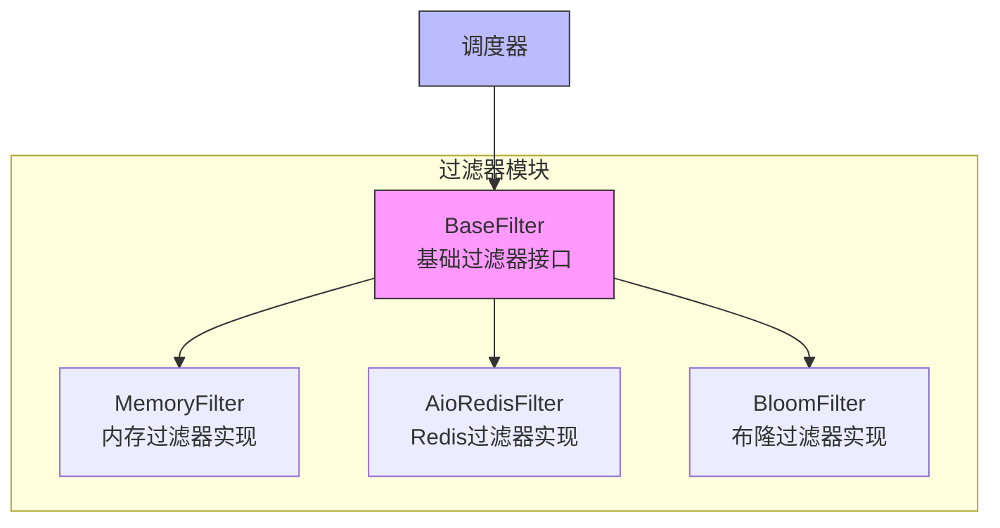

# 过滤器模块

过滤器模块是 Crawlo 框架中负责请求去重的核心组件。它通过维护已处理请求的指纹集合，防止重复爬取相同的 URL，提高爬取效率。

## 模块概述

过滤器模块采用抽象设计，支持多种过滤器实现，包括内存过滤器、Redis 过滤器和布隆过滤器。用户可以根据具体需求选择合适的过滤器。

### 核心组件

1. [BaseFilter](base.md) - 基础过滤器接口
2. [MemoryFilter](memory.md) - 内存过滤器实现
3. [AioRedisFilter](redis.md) - Redis 过滤器实现
4. [BloomFilter](bloom.md) - 布隆过滤器实现

## 架构设计



## 过滤器类型

### 内存过滤器 (MemoryFilter)

**适用场景:**
- 单机模式下的简单爬取任务
- 开发和测试环境
- 不需要持久化过滤数据的场景

**特点:**
- 基于内存存储，访问速度快
- 实现简单，资源消耗低
- 不支持持久化，进程重启后数据丢失

### Redis 过滤器 (AioRedisFilter)

**适用场景:**
- 分布式模式下的大规模爬取任务
- 需要过滤数据持久化的场景
- 多节点协同工作的环境

**特点:**
- 基于 Redis 存储，支持持久化
- 支持分布式部署
- 支持大规模数据去重

### 布隆过滤器 (BloomFilter)

**适用场景:**
- 需要处理超大规模 URL 的场景
- 对内存使用有严格要求的环境
- 可以接受一定误判率的场景

**特点:**
- 极低的内存使用
- 支持超大规模数据
- 存在一定的误判率

## 配置选项

过滤器模块的行为可以通过以下配置项进行调整：

| 配置项 | 类型 | 默认值 | 说明 |
|--------|------|--------|------|
| FILTER_TYPE | str | 'memory' | 过滤器类型（memory/redis/bloom） |
| REDIS_HOST | str | '127.0.0.1' | Redis 主机地址 |
| REDIS_PORT | int | 6379 | Redis 端口 |
| REDIS_PASSWORD | str | None | Redis 密码 |
| REDIS_DB | int | 0 | Redis 数据库编号 |
| BLOOM_FILTER_CAPACITY | int | 1000000 | 布隆过滤器容量 |
| BLOOM_FILTER_ERROR_RATE | float | 0.001 | 布隆过滤器误判率 |

## 使用示例

### 基本使用

```python
from crawlo.filter import MemoryFilter
from crawlo.network import Request

# 创建过滤器实例
filter = MemoryFilter()

# 检查请求是否重复
request = Request(url='http://example.com')
is_duplicate = filter.check_duplicate(request)

# 添加请求到过滤器
if not is_duplicate:
    filter.add_request(request)
```

### 切换过滤器类型

```python
from crawlo.config import CrawloConfig
from crawlo.filter import FilterFactory

# 配置使用 Redis 过滤器
config = CrawloConfig.distributed(filter_type='redis')

# 创建过滤器实例
filter = FilterFactory.create_filter(config)
```

## 性能对比

| 过滤器 | 内存使用 | 持久化支持 | 分布式支持 | 误判率 |
|--------|----------|------------|------------|--------|
| MemoryFilter | 高 | 不支持 | 不支持 | 0% |
| AioRedisFilter | 低 | 支持 | 支持 | 0% |
| BloomFilter | 极低 | 不支持 | 不支持 | 可配置 |

## 错误处理

### 连接异常处理

```python
try:
    is_duplicate = filter.check_duplicate(request)
except FilterConnectionException:
    logger.error("过滤器连接失败")
    # 可以选择跳过过滤直接处理请求
```

### 存储异常处理

```python
try:
    filter.add_request(request)
except FilterStorageException:
    logger.error("过滤器存储失败")
    # 可以选择重试或记录日志
```

## 监控和日志

过滤器模块集成了详细的监控和日志功能：

```python
# 记录过滤操作日志
logger.info(f"请求去重检查: {request.url}, 结果: {is_duplicate}")
logger.debug(f"当前过滤器大小: {filter.size()}")

# 记录异常日志
logger.error(f"过滤器操作失败: {e}")
```

## 最佳实践

### 根据模式选择过滤器类型

```python
# 单机模式使用内存过滤器
config = CrawloConfig.standalone(filter_type='memory')

# 分布式模式使用 Redis 过滤器
config = CrawloConfig.distributed(filter_type='redis')

# 超大规模使用布隆过滤器
config = CrawloConfig.standalone(filter_type='bloom')
```

### 合理配置布隆过滤器参数

```python
# 预估需要处理的 URL 数量
BLOOM_FILTER_CAPACITY = 10000000  # 1000万

# 设置可接受的误判率
BLOOM_FILTER_ERROR_RATE = 0.0001  # 0.01%
```

### 启用过滤器监控

```python
# 监控过滤器性能
stats = filter.get_stats()
print(f"过滤器检查次数: {stats['checks']}")
print(f"重复请求数: {stats['duplicates']}")
print(f"去重率: {stats['dedup_rate']:.2%}")
```