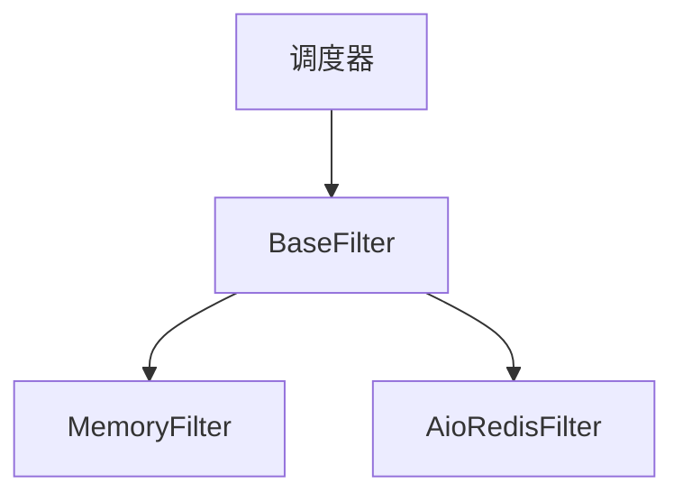

# 过滤器模块

过滤器模块提供请求去重功能，以防止多次爬取相同的URL。它支持内存和分布式过滤机制。

## 目录
- [BaseFilter](base.md) - 基础过滤器类和接口
- [MemoryFilter](memory.md) - 内存去重
- [AioRedisFilter](redis.md) - 基于Redis的分布式去重

## 概述

过滤器模块负责防止重复请求被处理。这对于高效爬取和避免对目标服务器造成不必要的负载至关重要。

## 架构



## 主要特性

- **请求指纹识别**：为请求生成唯一标识符
- **重复检测**：高效检测之前见过的请求
- **多种实现**：为您的部署选择合适的过滤器
- **TTL支持**：自动清理旧指纹
- **统计跟踪**：监控过滤器性能和效果

## 过滤器类型

### MemoryFilter

- **使用场景**：独立爬取、开发、测试
- **特性**：快速、轻量、无外部依赖
- **限制**：不适用于分布式爬取、内存受限

### AioRedisFilter

- **使用场景**：分布式爬取、生产环境
- **特性**：跨多个节点共享、持久化、可扩展
- **要求**：Redis服务器
- **高级特性**：TTL支持、管道优化、连接池

## 配置

过滤器系统可以在项目的[settings.py](https://github.com/crawl-coder/Crawlo/blob/master/examples/api_data_collection/api_data_collection/settings.py)中配置：

```python
# 过滤器类选择
FILTER_CLASS = 'crawlo.filters.memory_filter.MemoryFilter'
# FILTER_CLASS = 'crawlo.filters.aioredis_filter.AioRedisFilter'

# Redis过滤器设置
REDIS_HOST = '127.0.0.1'
REDIS_PORT = 6379
REDIS_PASSWORD = ''
REDIS_TTL = 0  # 0表示无过期时间
CLEANUP_FP = False  # 关闭时清理指纹
```

## 使用示例

```python
from crawlo.filters import get_filter_class

# 从设置获取过滤器类
filter_cls = get_filter_class(settings.get('FILTER_CLASS'))
filter_instance = filter_cls.create_instance(crawler)

# 检查请求是否之前见过
if await filter_instance.requested(request):
    # 请求是重复的
    pass
else:
    # 处理新请求
    pass
```

有关每个过滤器实现的详细信息，请参阅单独的文档页面。