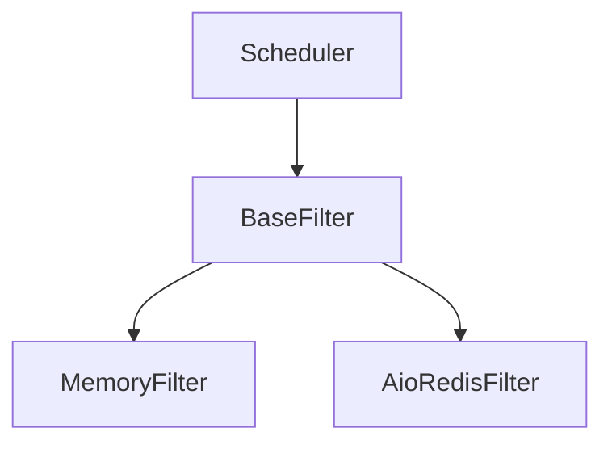

# Filter Module

The filter module provides request deduplication functionality to prevent crawling the same URLs multiple times. It supports both in-memory and distributed filtering mechanisms.

## Table of Contents
- [BaseFilter](base_en.md) - Base filter class and interface
- [MemoryFilter](memory_en.md) - In-memory deduplication
- [AioRedisFilter](redis_en.md) - Distributed Redis-based deduplication

## Overview

The filter module is responsible for preventing duplicate requests from being processed. This is crucial for efficient crawling and avoiding unnecessary load on target servers.

## Architecture



## Key Features

- **Request Fingerprinting**: Generate unique identifiers for requests
- **Duplicate Detection**: Efficiently detect previously seen requests
- **Multiple Implementations**: Choose the right filter for your deployment
- **TTL Support**: Automatic cleanup of old fingerprints
- **Statistics Tracking**: Monitor filter performance and effectiveness

## Filter Types

### MemoryFilter

- **Use Case**: Standalone crawling, development, testing
- **Features**: Fast, lightweight, no external dependencies
- **Limitations**: Not suitable for distributed crawling, memory constrained

### AioRedisFilter

- **Use Case**: Distributed crawling, production environments
- **Features**: Shared across multiple nodes, persistent, scalable
- **Requirements**: Redis server
- **Advanced Features**: TTL support, pipeline optimization, connection pooling

## Configuration

The filter system can be configured in your project's `settings.py`:

```python
# Filter class selection
FILTER_CLASS = 'crawlo.filters.memory_filter.MemoryFilter'
# FILTER_CLASS = 'crawlo.filters.aioredis_filter.AioRedisFilter'

# Redis filter settings
REDIS_HOST = '127.0.0.1'
REDIS_PORT = 6379
REDIS_PASSWORD = ''
REDIS_TTL = 0  # 0 means no expiration
CLEANUP_FP = False  # Clean up fingerprints on close
```

## Usage Example

```python
from crawlo.filters import get_filter_class

# Get filter class from settings
filter_cls = get_filter_class(settings.get('FILTER_CLASS'))
filter_instance = filter_cls.create_instance(crawler)

# Check if request was seen before
if await filter_instance.requested(request):
    # Request is a duplicate
    pass
else:
    # Process new request
    pass
```

For detailed information about each filter implementation, see the individual documentation pages.