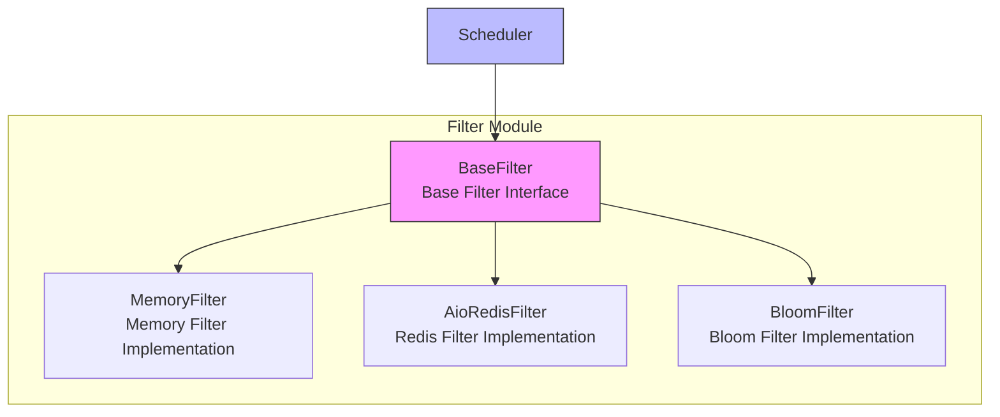

# Filter Module

The filter module is the core component in the Crawlo framework responsible for request deduplication. It prevents crawling the same URLs repeatedly by maintaining a collection of fingerprints of processed requests, improving crawling efficiency.

## Module Overview

The filter module adopts an abstract design, supporting multiple filter implementations including memory filter, Redis filter, and Bloom filter. Users can choose the appropriate filter based on specific needs.

### Core Components

1. [BaseFilter](base_en.md) - Base filter interface
2. [MemoryFilter](memory_en.md) - Memory filter implementation
3. [AioRedisFilter](redis_en.md) - Redis filter implementation
4. [BloomFilter](bloom_en.md) - Bloom filter implementation

## Architecture Design



## Filter Types

### Memory Filter (MemoryFilter)

**Use Cases:**
- Simple crawling tasks in standalone mode
- Development and testing environments
- Scenarios that don't require persistent filter data

**Features:**
- Memory-based storage, fast access
- Simple implementation, low resource consumption
- No persistence support, data lost on process restart

### Redis Filter (AioRedisFilter)

**Use Cases:**
- Large-scale crawling tasks in distributed mode
- Scenarios requiring persistent filter data
- Multi-node collaborative environments

**Features:**
- Redis-based storage, supports persistence
- Supports distributed deployment
- Supports large-scale data deduplication

### Bloom Filter (BloomFilter)

**Use Cases:**
- Scenarios requiring processing of ultra-large scale URLs
- Environments with strict memory usage requirements
- Scenarios where a certain false positive rate is acceptable

**Features:**
- Extremely low memory usage
- Supports ultra-large scale data
- Has a certain false positive rate

## Configuration Options

The filter module's behavior can be adjusted through the following configuration options:

| Configuration Item | Type | Default Value | Description |
|--------------------|------|---------------|-------------|
| FILTER_TYPE | str | 'memory' | Filter type (memory/redis/bloom) |
| REDIS_HOST | str | '127.0.0.1' | Redis host address |
| REDIS_PORT | int | 6379 | Redis port |
| REDIS_PASSWORD | str | None | Redis password |
| REDIS_DB | int | 0 | Redis database number |
| BLOOM_FILTER_CAPACITY | int | 1000000 | Bloom filter capacity |
| BLOOM_FILTER_ERROR_RATE | float | 0.001 | Bloom filter false positive rate |

## Usage Examples

### Basic Usage

```python
from crawlo.filter import MemoryFilter
from crawlo.network import Request

# Create filter instance
filter = MemoryFilter()

# Check if request is duplicate
request = Request(url='http://example.com')
is_duplicate = filter.check_duplicate(request)

# Add request to filter
if not is_duplicate:
    filter.add_request(request)
```

### Switching Filter Types

```python
from crawlo.config import CrawloConfig
from crawlo.filter import FilterFactory

# Configure to use Redis filter
config = CrawloConfig.distributed(filter_type='redis')

# Create filter instance
filter = FilterFactory.create_filter(config)
```

## Performance Comparison

| Filter | Memory Usage | Persistence Support | Distributed Support | False Positive Rate |
|--------|--------------|---------------------|---------------------|---------------------|
| MemoryFilter | High | Not supported | Not supported | 0% |
| AioRedisFilter | Low | Supported | Supported | 0% |
| BloomFilter | Extremely low | Not supported | Not supported | Configurable |

## Error Handling

### Connection Exception Handling

```python
try:
    is_duplicate = filter.check_duplicate(request)
except FilterConnectionException:
    logger.error("Filter connection failed")
    # Can choose to skip filtering and process request directly
```

### Storage Exception Handling

```python
try:
    filter.add_request(request)
except FilterStorageException:
    logger.error("Filter storage failed")
    # Can choose to retry or log
```

## Monitoring and Logging

The filter module integrates detailed monitoring and logging functionality:

```python
# Log filter operations
logger.info(f"Request deduplication check: {request.url}, Result: {is_duplicate}")
logger.debug(f"Current filter size: {filter.size()}")

# Log exception information
logger.error(f"Filter operation failed: {e}")
```

## Best Practices

### Choose Filter Type Based on Mode

```python
# Use memory filter for standalone mode
config = CrawloConfig.standalone(filter_type='memory')

# Use Redis filter for distributed mode
config = CrawloConfig.distributed(filter_type='redis')

# Use Bloom filter for ultra-large scale
config = CrawloConfig.standalone(filter_type='bloom')
```

### Configure Bloom Filter Parameters Appropriately

```python
# Estimate the number of URLs to process
BLOOM_FILTER_CAPACITY = 10000000  # 10 million

# Set acceptable false positive rate
BLOOM_FILTER_ERROR_RATE = 0.0001  # 0.01%
```

### Enable Filter Monitoring

```python
# Monitor filter performance
stats = filter.get_stats()
print(f"Filter checks: {stats['checks']}")
print(f"Duplicate requests: {stats['duplicates']}")
print(f"Deduplication rate: {stats['dedup_rate']:.2%}")
```