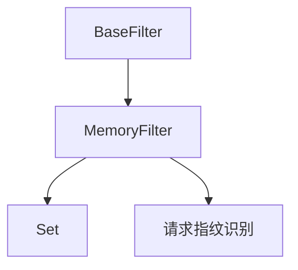

# 内存过滤器

内存过滤器是用于请求去重的过滤器接口的内存实现。它提供快速、轻量级的去重功能，无需外部依赖。

## 概述

内存过滤器设计用于：

- 独立爬取（单节点）
- 开发和测试环境
- 不需要外部依赖的场景
- 带去重功能的高性能本地爬取

## 架构

内存过滤器使用Python的内置数据结构进行高效去重：



## 主要特性

### 高性能

- 快速的内存操作
- 最小开销
- O(1)平均查找时间
- 高效的内存使用

### 简单实现

- 直接的基于集合的存储
- 无外部依赖
- 易于理解和调试
- 所需配置最少

### 请求指纹识别

- 一致的指纹生成
- 高效的哈希算法
- 可配置的指纹组件
- 抗碰撞

## 实现细节

### 存储后端

内存过滤器使用Python的内置[set](https://github.com/crawl-coder/Crawlo/blob/master/crawlo/utils/datatypes.py#L67)数据结构：

- 将请求指纹存储为字符串
- 提供O(1)平均查找时间
- 自动去重
- 内存高效存储

### 指纹识别

内存过滤器使用请求指纹识别生成唯一标识符：

- 基于URL的指纹识别
- 基于方法的区分
- 参数处理
- 可配置的组件

## 配置

内存过滤器通过爬虫设置配置：

```python
# 在settings.py中
FILTER_CLASS = 'crawlo.filters.memory_filter.MemoryFilter'
FILTER_DEBUG = False

# 内存过滤器没有特定设置
```

## API参考

### `MemoryFilter(logger, stats, debug=False)`

创建一个新的内存过滤器实例。

**参数：**
- `logger`：用于记录消息的日志记录器实例
- `stats`：用于跟踪过滤器性能的统计收集器
- `debug`：启用调试模式以获得额外日志

### `async requested(request)`

检查请求是否之前见过。

**参数：**
- `request`：要检查的请求

**返回：**
- `bool`：如果请求之前见过则为True，否则为False

### `async add_fingerprint(fp)`

向过滤器添加指纹。

**参数：**
- `fp`：要添加的指纹

**返回：**
- `bool`：如果指纹已添加则为True，如果已存在则为False

### `create_instance(crawler)`

从爬虫创建过滤器实例的类方法。

**参数：**
- `crawler`：爬虫实例

**返回：**
- 新的内存过滤器实例

### `async close(reason=None)`

过滤器不再需要时清理资源。

**参数：**
- `reason`：关闭过滤器的原因

### `get_stats()`

获取过滤器统计信息。

**返回：**
- `dict`：关于过滤器性能的统计信息

## 使用示例

```python
from crawlo.filters import MemoryFilter

# 在settings.py中配置
FILTER_CLASS = 'crawlo.filters.memory_filter.MemoryFilter'

# 或直接创建（不推荐用于生产环境）
filter_instance = MemoryFilter(logger, stats, debug=False)

# 检查请求是否见过
if await filter_instance.requested(request):
    print("请求是重复的")
else:
    print("请求是新的")

# 手动添加指纹
fp = "unique_fingerprint"
await filter_instance.add_fingerprint(fp)

# 获取统计信息
stats = filter_instance.get_stats()
print(f"总请求数: {stats['total_requests']}")
print(f"重复请求数: {stats['duplicate_requests']}")
```

## 性能考虑

### 内存使用

- 集合大小直接影响内存使用
- 大量唯一请求可能导致内存压力
- 在操作期间监控内存使用
- 考虑生产环境中的内存限制

### 速度

- O(1)平均查找时间
- 每次操作的开销最小
- 对于中等规模爬取很高效
- 在非常大的数据集上可能较慢

### 限制

- 不适用于分布式爬取
- 重启后无持久性
- 内存受限
- 仅限单节点

## 最佳实践

1. **内存监控**：在大数据集上监控内存使用
2. **规模考虑**：考虑生产环境的规模限制
3. **测试**：适用于开发和测试场景
4. **部署**：仅用于独立部署
5. **调试**：启用调试模式进行故障排除

## 何时使用内存过滤器

推荐在以下情况下使用内存过滤器：

- 开发和测试
- 独立爬取场景
- 带去重功能的高性能本地爬取
- 无外部依赖的环境
- 简单的单节点部署

不适用于：

- 分布式爬取
- 有大规模要求的生产环境
- 需要持久性的场景
- 有大数据集的内存受限环境