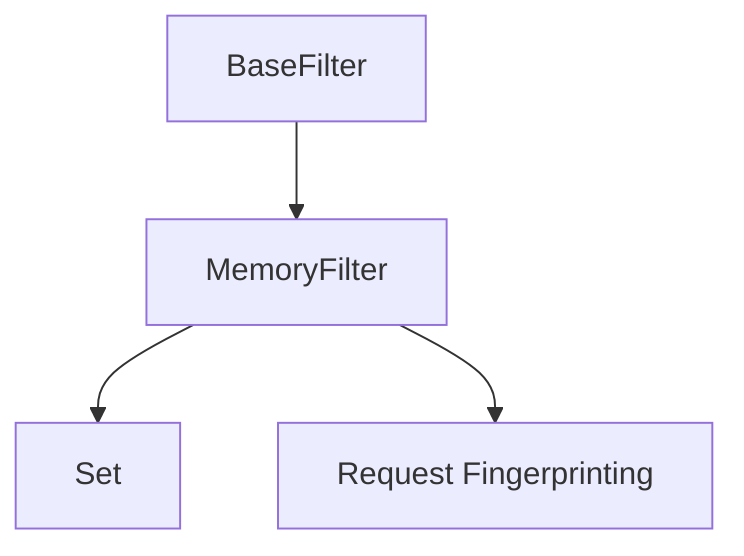

# MemoryFilter

The MemoryFilter is an in-memory implementation of the filter interface for request deduplication. It provides fast, lightweight deduplication without external dependencies.

## Overview

The MemoryFilter is designed for:

- Standalone crawling (single node)
- Development and testing environments
- Scenarios where external dependencies are not desired
- High-performance local crawling with deduplication

## Architecture

The MemoryFilter uses Python's built-in data structures for efficient deduplication:



## Key Features

### High Performance

- Fast in-memory operations
- Minimal overhead
- O(1) average case lookup time
- Efficient memory usage

### Simple Implementation

- Straightforward set-based storage
- No external dependencies
- Easy to understand and debug
- Minimal configuration required

### Request Fingerprinting

- Consistent fingerprint generation
- Efficient hashing algorithms
- Configurable fingerprint components
- Collision resistance

## Implementation Details

### Storage Backend

The MemoryFilter uses Python's built-in `set` data structure:

- Stores request fingerprints as strings
- Provides O(1) average case lookup
- Automatic deduplication
- Memory-efficient storage

### Fingerprinting

The MemoryFilter uses request fingerprinting to generate unique identifiers:

- URL-based fingerprinting
- Method-based differentiation
- Parameter handling
- Configurable components

## Configuration

The MemoryFilter is configured through crawler settings:

```python
# In settings.py
FILTER_CLASS = 'crawlo.filters.memory_filter.MemoryFilter'
FILTER_DEBUG = False

# MemoryFilter has no specific settings
```

## API Reference

### `MemoryFilter(logger, stats, debug=False)`

Creates a new MemoryFilter instance.

**Parameters:**
- `logger`: Logger instance for logging messages
- `stats`: Statistics collector for tracking filter performance
- `debug`: Enable debug mode for additional logging

### `async requested(request)`

Checks if a request has been seen before.

**Parameters:**
- `request`: The request to check

**Returns:**
- `bool`: True if the request has been seen before, False otherwise

### `async add_fingerprint(fp)`

Adds a fingerprint to the filter.

**Parameters:**
- `fp`: The fingerprint to add

**Returns:**
- `bool`: True if the fingerprint was added, False if it already existed

### `create_instance(crawler)`

Class method to create a filter instance from a crawler.

**Parameters:**
- `crawler`: The crawler instance

**Returns:**
- A new MemoryFilter instance

### `async close(reason=None)`

Cleans up resources when the filter is no longer needed.

**Parameters:**
- `reason`: Reason for closing the filter

### `get_stats()`

Gets filter statistics.

**Returns:**
- `dict`: Statistics about filter performance

## Example Usage

```python
from crawlo.filters import MemoryFilter

# Configure in settings.py
FILTER_CLASS = 'crawlo.filters.memory_filter.MemoryFilter'

# Or create directly (not recommended for production)
filter_instance = MemoryFilter(logger, stats, debug=False)

# Check if request was seen
if await filter_instance.requested(request):
    print("Request is a duplicate")
else:
    print("Request is new")

# Add fingerprint manually
fp = "unique_fingerprint"
await filter_instance.add_fingerprint(fp)

# Get statistics
stats = filter_instance.get_stats()
print(f"Total requests: {stats['total_requests']}")
print(f"Duplicate requests: {stats['duplicate_requests']}")
```

## Performance Considerations

### Memory Usage

- Set size directly affects memory usage
- Large numbers of unique requests can cause memory pressure
- Monitor memory usage during operation
- Consider memory constraints in production

### Speed

- O(1) average case lookup time
- Minimal overhead per operation
- Efficient for moderate-scale crawling
- May be slower with very large datasets

### Limitations

- Not suitable for distributed crawling
- No persistence across restarts
- Memory constrained
- Single node only

## Best Practices

1. **Memory Monitoring**: Monitor memory usage with large datasets
2. **Scale Considerations**: Consider scale limitations for production
3. **Testing**: Ideal for development and testing scenarios
4. **Deployment**: Use for standalone deployments only
5. **Debugging**: Enable debug mode for troubleshooting

## When to Use MemoryFilter

The MemoryFilter is recommended for:

- Development and testing
- Standalone crawling scenarios
- High-performance local crawling with deduplication
- Environments without external dependencies
- Simple, single-node deployments

It is not suitable for:

- Distributed crawling
- Production environments with large-scale requirements
- Scenarios requiring persistence
- Memory-constrained environments with large datasets