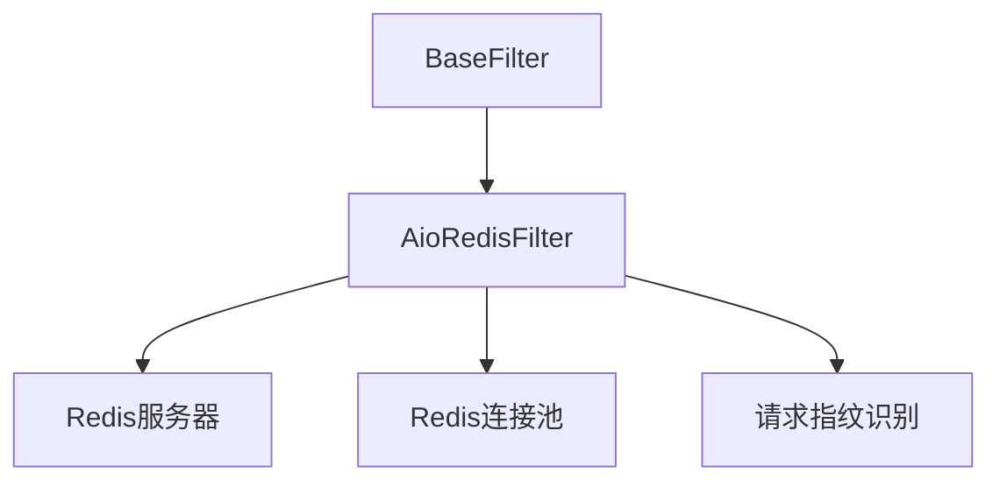

# AioRedis过滤器

AioRedis过滤器是基于Redis的分布式过滤器实现，支持跨多个爬虫节点的请求去重。它为分布式爬取场景提供持久化、共享的去重功能。

## 概述

AioRedis过滤器设计用于：

- 分布式爬取（多节点）
- 生产环境
- 需要持久化的场景
- 带去重功能的高可用爬取设置

## 架构

AioRedis过滤器使用Redis数据结构进行分布式去重：



## 主要特性

### 分布式操作

- 跨多个节点的共享去重
- 持久化存储
- 容错性
- 水平扩展

### 性能优化

- 连接池
- 管道操作
- 批处理
- 懒连接建立
- 高效的Redis数据结构

### TTL支持

- 旧指纹的自动过期
- 可配置的TTL设置
- 内存管理
- 定期清理

### 请求指纹识别

- 一致的指纹生成
- 高效的哈希算法
- 可配置的指纹组件
- 抗碰撞

## 实现细节

### 存储后端

AioRedis过滤器使用Redis集合进行高效去重：

- 在Redis集合中存储请求指纹
- 提供O(1)平均查找时间
- 自动去重
- 持久化存储

### 指纹识别

AioRedis过滤器使用请求指纹识别生成唯一标识符：

- 基于URL的指纹识别
- 基于方法的区分
- 参数处理
- 可配置的组件

## 配置

AioRedis过滤器通过爬虫设置配置：

```python
# 在settings.py中
FILTER_CLASS = 'crawlo.filters.aioredis_filter.AioRedisFilter'
REDIS_HOST = 'localhost'
REDIS_PORT = 6379
REDIS_PASSWORD = ''
REDIS_DB = 0
REDIS_TTL = 86400  # 24小时
CLEANUP_FP = False
FILTER_DEBUG = False

# Redis特定设置
REDIS_URL = 'redis://localhost:6379/0'
DECODE_RESPONSES = True
```

## API参考

### `AioRedisFilter(redis_key, client, stats, debug=False, cleanup_fp=False, ttl=None)`

创建一个新的AioRedis过滤器实例。

**参数：**
- `redis_key`：存储指纹的Redis键
- `client`：Redis客户端实例
- `stats`：用于跟踪过滤器性能的统计收集器
- `debug`：启用调试模式以获得额外日志
- `cleanup_fp`：关闭时清理指纹
- `ttl`：指纹的生存时间（秒）

### `async requested(request)`

检查请求是否之前见过。

**参数：**
- `request`：要检查的请求

**返回：**
- `bool`：如果请求之前见过则为True，否则为False

### `async add_fingerprint(fp)`

向过滤器添加指纹。

**参数：**
- `fp`：要添加的指纹

**返回：**
- `bool`：如果指纹已添加则为True，如果已存在则为False

### `create_instance(crawler)`

从爬虫创建过滤器实例的类方法。

**参数：**
- `crawler`：爬虫实例

**返回：**
- 新的AioRedis过滤器实例

### `async close(reason=None)`

过滤器不再需要时清理资源。

**参数：**
- `reason`：关闭过滤器的原因

### `get_stats()`

获取过滤器统计信息。

**返回：**
- `dict`：关于过滤器性能的统计信息

## 使用示例

```python
from crawlo.filters import AioRedisFilter

# 在settings.py中配置
FILTER_CLASS = 'crawlo.filters.aioredis_filter.AioRedisFilter'
REDIS_URL = 'redis://localhost:6379/0'
REDIS_TTL = 86400  # 24小时

# 或直接创建（不推荐用于生产环境）
filter_instance = AioRedisFilter(
    redis_key='crawlo:dedup:fingerprints',
    client=redis_client,
    stats=stats,
    debug=False,
    ttl=86400
)

# 检查请求是否见过
if await filter_instance.requested(request):
    print("请求是重复的")
else:
    print("请求是新的")

# 手动添加指纹
fp = "unique_fingerprint"
await filter_instance.add_fingerprint(fp)

# 获取统计信息
stats = await filter_instance.get_stats()
print(f"总指纹数: {stats['指纹总数']}")
```

## 性能考虑

### 连接管理

- 使用连接池以减少开销
- 配置适当的池大小
- 监控连接使用情况
- 优雅地处理连接失败

### Redis配置

- 优化Redis服务器设置
- 使用适当的Redis数据类型
- 监控Redis内存使用
- 配置Redis持久化设置

### TTL管理

- 为您的用例设置适当的TTL值
- 使用TTL监控内存使用
- 考虑清理策略
- 在内存使用和去重效果之间取得平衡

## 最佳实践

1. **连接池**：使用连接池以获得更好的性能
2. **错误处理**：实现健壮的错误处理和重试
3. **监控**：监控过滤器性能和内存使用
4. **TTL配置**：为您的用例设置适当的TTL值
5. **清理**：适当地配置清理选项
6. **安全性**：使用带认证的安全Redis配置

## 何时使用AioRedis过滤器

推荐在以下情况下使用AioRedis过滤器：

- 分布式爬取场景
- 生产环境
- 高可用性要求
- 持久化去重存储
- 多节点部署
- 大规模爬取操作

需要：

- Redis服务器安装和配置
- 到Redis服务器的网络连接
- 适当的Redis安全配置
- Redis实例的监控和维护