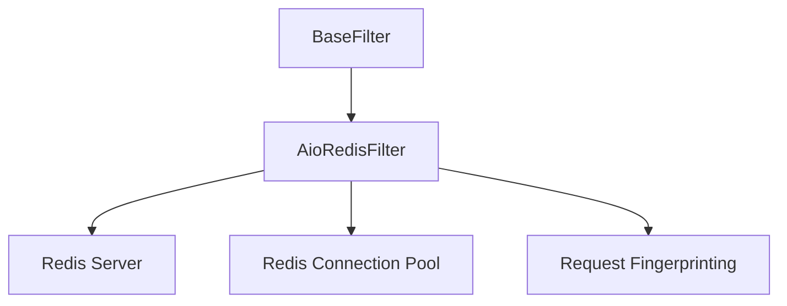

# AioRedisFilter

The AioRedisFilter is a distributed filter implementation based on Redis that enables request deduplication across multiple crawler nodes. It provides persistent, shared deduplication functionality for distributed crawling scenarios.

## Overview

The AioRedisFilter is designed for:

- Distributed crawling (multi-node)
- Production environments
- Scenarios requiring persistence
- High availability crawling setups with deduplication

## Architecture

The AioRedisFilter uses Redis data structures for distributed deduplication:



## Key Features

### Distributed Operation

- Shared deduplication across multiple nodes
- Persistent storage
- Fault tolerance
- Horizontal scaling

### Performance Optimizations

- Connection pooling
- Pipeline operations
- Batch processing
- Lazy connection establishment
- Efficient Redis data structures

### TTL Support

- Automatic expiration of old fingerprints
- Configurable TTL settings
- Memory management
- Periodic cleanup

### Request Fingerprinting

- Consistent fingerprint generation
- Efficient hashing algorithms
- Configurable fingerprint components
- Collision resistance

## Implementation Details

### Storage Backend

The AioRedisFilter uses Redis sets for efficient deduplication:

- Stores request fingerprints in Redis sets
- Provides O(1) average case lookup time
- Automatic deduplication
- Persistent storage

### Fingerprinting

The AioRedisFilter uses request fingerprinting to generate unique identifiers:

- URL-based fingerprinting
- Method-based differentiation
- Parameter handling
- Configurable components

## Configuration

The AioRedisFilter is configured through crawler settings:

```python
# In settings.py
FILTER_CLASS = 'crawlo.filters.aioredis_filter.AioRedisFilter'
REDIS_HOST = 'localhost'
REDIS_PORT = 6379
REDIS_PASSWORD = ''
REDIS_DB = 0
REDIS_TTL = 86400  # 24 hours
CLEANUP_FP = False
FILTER_DEBUG = False

# Redis-specific settings
REDIS_URL = 'redis://localhost:6379/0'
DECODE_RESPONSES = True
```

## API Reference

### `AioRedisFilter(redis_key, client, stats, debug=False, cleanup_fp=False, ttl=None)`

Creates a new AioRedisFilter instance.

**Parameters:**
- `redis_key`: Redis key for storing fingerprints
- `client`: Redis client instance
- `stats`: Statistics collector for tracking filter performance
- `debug`: Enable debug mode for additional logging
- `cleanup_fp`: Clean up fingerprints on close
- `ttl`: Time-to-live for fingerprints in seconds

### `async requested(request)`

Checks if a request has been seen before.

**Parameters:**
- `request`: The request to check

**Returns:**
- `bool`: True if the request has been seen before, False otherwise

### `async add_fingerprint(fp)`

Adds a fingerprint to the filter.

**Parameters:**
- `fp`: The fingerprint to add

**Returns:**
- `bool`: True if the fingerprint was added, False if it already existed

### `create_instance(crawler)`

Class method to create a filter instance from a crawler.

**Parameters:**
- `crawler`: The crawler instance

**Returns:**
- A new AioRedisFilter instance

### `async close(reason=None)`

Cleans up resources when the filter is no longer needed.

**Parameters:**
- `reason`: Reason for closing the filter

### `get_stats()`

Gets filter statistics.

**Returns:**
- `dict`: Statistics about filter performance

## Example Usage

```python
from crawlo.filters import AioRedisFilter

# Configure in settings.py
FILTER_CLASS = 'crawlo.filters.aioredis_filter.AioRedisFilter'
REDIS_URL = 'redis://localhost:6379/0'
REDIS_TTL = 86400  # 24 hours

# Or create directly (not recommended for production)
filter_instance = AioRedisFilter(
    redis_key='crawlo:dedup:fingerprints',
    client=redis_client,
    stats=stats,
    debug=False,
    ttl=86400
)

# Check if request was seen
if await filter_instance.requested(request):
    print("Request is a duplicate")
else:
    print("Request is new")

# Add fingerprint manually
fp = "unique_fingerprint"
await filter_instance.add_fingerprint(fp)

# Get statistics
stats = await filter_instance.get_stats()
print(f"Total fingerprints: {stats['指纹总数']}")
```

## Performance Considerations

### Connection Management

- Use connection pooling to reduce overhead
- Configure appropriate pool sizes
- Monitor connection usage
- Handle connection failures gracefully

### Redis Configuration

- Optimize Redis server settings
- Use appropriate Redis data types
- Monitor Redis memory usage
- Configure Redis persistence settings

### TTL Management

- Set appropriate TTL values for your use case
- Monitor memory usage with TTL
- Consider cleanup strategies
- Balance between memory usage and deduplication effectiveness

## Best Practices

1. **Connection Pooling**: Use connection pools for better performance
2. **Error Handling**: Implement robust error handling and retries
3. **Monitoring**: Monitor filter performance and memory usage
4. **TTL Configuration**: Set appropriate TTL values for your use case
5. **Cleanup**: Configure cleanup options appropriately
6. **Security**: Use secure Redis configurations with authentication

## When to Use AioRedisFilter

The AioRedisFilter is recommended for:

- Distributed crawling scenarios
- Production environments
- High availability requirements
- Persistent deduplication storage
- Multi-node deployments
- Large-scale crawling operations

It requires:

- Redis server installation and configuration
- Network connectivity to Redis server
- Proper Redis security configuration
- Monitoring and maintenance of Redis instance