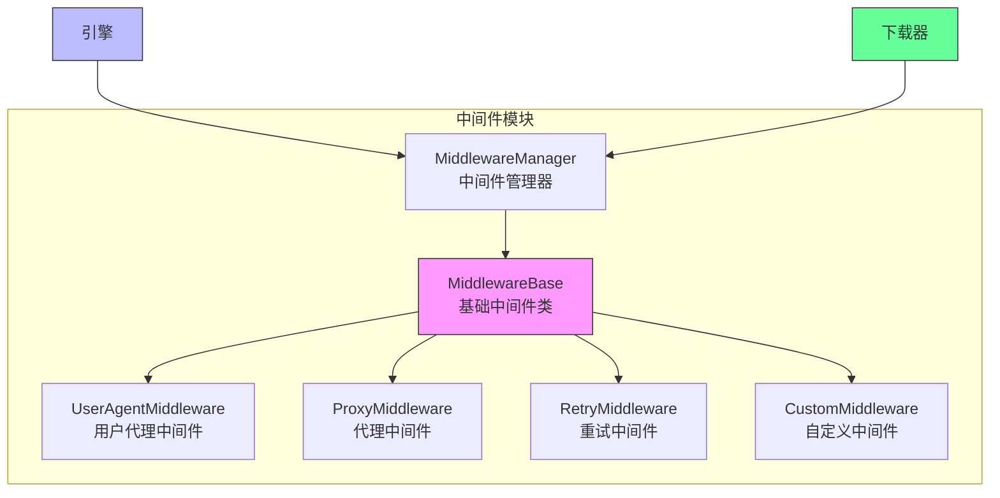

# 中间件模块

中间件模块是 Crawlo 框架中负责处理请求和响应的组件。它提供了一个钩子机制，允许用户在请求发送前和响应返回后执行自定义逻辑。

## 模块概述

中间件模块采用插件化设计，支持多种中间件实现。用户可以通过配置中间件列表来扩展框架功能，实现请求处理、响应处理、错误处理等自定义逻辑。

### 核心组件

1. [MiddlewareManager](manager.md) - 中间件管理器
2. [内置中间件](built_in.md) - 框架提供的内置中间件
3. [自定义中间件](custom.md) - 用户自定义的中间件

## 架构设计



## 中间件类型

### UserAgentMiddleware

**功能:**
- 为请求添加用户代理头部
- 支持随机用户代理

**配置选项:**
```python
# 设置用户代理
USER_AGENT = 'Mozilla/5.0 (Windows NT 10.0; Win64; x64) AppleWebKit/537.36'

# 使用随机用户代理
RANDOM_USER_AGENT = True
```

### ProxyMiddleware

**功能:**
- 为请求添加代理支持
- 支持代理轮换

**配置选项:**
```python
# 设置代理
PROXY = 'http://127.0.0.1:8080'

# 使用代理列表
PROXY_LIST = [
    'http://proxy1:8080',
    'http://proxy2:8080',
    'http://proxy3:8080'
]
```

### RetryMiddleware

**功能:**
- 自动重试失败的请求
- 支持多种重试条件

**配置选项:**
```python
# 设置最大重试次数
MAX_RETRY_TIMES = 3

# 设置重试状态码
RETRY_STATUS_CODES = [500, 502, 503, 504, 429]
```

## 配置选项

中间件模块的行为可以通过以下配置项进行调整：

| 配置项 | 类型 | 默认值 | 说明 |
|--------|------|--------|------|
| MIDDLEWARES | list | [] | 中间件列表 |
| USER_AGENT | str | '' | 用户代理字符串 |
| RANDOM_USER_AGENT | bool | False | 是否使用随机用户代理 |
| PROXY | str | None | 代理地址 |
| PROXY_LIST | list | [] | 代理列表 |
| MAX_RETRY_TIMES | int | 3 | 最大重试次数 |
| RETRY_STATUS_CODES | list | [500, 502, 503, 504, 429] | 重试状态码 |

## 使用示例

### 配置中间件

```python
# 在配置文件中配置中间件
MIDDLEWARES = [
    'crawlo.middleware.UserAgentMiddleware',
    'crawlo.middleware.ProxyMiddleware',
    'crawlo.middleware.RetryMiddleware',
]

# 配置中间件参数
USER_AGENT = 'MyCrawler/1.0'
PROXY = 'http://proxy.example.com:8080'
MAX_RETRY_TIMES = 5
```

### 创建自定义中间件

```python
from crawlo.middleware import MiddlewareBase

class CustomMiddleware(MiddlewareBase):
    def process_request(self, request, spider):
        """处理请求"""
        # 在请求发送前执行自定义逻辑
        request.headers['X-Custom-Header'] = 'custom-value'
        return request
    
    def process_response(self, request, response, spider):
        """处理响应"""
        # 在响应返回后执行自定义逻辑
        if response.status_code == 403:
            # 处理 403 错误
            self.logger.warning(f"访问被拒绝: {request.url}")
        return response
    
    def process_exception(self, request, exception, spider):
        """处理异常"""
        # 处理请求异常
        self.logger.error(f"请求异常: {request.url}, 错误: {exception}")
        return None
```

## 执行顺序

中间件按照配置列表中的顺序执行：

1. **请求处理阶段** - 从上到下执行 [process_request](../../api/crawlo_middleware.md) 方法
2. **响应处理阶段** - 从下到上执行 [process_response](../../api/crawlo_middleware.md) 方法
3. **异常处理阶段** - 从下到上执行 [process_exception](../../api/crawlo_middleware.md) 方法

## 性能优化

### 中间件选择

```python
# 只配置需要的中间件
MIDDLEWARES = [
    'crawlo.middleware.UserAgentMiddleware',  # 只有需要时才配置
    'crawlo.middleware.RetryMiddleware',      # 只有需要重试时才配置
]
```

### 异步支持

```python
class AsyncMiddleware(MiddlewareBase):
    async def process_request(self, request, spider):
        """异步处理请求"""
        # 异步操作
        await self.async_operation()
        return request
```

## 错误处理

### 中间件异常处理

```python
def process_request(self, request, spider):
    try:
        # 处理逻辑
        return request
    except Exception as e:
        self.logger.error(f"中间件处理失败: {e}")
        # 可以选择继续处理或抛出异常
        return request
```

## 监控和日志

中间件模块集成了详细的监控和日志功能：

```python
# 记录中间件操作日志
logger.info(f"中间件处理请求: {request.url}")
logger.debug(f"中间件添加头部: {request.headers}")

# 记录异常日志
logger.error(f"中间件执行失败: {e}")
```

## 最佳实践

### 合理配置中间件

```python
# 生产环境配置
MIDDLEWARES = [
    'crawlo.middleware.UserAgentMiddleware',
    'crawlo.middleware.ProxyMiddleware',
    'crawlo.middleware.RetryMiddleware',
]

# 开发环境配置
MIDDLEWARES = [
    'crawlo.middleware.UserAgentMiddleware',
]
```

### 中间件性能优化

```python
class EfficientMiddleware(MiddlewareBase):
    def __init__(self, settings):
        super().__init__(settings)
        # 预处理配置，避免重复计算
        self.cached_data = self.preprocess_settings()
    
    def process_request(self, request, spider):
        # 使用缓存数据，避免重复计算
        request.metadata['cached'] = self.cached_data
        return request
```

### 异常处理最佳实践

```python
def process_exception(self, request, exception, spider):
    """处理异常的最佳实践"""
    # 记录详细错误信息
    self.logger.error(f"请求失败: {request.url}", exc_info=True)
    
    # 根据异常类型采取不同措施
    if isinstance(exception, asyncio.TimeoutError):
        # 超时异常处理
        request.retry_times += 1
        if request.retry_times < self.settings.MAX_RETRY_TIMES:
            return request  # 重新入队重试
    
    # 其他异常直接返回 None，不重试
    return None
```